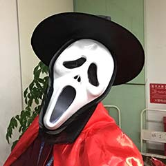

# CSS

## CSS mix-blend-mode滤色screen混合模式

### 滤色screen混合模式速览

`screen` 混合模式， 计算公式为： $C = 255 - (255 - A)*(255- B)/255$


eg:

有一个红色，其RGB值是（255,0,0），还有一个蓝色，其RGB值是（0，0，255），则这两个颜色的混合模式之后的颜色为：

R: 255 - （255 - 255）* （255 - 0） / 255 = 255

G: 255 - （255 - 0） * （255 - 0） / 255 = 0

B: 255 - （255 - 0） * （255 - 255） / 255 = 255；

最终混合后的颜色如下：

<div style="width:150px;height:120px;background:RGB(255,0,0)">
<div style="height:100%;background:RGB(0,0,255);mix-blend-mode:screen"></div>
</div>

### 滤色模式的特性与web应用

1. 任何颜色与黑色执行滤色，还是原来的颜色；
2. 任何颜色和白色执行滤色得到的是白色；
3. 任何颜色和其他颜色执行滤色，混合后颜色会更浅，类似漂白效果。


## 伪类匹配列表数目实现微信群头像CSS布局的技巧

### 不同列表数量不同布局

聊天软件中的群头像，往往采用复合头像作为一个大的头像。


### 伪类实现技巧

在这个方法中，你不需要在父元素上设置当前列表个数，因此，HTML看起来平平无奇：

```html
<ul class="box">
    <li></li>
    <li></li>
    <li></li>
    ...
</ul>
```

关键在于CSS ， 我们可以借助伪类判断当前列表个数， 示意如下：

```css
li:only-child{ /* 1个 */}
li:first-child:nth-last-child(2) { /* 2个 */ }
li:first-child:nth-last-child(3) { /* 3个 */ }
```

在CSS中，伪类可以级联使用的，于是，如果列表可以匹配`:first-child:nth-last-child(2)`则表示当前`<li>`元素即是第一个子元素，从后往前的第2个元素，因此，我们就能判断当前总共两个 `<li>`子元素， 我们就能精准实现我们想要的布局了，只需要配合相邻兄弟选择符加号`+`以及兄弟选择符`~`即可，例如：

```css
/* 3个li项目的第1个列表项 */
li:first-child:nth-last-child(3) {}
/* 3个li项目的第1个列表项的后一个，也就是第2项的样式 */
li:first-child:nth-last-child(3) + li {}
/* 3个li项目的第一个列表项后面两个列表项，也就是第2项和第3项的样式 */
li:first-child:nth-last-child(3) ~ li {}
```

​																				[查看Demo](https://www.zhangxinxu.com/study/201903/css-nth-last-child-group-avatar-demo.php)

### 延伸与拓展：文字多字号自动变小

和上面类似的原理，我们可以实现文字内容多，字号自动变小的效果，不过我们需要把所有的字符使用一个标签包裹起来，剩下的事情就全部交给CSS就好了。

​																				[查看Demo](https://www.zhangxinxu.com/study/201903/css-font-size-auto-demo.php)

```css
.box span {
    font-size: 40px;    
}
/* 字符个数 大于13个 */
.box span:first-child:nth-last-child(n+13),
.box span:first-child:nth-last-child(n+13) ~ span {
    font-size: 30px;    
}
/* 字符个数大于17个 */
.box span:first-child:nth-last-child(n+17),
.box span:first-child:nth-last-child(n+17) ~ span {
    font-size: 20px;    
}
/* 字符个数大于25个 */
.box span:first-child:nth-last-child(n+25),
.box span:first-child:nth-last-child(n+25) ~ span {
    font-size: 14px;    
}


```

​															**本方法IE9+都支持，放心使用。**


## CSS :placeholder-shown伪类实现Material Design占位符交互效果

### Material Design规范中占位符交互效果


这种设计可以借助 CSS `:placeholder-shown`伪类，纯CSS ，无任何JS ，实现这样的占位符交互效果。

> :placeholder-shown表示，当输入框的placeholder内容显示的时候，输入框如何如何。

兼容性：


​																				[查看Demo](https://www.zhangxinxu.com/study/201812/placeholder-shown-label-transition-demo.php)


#### 实现原理

```html
<div class="input-fill-x">
    <input class="input-fill" placeholder="邮箱">
    <label class="input-label">邮箱</label>
</div>
```

<b>首先</b>，让浏览器默认的placeholder效果不可见， 我们可以让颜色透明即可，如下CSS

```CSS
/* 默认placeholder颜色透明不可见 */
.input-fill:placeholder-shown::placeholder {
    color: transparent;
}
```

<b>然后</b>，后面的`.input-label`这个label元素代替成为我们肉眼看到的占位符。我们可以采用绝对定位：

```css
.input-fill-x {
    position: relative;
}
.input-label {
    position: absolute;
    left: 16px; top: 14px;
    pointer-events: none;
}
```

<b>最后</b>，对这个label元素在输入框focus的时候，以及非placeholder显示的时候进行重定位（缩小，位移到上方）

```css
.input-fill:not(:placeholder-shown) ~ .input-label,
.input-fill:focus ~ .input-label {
    transform: scale(0.75) translate(0, -32px);
}
```

​											[Input Material Design占位符交互效果 (codepen.io)](https://codepen.io/xxsn/project/editor/ZdJxWz)


## CSS 实现抛物线运动效果

先上效果： [Demo](https://www.zhangxinxu.com/study/201808/css3-parabola-shopping.php)

抛物线效果的核心就是CSS代码实现的。原理如下：

抛物线运动元素使用至少内外两层标签，例如，demo中的抛物线运动物体是CSS世界这本书的缩略图，外层是`<div>`，里面是``图片：

```html
<div class="fly-item">
    
</div>
```

然后内外两次标签一个负责水平方向的translate移动， 一个负责垂直方向的translate移动， 然后使用不同的缓动函数，也就是使用不同的`timing-function`， 在CSS3`animation`动画效果中是`animation-timing-function`属性，在CSS3`transition`过渡效果中是`transition-timing-function`属性，demo使用的是`transition`过渡，因此，CSS代码如下：

```css
.fly-item {
    /* 水平移动，线性匀速 */
    transition-timing-function: linear;
}
.fly-item > img {
    /* 垂直移动，先慢后快 */
    transition-timing-function: cubic-bezier(.55,0,.85,.36);
}
```

然后同时执行`translate`移动，抛物线效果就出现了。


## 渐变虚框及边框滚动动画的纯CSS实现

### 渐变虚线边框的实现

如果对边框的样式细节不是很在意，可以借助反向镂空的方法实现， 也就是虚线原本实色的地方和周围颜色融为一体，看上去透明，而原来虚框透明的部分透出渐变背景色，于是看上去是渐变色。

如：

```html
<div class="box">
    <div class="content"></div>
</div>
```

```css
.box {
    width: 150px;
    border: 2px dashed #fff;
    background: linear-gradient(to bottom, #34538b, #cd0000);
    background-origin: border-box;
}
.content {
    height: 100px;
    background-color: #fff;
}
```

这种实现，兼容性很好，但是虚实比例反过来了虚线太稀疏，边角无法形成直角。


### 借助CSS遮罩实现精致的渐变虚框

这个方法HTTML只需要一层标签即可，而且没有荣誉的唇色覆盖，适用于各种背景场合， HTML代码如下：

```html
<div class="box">
</div>
```

CSS代码如下，渐进增强，不支持遮罩的浏览器还是纯色虚框：

```css
.box {
    width: 200px;
    height: 150px;
    border: 2px dashed #cd0000;
    box-sizing: border-box;
}
@supports (-webkit-mask: none) or (mask: none) {
  .box {
    border: none;
    background: linear-gradient(to bottom, #34538b, #cd0000) no-repeat;
    mask: linear-gradient(to right, #000 6px, transparent 6px) repeat-x,
          linear-gradient(to bottom, #000 6px, transparent 6px) repeat-y,
          linear-gradient(to right, #000 6px, transparent 6px) repeat-x 0 100%,
          linear-gradient(to bottom, #000 6px, transparent 6px) repeat-y 100% 0;
    mask-size: 8px 2px, 2px 8px, 8px 2px, 2px 8px;
  }    
}
```

​																				[查看Demo](https://www.zhangxinxu.com/study/201808/border-dashed-gradient.php)

#### 关于CSS遮罩

默认情况下，CSS遮罩可以让元素只显示遮罩图片有颜色部分区域，于是，这里，我们只要使用`mask`属性绘制一个黑色虚框，就能实现真正意义上的渐变虚框效果了。


### 虚线边框滚动动画

```html
<div class="box">
    <div class="content">
        占位内容
    </div>
</div>
```

```css
.box {
    width: 200px;
    background: repeating-linear-gradient(135deg, transparent, transparent 3px, #000 3px, #000 8px);
    animation: shine 1s infinite linear;
    overflow: hidden;
}
.content {
    height: 128px;
    margin: 1px; padding: 10px;
    background-color: #fff;    
}
@keyframes shine {
    0% { background-position: -1px -1px;}
    100% { background-position: -12px -12px;}
}
```

​																					[查看Demo](https://www.zhangxinxu.com/study/201808/border-dashed-around-animation.php)

实现原理：

这种边框跑马灯一样的效果的实现原理，可以参见 **使用CSS实现Photoshop选取效果**一文。[link](https://www.zhangxinxu.com/wordpress/?p=895)

边框区域镂空，然后背景图片设为下面这个GIF平铺背景即可：


例如下面这个水果的选取背景效果：


### 一个实线边框loading动画

先看效果吧，[查看Demo](https://www.zhangxinxu.com/study/201808/border-solid-loading-animation.php)

实现的效果是一条边框实线，像一个贪吃蛇一样，一直围着这个图片元素跑跑跑。

实现原理：

使用CSS `clip`属性对边框进行裁剪而已， 使用`clip`属性是因为兼容性较好，如果项目不兼容IE，则可以使用`clip-path`属性来进行裁剪。

具体如下：

```html
<div class="box">
    
</div>
```

```css
.box {
    display: inline-block;
    padding: 10px;
    position: relative;
}
.box::before {
    content: '';
    position: absolute;
    left: 0; top: 0; right: 0; bottom: 0;
    border: 2px solid #cd0000;
    animation: borderAround 1.5s infinite linear;    
}
@keyframes borderAround {
    0%, 100% { clip: rect(0 148px 2px 0); }
    25% { clip: rect(0 148px 116px 146px); }
    50% { clip: rect(114px 148px 116px 0); }
    75% { clip: rect(0 2px 116px 0); }
}
```


## CSS 遮罩 CSS3 mask/masks详细介绍

### CSS mask-image属性详细介绍

`mask-image`指遮罩使用的图片资源，默认值是`none`，也就是无遮罩图片。因此，和`border`属性中的`border-style`属性类似，是一个想要有效果就必须设定的属性值。

`mask-image`遮罩所支持的图片类型非常的广泛，可以`url()`静态图片资源，格式包括JPG,PNG以及SVG等都是支持的；同时还支持多背景，因此理论上，使用`mask-image`我们可以遮罩出任意我们想要的图形。

例如：

原始图：


遮罩图片：


```html

```

```css
.mask-image {
    width: 250px;
    height: 187.5px;
    -webkit-mask-image: url(loading.png);
    mask-image: url(loading.png);
}
```

最后效果：


从上面这个基本的案例，我们可以看出， 所谓遮罩， 就是原始图片只显示遮罩图片非透明的部分。 例如本案例中， loading圆环有颜色部分就是外面一圈圆环，于是最终我们看到效果是原始图片，只露出了一个一个的圆环。并且半透明区域也准确遮罩显示了。

因此，我们很少使用jpg图片来作为遮罩图片，因为jpg图片一定是完全不透明的，最终的效果就是原图什么也看不到。

### SVG图形遮罩效果展示

除了支持普通静态图片的遮罩，`mask-image`还支持SVG图形的遮罩效果。

假设有下面名为`star.svg`的SVG图形

<svg viewBox="0 0 1025 1024" version="1.1" xmlns="http://www.w3.org/2000/svg" width="32.03125" height="32"><path d="M1024 402.148612c0-15.180828-11.484233-24.615229-34.469943-28.311824L680.617553 328.921539 542.157967 48.915763c-7.789793-16.821125-17.849274-25.227377-30.154733-25.227377-12.303304 0-22.356318 8.406252-30.152578 25.227377L343.384602 328.921539 34.45701 373.836788C11.488544 377.533383 0 386.967784 0 402.148612c0 8.619641 5.129969 18.465733 15.387751 29.542586l224.002896 217.846934L186.467905 957.226341c-0.821226 5.746427-1.228606 9.86118-1.228606 12.311925 0 8.61533 2.151138 15.894282 6.457726 21.847632 4.304432 5.961972 10.762158 8.92787 19.381799 8.92787 7.38888 0 15.590364-2.450746 24.615229-7.378102l276.302714-145.247096 276.322113 145.247096c8.630418 4.927357 16.834058 7.378102 24.606607 7.378102 8.23166 0 14.473841-2.965898 18.780428-8.92787 4.293655-5.944729 6.446948-13.232302 6.446948-21.847632 0-5.326115-0.206923-9.427935-0.618614-12.311925l-52.927054-307.688209 223.384282-217.846934C1018.673885 421.02388 1024 411.173478 1024 402.148612z"></path></svg>

CSS代码如下：

```css
.mask-image {
    width: 250px;
    height: 187.5px;
    -webkit-mask-image: url(star.svg);
    mask-image: url(star.svg);
}
```

结果原始图片显示为一片一片的星星形状：


​																					[查看demo](http://www.zhangxinxu.com/study/201711/mask-image-svg-url.html)


### 使用SVG图形中`<mask>`元素作为遮罩元素

此用法和上面的区别在于仅仅是使用SVG中定义的`<mask>`作为遮罩，而不是SVG元素本身。

在定义上，我们既能够把内敛的SVG中的`<mask>`作为遮罩， 也可以把外链的SVG文件中的`<mask>`作为遮罩；既能够作用在普通的HTML上，也能作用在SVG元素上。

单从最终的表现上来看，内联使用还是外链使用，应用在普通 HTML上和应用在SVG原生上是有比较大的兼容性差异的，这里有必要好好说明下。

如下SVG代码：

```HTML
<svg width="50" height="50" version="1.1" xmlns="http://www.w3.org/2000/svg">
    <ellipse cx="25" cy="25" rx="20" ry="10" fill="#000000" stroke="none"></ellipse>
    <rect x="15" y="5" width="20" height="40" rx="5" ry="5" fill="#000000" stroke="none"></rect>
</svg>
```

表现如下：

<svg width="50" height="50" version="1.1" xmlns="http://www.w3.org/2000/svg">
    <ellipse cx="25" cy="25" rx="20" ry="10" fill="#000000" stroke="none"></ellipse>
    <rect x="15" y="5" width="20" height="40" rx="5" ry="5" fill="#000000" stroke="none"></rect>
</svg>

下面我们要把上面这个形状转化为我们需要的遮罩。

理论上，我们外面直接套个`<mask>`标签`<defs>`中就可以了，类似如下：

```html
<svg>
    <defs>    
        <mask id="mask">
            <ellipse cx="25"  ...></ellipse>
            <rect x="15" ...></rect>
        </mask>
    </defs>    
</svg>
```

但是，**注意**，如果作为CSS`mask`属性值使用，上面这样直接处理是没有任何效果的，主要问题在于尺寸的识别上会有障碍。

通常的做法是设定`<mask>`元素的`maskContentUnits`属性值为`objectBoundingBox`,然后我们`<mask>`元素内的图形尺寸全部先定在`1px*1px`的规则内。

于是，本案例需要的SVG`<mask>`相关代码理论上应该是下面这样：

```html
<svg>
    <defs>    
        <mask id="mask" maskContentUnits="objectBoundingBox">
            <ellipse cx=".5" cy=".5" rx=".4" ry=".2" fill="white"></ellipse>
            <rect x=".3" y=".1" width=".4" height=".8" rx=".1" ry=".1" fill="white"></rect>
        </mask>
    </defs>    
</svg>
```

然而事情没有这么简单：

1. SVG`<mask>`其遮罩模式默认和普通图片的遮罩是不一样的，其遮罩类型是`luminance`，也就是基于亮度来进行遮罩的。而普通图片默认遮罩类型是`alpha`，基于透明度来遮罩的。当然，我们可以通过`mask-type`或`mask-mode`来设置SVG`<mask>`遮罩类型是`alpha`，用法为：`mask-type:alpha`。

   因此，上面代码两个形状的填充使用的是`fill="white"`,白色亮度最高，表示完全遮罩。如果换成`fill="black"则是完全透明。

2. 假设上面的SVG代码内敛在页面中，同事我们应用了如下CSS代码：

   ```css
   .mask-image{
       mask-image: url(#mask);
       -webkit-mask-image: url(#mask); /* #mask对应SVG中<mask>元素的id属性值 */
   }
   ```

   结果会发现，在Firefox浏览器下，遮罩效果的边缘有些毛糙。


## CSS3 mix-blend-mode

> 该CSS属性作用是让元素的内容和这个元素的背景以及下面的元素发生“混合”

该属性兼容性如下：


该属性的值中英文对照如下：

```css
mix-blend-mode: normal;          	//正常
mix-blend-mode: multiply;        	//正片叠底
mix-blend-mode: screen;          	//滤色
mix-blend-mode: overlay;         	//叠加
mix-blend-mode: darken;          	//变暗
mix-blend-mode: lighten;         	//变亮
mix-blend-mode: color-dodge;      //颜色减淡
mix-blend-mode: color-burn;	       //颜色加深
mix-blend-mode: hard-light;		//强光
mix-blend-mode: soft-light;		 //柔光
mix-blend-mode: difference;      //差值
mix-blend-mode: exclusion;       //排除
mix-blend-mode: hue;             //色相
mix-blend-mode: saturation;      //饱和度
mix-blend-mode: color;           //颜色
mix-blend-mode: luminosity;      //亮度
```

各个混合模式常见应用

- `multiply`混合后通常颜色会加深，多用在白色背景图片和其他元素的混合，以及彩色纹理的合并上。
- `screen`混合后颜色会减淡，非常适合实现霓虹灯光效果，适合黑色背景素材和其他元素混合，非常实用。
- `overlay`在颜色值暗的时候，采用了类似“正片叠底”的算法，而颜色亮的时候，采用了类似“滤色”的算法。此混合模式比较适合实现文字水印效果。
- `darken`表示哪个颜色暗使用哪个颜色，在web开发中，给图形或文字着色会很实用。
- `lighten`是哪个颜色浅就表现为哪个颜色，在web开发中，给图形或文字着色会很实用。
- `color-dodge`颜色减淡混合模式可以用来保护底图的高光，适合处理高光下的人物照片。
- `color-burn`颜色加深混合模式可以用来保护底图的阴影，适合处理幽深秘境一类的照片，通过和特定的色彩进行混合，可以营造更加幽深的意境。
- `hard-light`的效果是强光，最终的混合效果就好像耀眼的聚光灯照射过来，表现为图像亮的地方更亮，暗的地方更暗。多用在图像表现处理上。
- `soft-light`的效果是柔光，最终的混合效果就好像发散的光源弥漫过来，表现效果和hard-light有类似之处，只是表现没有那么强烈。给图像着色的时候常用此混合模式。
- `difference`是差值效果，可以实现颜色的反色效果。
- `exclusion`的效果是排除，最终的混合效果和difference模式是类似的，区别在于exclusion的对比度要更低一些。

## CSS3 background-blend-mode

> `background-blend-mode`背景混合模式。可以是背景图片间的混合，也可以是背景图片与背景色的混合。

属性兼容性如下：


**注意：**

只能是background属性中的背景图片和颜色混合，而且只能在一个background属性中。

`background-blend-mode`目前多用在纹理效果，以及图标的变色上，其作用原理要比`mix-blend-mode`更难理解。

****


## border-radius

### 一、border-radius百分比值

`border-radius`支持百分比值，例如`border-radius:50%`。`border-radius`百分比值是后来才支持的，某些老版本的Android机子，`border-radius:50%`它就不认识。

百分比是相对单位，但是不同属性相对的内容是不一样的。

* translate 是自身
* width/height 是父级
* background-position需要尺寸差计算等。

那么`border-radius`的百分比值相对的属性是？

举个栗子：

```css
.radius-test1 {
    width:100px;
    height: 100px;
    border:  50px solid #cd0000;
    border-radius: 50%;
    box-sizing: content-box;
}
```

```html
<div class="radius-test1">
</div>
```


答案是，相对元素占据尺寸的百分比，也就是包含边框，padding后的尺寸。而不是单纯的相对于`width/height`值。


`border-radius`还有个大值特性，也就是值很大的时候，只会使用能够渲染的圆角大小渲染。因此，要实现一个正方形元素的圆角效果（例如网站头像）， 我们可以使用一个很大的圆角值，同样不需要计算的。例如： 240*240像素图片，我们直接设置圆角大小300px，跟设置50%效果是一样的。





貌似大数值`border-radius`值好像和50%没什么区别，那是因为上面的图片是正方形，实际两者是有区别的。

我们把上面红圈粒子的height改成 200px看看对应效果；

```css
.radius-test2 {
    width: 100px;
    height: 200px;
    border: 50px solid #cd0000;
    border-radius: 50%;
}
.radius-test3 {
    width: 100px;
    height: 200px;
    border: 50px solid #cd0000;
    border-radius: 300px;
}
```


这样一看，差距就很明显了，一个像马桶盖子，一个像橡胶跑道。

**GOD，why？**

`50%`成为“马桶盖子”还好理解，宽度和高度分别50%圆角化； 但是后面命名圆角300px，比占据高度需要的圆角大小值要高出不少，为什么还是直的呢？

实际原因还就是因为太大了，所以才会变成的“操场跑道”

### 三、border-radius单值表现深入

由于我们平时使用`border-radius`绝大多数情况是都单值，例如`border-radius:300px`，于是，久而久之可那会忽略这样一个事实，就是`border-radius`单值实际上是一种简写。就跟 `padding: 300px`,`border-width: 200px`是一样的，是各个方位等值时候的一种简化书写形式。但是和一般的可简写CSS属性相比，`border-radius`要比看上去的复杂的多。

我们将`border-radius: 300px`还原成其整容前的墨阳，结果是：

```css
border-radius: 300px 300px 300px 300px/300px 300px 300px 300px;
```

日！这是什么鬼。

解释一下：

```text
border-radius: 左上角水平圆角半径大小 右上角水平圆角半径大小 右下角水平圆角半径大小 左下角水平圆角半径大小/左上角垂直圆角半径大小 右上角垂直圆角半径大小 右下角垂直圆角半径大小 左下角垂直圆角半径大小;
```

也就是说 **斜杠前是水平方向，斜杠后是垂直方向**。

虽然`border-radius`和`border-width`/`border-color`等都是`border`打头的，但是，两者缩写与方位的表示却不一样。

传统的`border`四个值分别表示 **上， 右， 下， 左** 边框。但是 `border-radius`表示的是角落。

​				[CSS3 border-radius圆角各个属性值作用演示 » 张鑫旭-鑫空间-鑫生活 (zhangxinxu.com)](https://www.zhangxinxu.com/study/201511/demo-border-radius.html)


对于正圆，我们很少提到 “水平半径” 和 “垂直半径”， 因为，半径都是一样长的。 但是对于标准椭圆， 那就不一样了，因为存在最长半径和最小半径。在web中， 圆角的水平半径指的是椭圆的水平半径， 垂直半径就是椭圆下图所示的垂直半径：


一个水平半径和一个垂直半径所夹起的那 `1 / 4`段 圆弧就是我们平时看的 圆角呈现， 如下变色显示：


OK, 为了演示水平垂直半径，我们现在先重置0，然后让水平1和垂直1都是300像素，如下图所示：


大家会看到，左上角出现了圆弧，那这个圆弧是怎么来的呢？我们画个圈圈辅助下~


可以看到， **原本设置的是`300px` * `300px`, 结果最后显示的却是 `200px` * `200px` 半径下的圆弧效果**，这显然不符合认知。

实际上， CSS3圆角除了大值特性， 还有个**等比例特性**，就是水平半径和垂直半径的比例是恒定不变的。

上面的栗子，由于我们的元素占据宽度是200px， 高度300px。 所以， 根据大值特性， 水平方向的300px只能按照 200px半径渲染； 再根据等比例特性， 虽然垂直方向理论上的最大半径是300px，但是受制于当初设定的300px * 300px的1：1比例， 垂直方向最终渲染的半径大小也是200px。

于是，我们最后得到一个 200px * 200px 的圆弧。

所以，**操场跑道**就是因为这个原因而形成的。


既如此，如何设置才能实现等同于`border-radius:50%`的效果呢。

如果理解了上面内容，其实很简单， 最关键的一点就是比例关系。 我们元素占据的尺寸是 200px * 300px；

所以只要让水平半径和垂直半径保持2：3的比例就可以了，然后利用“大值特性”设一个安全的值即可

```css
.radius-test4 {
      margin: 10px auto;
      width: 100px;
      height: 200px;
      border: 50px solid #cd0000;
      border-radius: 200px/300px;
    }
```

```html
<div class="radius-test4">
    
</div>
```


### 四、border-radius与图形构建

`border-radius`支持的可变值足有8个，基本上，每个值的变化都会呈现不同的图形，例如，下面这样，


案例： 

[随机不规则圆角头像demo](https://www.zhangxinxu.com/study/201702/cicada-principle-border-radius.html)


### 六、补充

1. 有时候我们想使用透明边框优雅的增加元素的点击区域，此时的圆角大小值需要把透明边框的宽度也计算在内。

   例如， 如果希望圆角 2px， 结果外面扩展了2px的透明边框；此时， 实际设置的`border-radius`值应该是4px。

2. 我们都知道`border-radius`指定某个角落的圆角大小，比如`border-top-left-radius: 40px`这个大家都知道，但是，下面的内容你可不一定知道：

   * 支持最多两个值，必须使用空格分隔。分别表示水平半径和垂直半径。而`border-radius`那种斜杠 `/` 分隔的写法这里是不支持的，只能是空格。

   * 中间两个方位关键字，如`top/left`的前后顺序不能改变，否则会被人为是不合法。`top/bottom`表示垂直方向的在前面，`left/right`表示水平方向的右边。全部写法

     ```css
     .radius {
         border-top-left-radius: 200px 100px;
         border-top-right-radius: 200px 100px;
         border-bottom-left-radius: 200px 100px;
         border-bottom-right-radius: 200px 100px;
     }
     ```

     上面综合一下可得，<b>border-垂直-水平-radius: 水平 垂直</b>

     你没看没错！前面方位关键字和后面的半径方位**不匹配**，**不匹配**，正好相反！


## position：sticky

`position:sticky`有个非常重要的特性，就是sticky元素效果完全受制于**父级元素们**

这和`position:fixed`定位有这根本性的不同，fixed元素直抵页面根元素，其他父元素对其left/top定位无法限制。

特性：

1. 父级元素不能有任何的`overflow:visible`意外的overflow设置，否则没有粘滞效果。因为改变了滚动容器（即使没有出现滚动条）。因此如果你的`position:sticky`无效，看看是不是某一个祖先元素设置了overflow:hidden，移除之即可。
2. 父级元素设置和粘性定位元素等高的固定的`height`高度值，或者高度计算值和粘性定位元素高度一样，也没有粘滞效果。[点击这里查看](https://www.zhangxinxu.com/wordpress/2020/03/position-sticky-rules/)
3. 同一个父容器中的sticky元素，如果定位值相等，则会重叠；如果属于不同父元素，且这些父元素正好紧密相连，则会就站炔草，几开原来的元素，形成一次占位的效果。至于原因需要理解粘性定位的计算规则[点击这里查看](https://www.zhangxinxu.com/wordpress/2020/03/position-sticky-rules/)
4. sticky定位，不近可以设置`top`,基于滚动容器上边缘定位；还可以设置`bottom`，也就是相对底部粘滞。如果水平滚动，也可以是设置`left/right`值。

[position:sticky实现的富有层次的滚动交互demo](https://www.zhangxinxu.com/study/201812/position-sticky-demo.php)


### 层次滚动实现原理

首先，HTML结构如下（结构很重要）

```html
<article>
    <section>
        <h4>网曝王宝强殴打马蓉</h4>
        <content>
            <p>12月2日，有网友爆料称...</p>
        </content>
        <footer>网友评论：...</footer>
    </section>
    <section>
        <h4>知情人爆料称马蓉闯入王宝强家拿剪刀对峙</h4>
        <content>
            <p>...</p>
        </content>
        <footer>网友评论：...</footer>
    </section>
    ...
</article>
```

其中，标题`<h4>`和底部`<footer>`设置了sticky定位，如下：

```css
article h4, 
h4 {
    position: sticky;
    top: 0;
    z-index: 1;
}
content {
    position: relative;
}
footer {
    position: sticky;
    bottom: 50vh;
    z-index: -1;
}
```

由于每一段短新闻都在section标签中，属于不同的父元素，因此，滚动的手，后面的新闻标题才能把前面已经sticky定位的新闻标题推开，这是sticky定位天然的特性，无需任何Javascript的帮助。


如果，我们这里的HTML结构做调整，标题都是平级的，如下

```html
<article>
    <section>
        <h4>网曝王宝强殴打马蓉</h4>
        <content>
            <p>12月2日，有网友爆料称...</p>
        </content>
        <footer>网友评论：...</footer>
        <!-- 下一个短新闻 -->
        <h4>知情人爆料称马蓉闯入王宝强家拿剪刀对峙</h4>
        <content>
            <p>...</p>
        </content>
        <footer>网友评论：...</footer>
    </section>
    ...
</article>
```

则最终效果是所有sticky定位的新闻标题都会重叠在一起，这并不是我们想要的效果。所以，`position:sticky`布局的时候，使用合适的HTML结构很重要。


上面效果中，评论从后面钻出来的效果又是如何实现的？

关键点：

1. 定位`bottom`,效果和`top`正好是队里的。设置`top`粘滞的元素睡着往下滚动，是先滚动后固定；而设置`bottom·粘滞的元素则是先固定，后滚动；
2. `z-index: - 1`让网友评论footer元素藏在了content的后面，于是才有了“犹抱琵琶半遮面”的效果。


