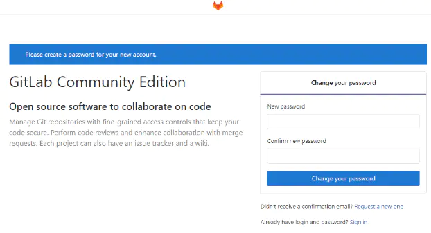

#	Docker 安装Gitlab

> 1. 下载docker镜像

```sh
docker pull gitlab/gitlab-ce
```

> 2. 在本机准备gitlab工作目录

```sh
mkdir -p /home/gitlab/config
mkdir -p /home/gitlab/logs
mkdir -p /home/gitlab/data
```

> ​	3.	运行脚本启动Gitlab

```sh
docker run -d --hostname 192.168.206.138 \
	-p 10110:443 -p 10111:80 -p 10112:22 \
	--name gitlab --restart always \
	--volume /home/gitlab/config:/etc/gitlab \
	--volume /home/gitlab/logs:/var/log/gitlab \
	--volume /home/gitlab/data:/var/opt/gitlab \ gitlabImageId
	--privileged=true
```

| 参数名称   | 参数说明                                                     |
| ---------- | ------------------------------------------------------------ |
| d          | 守护运行                                                     |
| hostname   | 指定主机地址，如果有域名可以指向域名                         |
| p          | 端口映射； 宿主机端口: 容器端口 (10112 访问端口， 10111clone项目的端口) |
| name       | 给容器命名                                                   |
| restart    | 自动重启                                                     |
| volume     | 数据卷映射；防止容器运行崩溃等情况导致数据丢失。             |
| privileged | 使得容器内root用户拥有root权限，否则root账户只是一个普通权限账号 |

----

> ​	4.	修改gitlab.rb配置文件

按照上面的方式，gitlab容器运行没有问题，但是在gitlab创建项目的时候，生成项目的URL访问地址是按照容器的hostname来生成的，也就是容器的id。作为gitlab服务器，我们需要一个固定的URL访问地址，于是需要配置gitlab.rb(宿主机路径：/home/gitlab/config/gitlab.rb)

```sh
external_url 'http://192.168.206.138'
gitlab_rails['gitlab_ssh_host'] = '192.168.206.138'
gitlab_rails['gitlab_shell_ssh_port'] = 10112
```

---

> ​	5.	进入gitlab容器重启配置服务

```sh
docker exec -it gitlab /bin/bash # 进入gitlab容器命令
gitlab-ctl reconfigure # 重置gitlab客户端的命令
```

---

> ​	6.	打开Gitlab

浏览器输入http://192.168.206.10112，如果出现此界面，代表已经安装ok。



默认账户为root，密码为重置后的密码。登录后进入如下界面。


---


> ​	7.	其他内容

**Gitlab 容器命令：**

* docker start gitlab 开始命令
* docker restart gitlab 重启命令
* docker stop gitlab 停止命令

**Gitlab 常用命令：**

* gitlab-ctl reconfigure // 重新应用gitlab的配置
* gitlab-ctl restart  // 重启gitlab 服务
* gitlab-ctl status //  查看gitlab运行状态
* gitlab-ctl stop // 停止gitlab服务
* gitlab-ctl tail  // 查看gitlab运行日志