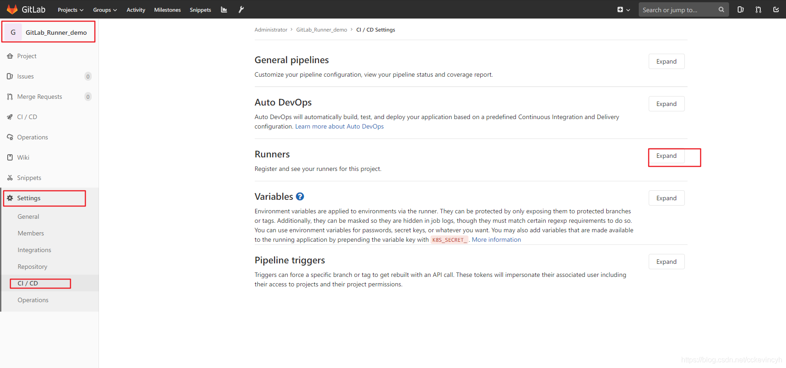
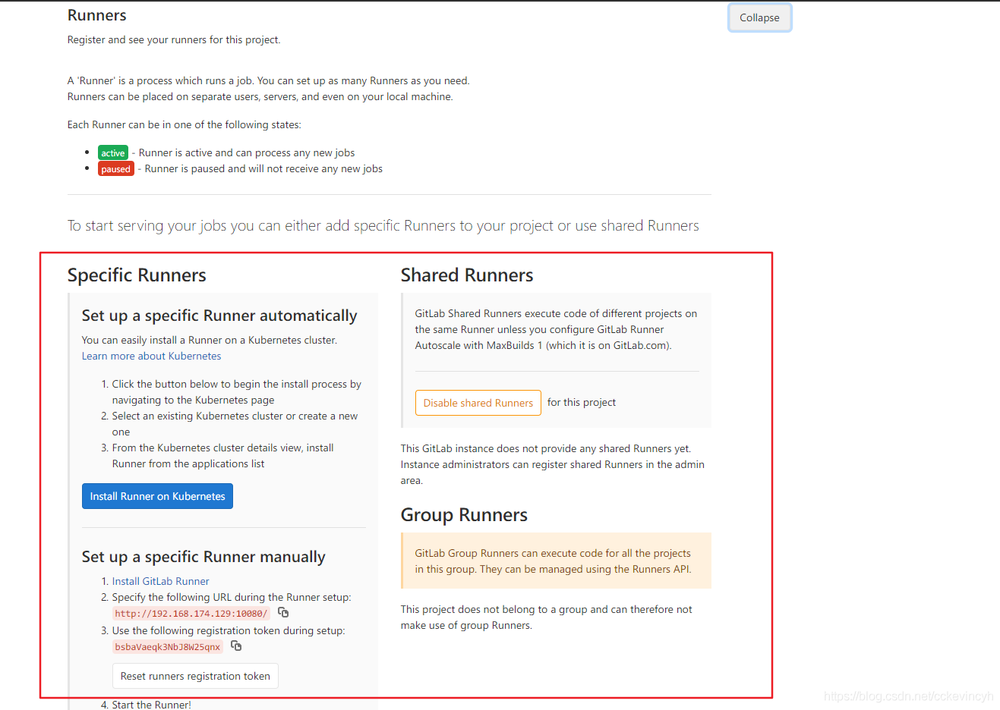
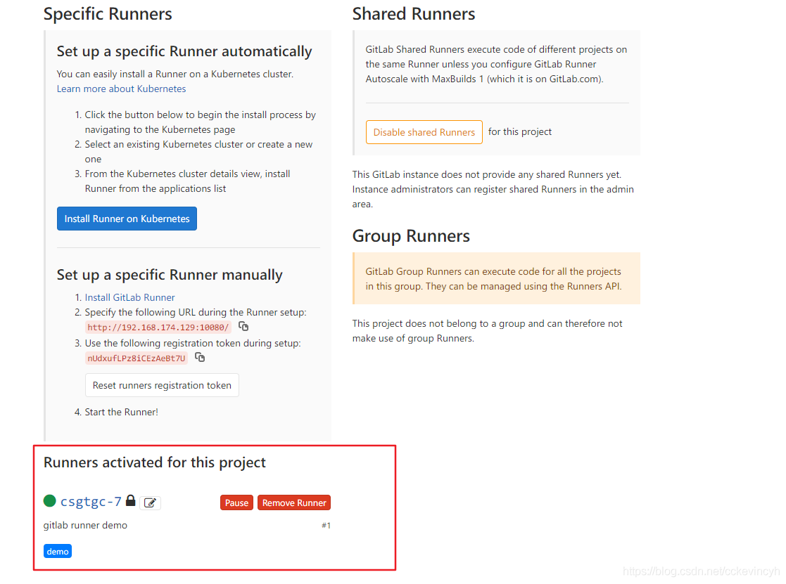

# Docker 安装gitlab-runner

> 	1. 安装gitlab-runner


> 2. 准备环境

* 赋值`daemon.json`到`/etc/docker/`，并执行`systemctl daemon-reload, systemctl restart docker`

* 创建工作目录 `opt/docker_gitlab-runner`

* 将提供好的`docker-compose.yml`文件以及`sudo chown root:root /var/run/docker.sock`(如果重启过docker， 需要重新执行)

* 在`/opt/docker_gitlab-runner`目录中执行`docker-compose up 注册Runner信息到gitlab-d --build`启动容器

* 添加容器权限，保证容器可以使用宿主机的docker

  `docker exec -it gitlab-runner usermod -aG root gitlab-runner`


> 3. 注册Runner信息到gitlab

* 找到项目中的setting->CI/CD,然后找到Runners

  

  

* 执行如下命令

  ```shell
  docker exec -it gitlab-runner gitlab-runner register
  ```

  返回下图内容，然后将gitlab项目中runner中的内容依次填入

  

* 刷新项目的 runner 页面，可以看到gitlab-runner已经注册到项目当中，鼓掌👏👏👏

  

  