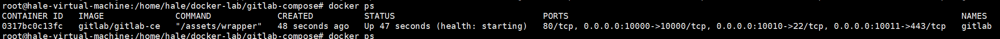

# GitLab安装

## 使用 Docker 命令安装

1. 拉取gitlab镜像

   ```sh
   docker pull gitlab/gitlab-ce:latest
   ```

2. 在本机准备gitlab数据卷（保证数据不丢失）

   ```sh
   mkdir -p /home/gitlab/config
   mkdir -p /home/gitlab/logs
   mkdir -p /home/gitlab/data
   ```

3. 运行脚本创建gitlab容器并启动守护运行

   ```sh
   docker run -d \
   --hostname 192.168.0.111 \
   -p 7001:443 \
   -p 7002:7002 \
   -p 7003:22 \
   --name gitlab
   --restart always
   --volume /home/gitlab/config:/etc/gitlab \
   --volume /home/gitlab/logs:/var/log/gitlab \
   --volume /home/gitlab/data:/var/opt/gitlab gitlab/gitlab-ce:latest
   ```

   #### 参数说明：

   | 参数名称 | 参数说明                                                      |
   | -------- | ------------------------------------------------------------- |
   | d        | 指定容器运行于前台还是后台                                    |
   | hostname | 指定主机地址，如果有域名可以指向域名                          |
   | p        | 端口映射； 宿主机端口:容器端口                                |
   | name     | 容器命名                                                      |
   | restart  | 重启机制                                                      |
   | volume   | 数据卷； 将宿主机目录与容器目录映射同步。保证容器数据不丢失。 |

4. 修改gitlab.rb配置文件

   > 按照上面的方式，gitlab容器运行时没有问题的，但是在gitlab上创建项目的时候，生成项目的URL访问地址是按容器的hostname来生成的， 也就是容器的id。 作为gitlab服务器，我们需要一个固定的URL访问地址，于是需要配置gitlab.rb（宿主机路径： /home/gitlab/config/gitlab.rb）

   ```	sh
   external_url 'http://192.168.0.111:7002'
   gitlab_rails['gitlab_ssh_host'] = '192.168.0.111'
   gitlab_rails['gitlab_shell_ssh_port'] = 7003
   ```

   > **注意：** external_url 和 gitlab_rails 这两个ip参数建议固定操作系统的静态不变的IP或者说是域名进行配置，假设IP变的话在Gitlab新建项目的时候，生成的IP还是原来的IP，此时就无法推送代码在Gitlab里面。**建议使用机器固定IP或者用域名来配置**

5. 进入gitlab容器重启配置服务

   ```sh
   docker exec -it gitlab /bin/bash
   gitlab-ctl reconfigure # 重置gitlab客户端的配置命令
   ```

   由于我们进行了数据卷映射，所以当宿主机的gitlab.rb文件修改了，gitlab的文件也会跟着改变，但是容器的文件不会跟着生效，必须要进入容器中执行配置重置命令。

 6. 退出容器并重启gitlab

    当配置文件修改之后最好重启容器，减少意外情况发生。

    ```sh
    exit # 退出容器
    docker restart gitlab # 重启gitlab
    ```

	7. gitlab容器命令

    * docker start gitlab 启动gitlab容器
    * docker stop gitlab 停止gitlab容器
    * docker restart gitlab 重启gitlab命令

	8. 检查启动信息

    ```sh
    docker ps
    ```

    

    从上图可以看出，容器已经启动，但是当前状态为health，gitlab服务并没有启动完成。

    

    当容器状态由health->healthy时，说明gitlab服务已经启动完成。

	9. 查看端口映射情况

    ```sh
    netstat -ntl
    ```

    

    如上图所见，端口映射没有问题。

	10. 打开浏览器访问http://192.168.0.111:7002

     如果出现以下界面说明gitlab整个安装流程已经完成。

     

     > gitlab安装之后需要重置密码，gitlab的默认账户是root。

----


## 使用docker-compose安装

> ​	使用docker-compose安装将十分方便，第一步与第二步同上面操作。

1. 创建安装文件docker-compose.yml目录

   ```sh
   mkdir -p /home/docker-lab/gitlab && cd /home/docker-lab/gitlab
   ```

   这个目录随意创建，选一个自己习惯、记得住的目录即可。

2. 创建docker-compose文件

   ```sh
   touch docker-compose.yml
   ```

   

3. 编辑docker-compose.yml文件

  ```sh
  vim docker-compose.yml
  ```

  **文件内容如下**

  ```yml
  version: '3.9'
  services:
    gitlab:
        image: 'gitlab/gitlab-ce'
        restart: always
        container_name: gitlab
        environment:
          TZ: 'Asia/Shanghai'
          GITLAB_OMNIBUS_CONFIG: |
            external_url 'http://192.168.0.111:17002'
            gitlab_rails['time_zone'] = 'Asia/Shanghai'
            gitlab_rails['gitlab_ssh_host'] = '192.168.0.111'
            gitlab_rails['gitlab_shell_ssh_port'] = '7003'
        ports:
          - '7002:7002'
          - '7001:443'
          - '7003:22'
        volumes:
          - /home/gitlab/config:/etc/gitlab
          - /home/gitlab/data:/var/opt/gitlab
          - /home/gitlab/logs:/var/log/gitlab
   
   ```

   > docker-compose.yml文件，要严格遵守2个空格缩进的格式进行书写。

4. 启动

   ```sh
   docker-compose up -d
   ```

   启动成功如下图所示

   

5. 查看启动信息，查看端口映射

   命令同docker创建相同

   ```sh
   docker ps
   netstat -ntl
   ```

6. 打开浏览器访问http://192.168.0.111:7002，其余内容同上

## Gitlab 调优

1. 进入gitlab容器

   ```yaml
   docker exec -it 容器ID /bin/bash
   ```

   

2. 找到配置文件

   ```shell
   vim /etc/gitlab/gitlab.rb
   ```

   

3. 搜索并调整参数

   ```text
   /worker_processes                                        //vim搜索
   unicorn['worker_processes'] = 2                   //cpu核数
   
   /shared_buffers
   postgresql['shared_buffers'] = "256MB"        //减少postgres数据库缓存
   
   /max_worker_processes 
   
   postgresql["max_worker_processes "]=5     //最大数据库连接数
   
   /concurrency
   sidekiq['concurrency'] = 15                            //降低sidekiq中的并发级别
   
   /prometheus_monitoring
   prometheus_monitoring['enable'] = false       //禁用普罗米修斯监控
   
   /worker_memory_limit_min
   unicorn['worker_memory_limit_min'] = "200 * 1 << 20         //最小内存改为200
   /worker_memory_limit_max
   unicorn['worker_memory_limit_max'] = "300 * 1 << 20        //最大内存改为300
   ```

   

4. 保存配置文件并重新运行配置文件

   ```shell
   gitlab-ctl reconfigure
   ```

5. 退出容器并重启容器

   ```shell
   sudo docker restart 容器ID
   ```

   