# Jenkins

##	介绍

Jenkins 是一款开源自动化服务器， 旨在自动化连续集成和交付软件所涉及的重复技术任务。 

## 安装

#### 先决条件

* 一个Ubuntu 18.04系统
* 安装Java SDK

> ​	1.	安装Java SDK

```sh
apt-get update
sudo apt-get install -y openjdk-8-jdk
apt-get clean all
```

---

> ​	2.	安装Jenkins

1. 首先， 将存储库秘钥添加到系统

   ```sh
   wget -q -O - https://pkg.jenkins.io/debian/jenkins-ci.org.key | sudo apt-key add -
   ```

   添加秘钥后，系统返回`OK`

2. 将Debian包存储库地址附加到服务器的`sources.list`

   ```sh
   echo deb http://pkg.jenkins.io/debian-stable binary/ | sudo tee /etc/apt/sources.list.d/jenkins.list
   ```

3. 当前两条命令执行`OK`后， 运行 ``update``, 以便 `apt-get`将使用新的存储库

   ```sh
   sudo apt-get update
   ```

4. 最后，安装Jenkins及其依赖项，包括Java

   ```sh
   sudo apt-get install -y jenkins
   ```

   现在Jenkins及其依赖项已经安装完成， 可以启动Jenkins服务器。

## 启动Jenkins

1. 使用`systemctl`命令启动Jenkins

   ```sh
   sudo systemctl start jenkins
   ```

2. 查看Jenkins状态

   ```sh
   sudo sysltemctl status jenkins
   ```

   如果一切顺利，输出显示服务处于活动状态，并配置为开机时启动：

   ```sh
    jenkins.service - LSB: Start Jenkins at boot time
      Loaded: loaded (/etc/init.d/jenkins; bad; vendor preset: enabled)
      Active: active (exited) since 四 2019-08-08 20:27:37 CST; 33s ago
        Docs: man:systemd-sysv-generator(8)
   ```

   可以看见Jenkins正在运行，如果不能访问，需调整防火墙规则，以便从浏览器访问Jenkins完成初始化设置


## 设置Jenkins

> ​	1.	通过ip + port 访问Jenkins默认端口是8080

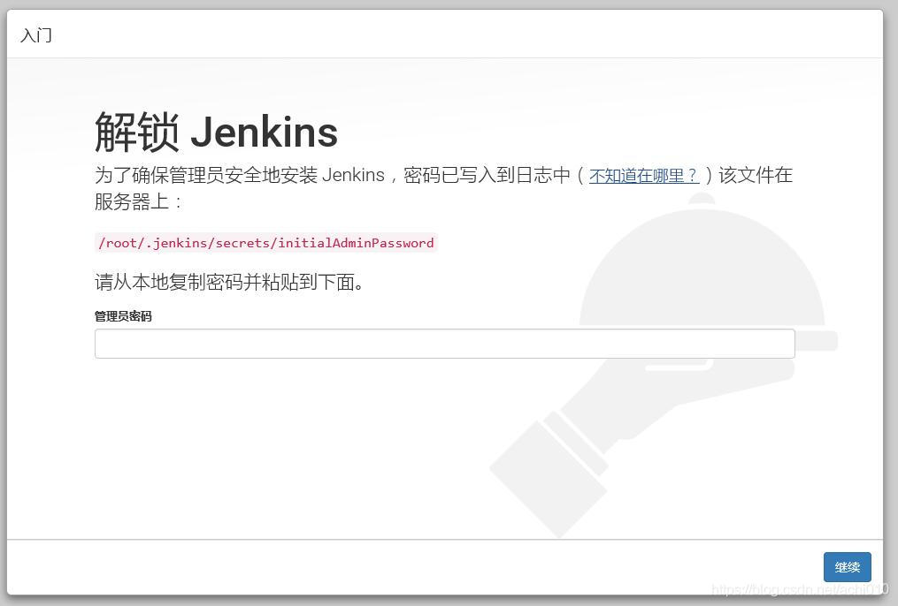


> ​	2.	在终端窗口中，使用`cat`命令显示密码

```sh
sudo cat /var/lib/jenkins/secrets/initialAdminPassword
```

从终端复制32个字符的密码，并将其粘贴到“管理员密码”字段中，然后单击“继续”。

> ​	3.	安装插件

进入页面后选择推荐的插件

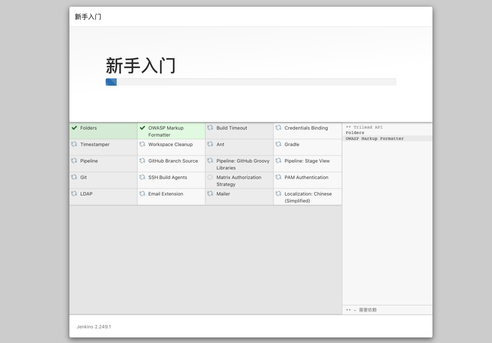

安装完成后，系统提示您设置第一个管理用户。可以跳过此步骤，并使用上面使用的初始密码作为`admin`继续使用。

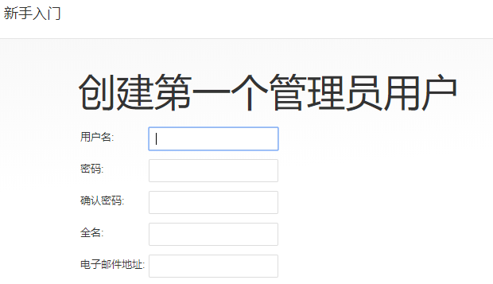


确认实例配置


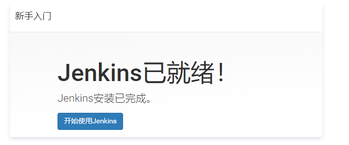

至此Jenkins已经设置ok。


## 插件配置

我们使用Jenkins部署项目会有各种不同的需求，Jenkins插件库中包含丰富的插件以帮助我们实现需求。通常使用的插件如下。

* git-parameter # 帮助我们在项目中实现参数化构建
* Publish Over SSH # 帮助我们实现持续部署


## 系统管理

> 系统配置

1. 点击系统管理进入系统管理页面

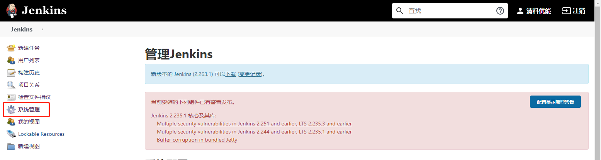


2. 点击系统配置进入配置页面，并滚动到**[Publish over SSH]()**

   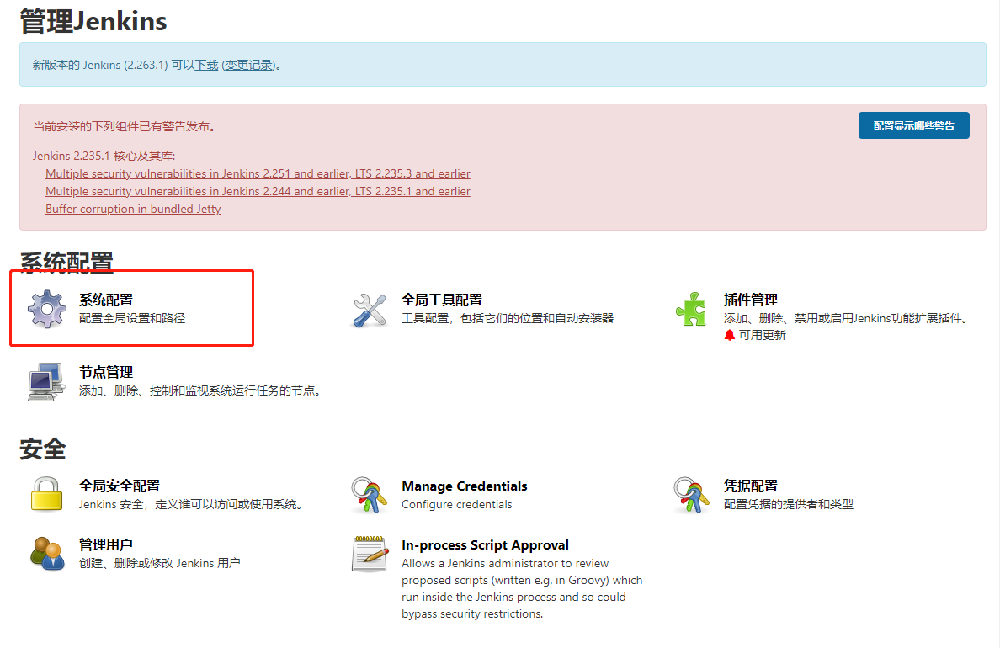

3. 生成SSH Key

   ```shell
   ssh-keygen -t rsa -C "your_email@youremail.com"
   ```

   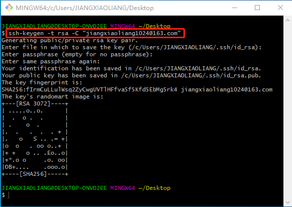

4. 获取私钥

   ```shell
   cat /home/username/.ssh/id_rsa
   ```

   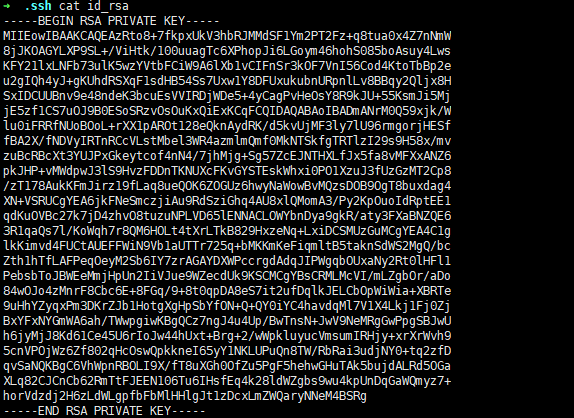

5. 配置**[Publish over SSH]()**在key字段中配置本地私钥

   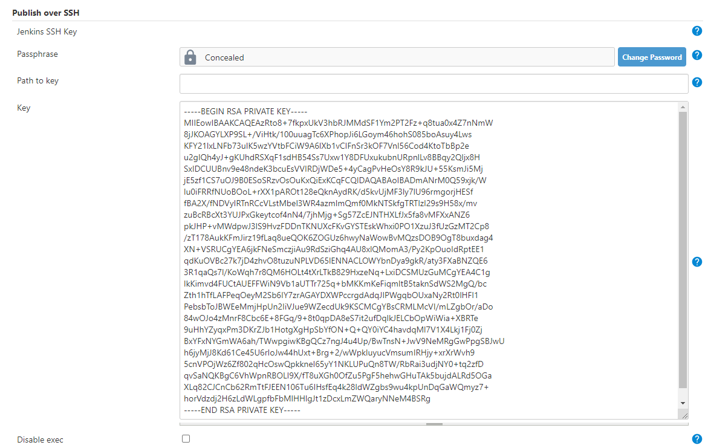

6. SSH Servers配置（[生产要能通过ssh访问]()）

   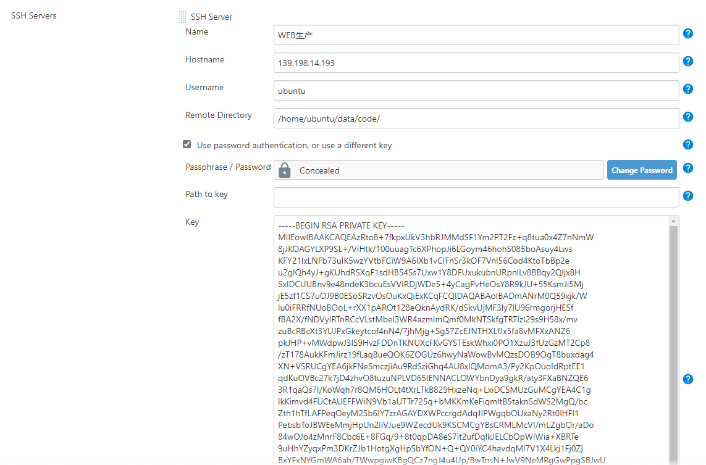

> 全局凭据

1. 获取私钥同上面步骤

2. 点击Manage Credentials进入凭据配置页面

   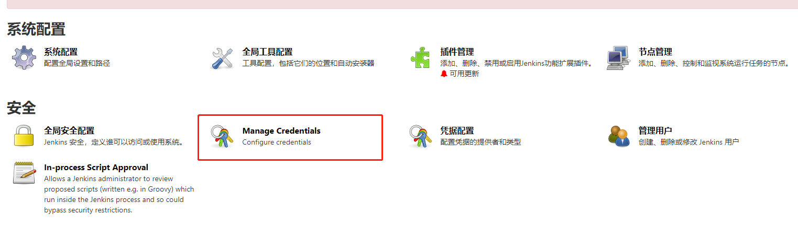

3. 如图进图添加凭据页面

   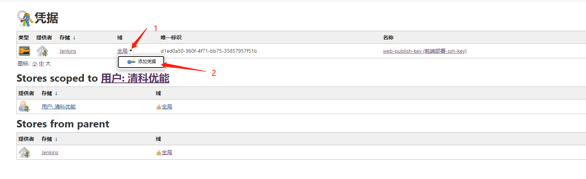

4. 按照下图进行配置即可

   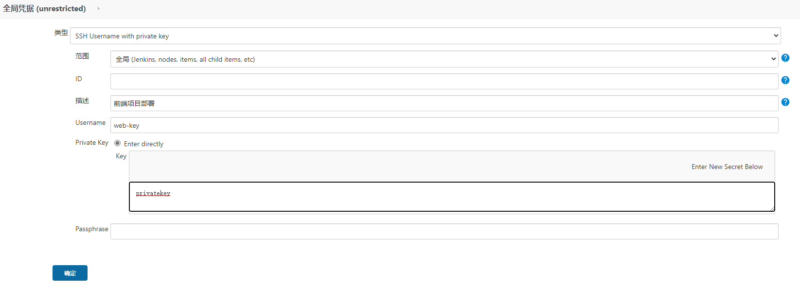

   

## 项目构建配置


> General配置

1. 描述

   填写项目描述即可

   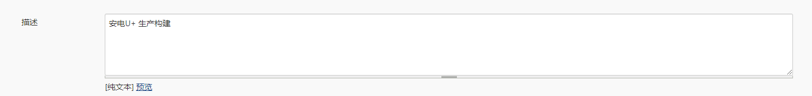

2. 

