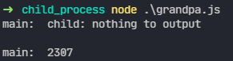
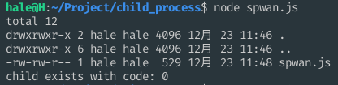
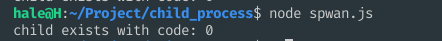
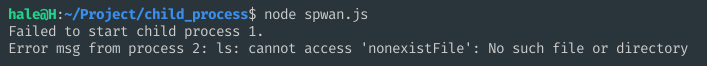
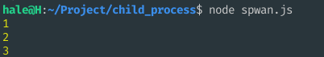
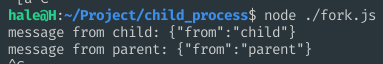

# Node 子进程

## spwan

```js
const { spwan } = require("child_process");
spwan(command[,args][,options])
```

* command <string>  要运行的命令
* args <string[]> 字符串参数列表
* options <Object>
  * cwd <string> | <URL> 子进程的当前工作目录。
  * env <Object> 环境变量键值对。 默认值: process.env
  * argv0 <string> 显示设置发送给子进程的 `argv[0]`的值。 如果未指定，则设置为 `command`
  * stdio <Array> | <string> 子进程的标准输入输出配置（参见`options.stdio`）
  * detached <boolean> 准备子进程独立于父进程运行。
  * serialization <string> 指定用于在进程之间发送消息的序列化类型。 可能值为 `'json'` 和`'advanced'`。 默认值为json
  * shell <boolean> | <string> 如果是`true`， 则在shell内运行`command`。 在Unix上使用 `'/bin/sh'`， 在Windows上使用`process.env.ComSpec`。 可以将不同的shell指定为字符串。
  * signal <AbortSignal> 允许使用中止信号中止子进程。
  * timeout <number> 允许进程运行的最长时间（以毫秒为单位）。 默认 undefined
  * killSignal <string> | <integer> 当衍生的进程将被超时或中止信号杀死是要使用的信号值。 默认值 `sigterm`


### stdio几种使用情况展示

```js
// grandpa.js
const spawn = require("child_process").spawn;
const ls = spawn("node", ["father.js"], {cwd: "."});

ls.stdout.on("data", (data) => {
    console.log("main: ", data.toString());
});

ls.stderr.on("data", (data) => {
    console.log(`stderr: ${data}`);
});

ls.on("close", (code) => {
    console.log(`child process exited with code ${code}`);
});

// father.js
const spawn = require("child_process").spawn;
spawn("node", ["grandson.js"], {stdio: "inherit"});
console.log("child: nothing to output");

// son.js
let count = 0;
for (let i = 0; i < 100; i++) {
    count += ~~(Math.random() * i);
}
console.log(`${count}` + "\n");

```



```js
// spwan.js
var ls = spawn('ls', ['-al'], {
    stdio: 'inherit'
});

ls.on('close', function(code){
    console.log('child exists with code: ' + code);
});
```



```js
// spwan.js
var ls = spawn('ls', ['-al']);

ls.on('close', function(code){
    console.log('child exists with code: ' + code);
});
```



这里说一下options.stido属性，value可能是以下之一：

* 'pipe'：相当于`['pipe', 'pipe', 'pipe']` (默认情况)
* 'overlapped'：相当于 `['overlapped', 'overlapped', 'overlapped']`
* 'ignore'： 相当于  `['ignore', 'ignore', 'ignore']`
* 'inherit'： 相当于  `['inherit', 'inherit', 'inherit']` 或 `[0, 1, 2]`

否则，`options.stdio` 的值是一个数组，其中每个索引对应于子进程中的文件描述符。 文件描述符 0、1 和 2 分别对应于标准输入、标准输出和标准错误。 可以指定额外的文件描述符以在父进程和子进程之间创建额外的管道。 该值是以下之一：

1. `'pipe'`：在子进程和父进程之间创建管道。 管道的父端作为 [`subprocess.stdio[fd\]`](http://nodejs.cn/api/child_process.html#subprocessstdio) 的 `child_process` 对象的属性暴露给父进程。 为文件描述符 0、1 和 2 创建的管道也可分别用作 [`subprocess.stdin`](http://nodejs.cn/api/child_process.html#subprocessstdin)、[`subprocess.stdout`](http://nodejs.cn/api/child_process.html#subprocessstdout) 和 [`subprocess.stderr`](http://nodejs.cn/api/child_process.html#subprocessstderr)。
2. `'overlapped'`：与 `'pipe'` 相同，只是在句柄上设置了 `FILE_FLAG_OVERLAPPED` 标志。 这对于子进程的标准输入输出句柄上的重叠 I/O 是必需的。 有关更多详细信息，请参阅[文档](http://url.nodejs.cn/dxU267)。 这与非 Windows 系统上的 `'pipe'` 完全相同。
3. `'ipc'`：创建 IPC 通道，用于在父子进程之间传递消息/文件描述符。 一个 [`ChildProcess`](http://nodejs.cn/api/child_process.html#class-childprocess) 最多可以有一个 IPC 标准输入输出文件描述符。 设置此选项将启用 [`subprocess.send()`](http://nodejs.cn/api/child_process.html#subprocesssendmessage-sendhandle-options-callback) 方法。 如果子进程是 Node.js 进程，则 IPC 通道的存在将启用 [`process.send()`](http://nodejs.cn/api/process.html#processsendmessage-sendhandle-options-callback) 和 [`process.disconnect()`](http://nodejs.cn/api/process.html#processdisconnect) 方法，以及子进程中的 [`'disconnect'`](http://nodejs.cn/api/process.html#event-disconnect) 和 [`'message'`](http://nodejs.cn/api/process.html#event-message) 事件。
4. `'ignore'`：指示 Node.js 忽略子进程中的文件描述符。 虽然 Node.js 将始终为其衍生的进程打开文件描述符 0、1 和 2，但将文件描述符设置为 `'ignore'` 将导致 Node.js 打开 `/dev/null` 并将其附加到子进程的文件描述符。
5. `'inherit'`：通过相应的标准输入输出流传入/传出父进程。 在前三个位置，这分别相当于 `process.stdin`、`process.stdout` 和 `process.stderr`。 在任何其他位置，相当于 `'ignore'`。

### 例子4：错误处理，包含两种场景，这两种场景有不同的处理方式。

- 场景1：命令本身不存在，创建子进程报错。
- 场景2：命令存在，但运行过程报错。

```js
var spawn = require('child_process').spawn;

// 不存在的命令
var child = spawn('bad_command');
// 命令不存在时错误捕获
child.on('error', (err) => {
  console.log('Failed to start child process 1.');
});

// 存在的命令， 但执行会报错
var child2 = spawn('ls', ['nonexistFile']);

// 命令存在， 但在子进程运行过程中报错
child2.stderr.on('data', function(data){
    console.log('Error msg from process 2: ' + data);
});

// 不会捕捉运行时的报错
child2.on('error', (err) => {
  console.log('Failed to start child process 2.');
});
```



### 例子5：echo "hello nodejs" | grep "nodejs"

```js
var spawn = require('child_process').spawn;

var echo = spawn('echo', ['hello nodejs']);
var grep = spawn('grep', ['nodejs']);


echo.stdout.on('data', function(data){
    grep.stdin.write(data);
});

echo.on('close', function(code){
    if(code!==0){
        console.log('echo exists with code: ' + code);
    }
    grep.stdin.end();
});

grep.stdout.setEncoding('utf8');

grep.stdout.on('data', function(data){
    console.log('grep: ' + data);
});

grep.on('close', function(code){
    if(code!==0){
        console.log('grep exists with code: ' + code);
    }
});
```

### 通过child.stdin.write()写入

```js
var spawn = require('child_process').spawn;
var grep = spawn('grep', ['nodejs']);

setTimeout(function(){
    grep.stdin.write('hello nodejs \n hello javascript');
    grep.stdin.end();
}, 2000);

grep.stdout.on('data', function(data){
    console.log('data from grep: ' + data);
});

grep.on('close', function(code){
    console.log('grep exists with code: ' + code);
});
```


### 默认情况：父进程等待子进程结束。

```js
// spwan_child.js 子进程代码
var times = 0;
setInterval(function(){
    console.log(++times);
}, 1000);

// 主进程 spwan.js 代码
var child =  spawn('node', ['spwan_child.js'], {
    stdio: 'inherit'
});

child.on('close', (code) => {
    console.log("node exists with code : " + code);
});
```



上图可以发现，主进程一直hold，资源没有得到释放

### 通过child.unref()让父进程退出

调用`child.unref()` ，将子进程从父进程的时间循环中剔除。于是父进程可以愉快的退出。 这里有几个要点

1. 调用 `child.unref()`
2. 设置 `detached`为`true`
3. 设置`stdio`为`ignore` （这点容易忘记）

```js
var child = spawn('node', ['spwan_child.js'], {
    detached: true,
    stdio: 'ignore' // 备注： 如果不设置为ignore， 那么父进程还是不会退出
})
child.unref();
```


### 将stdio重定向到文件

```js
var fs = require('fs')
var { spawn } = require("child_process")

var out = fs.openSync('./out.log', 'a');
var err = fs.openSync('./err.log', 'a');
var child = spawn('node', ['spawn_child.js'], {
    detached: true,
    stdio: ['ignore', out, err]
})
chidl.unref();
```


## exec

`child_process.exec(command[, options][, callback])`

> 创建一个shell，然后再shell里执行命令。执行完成后，将stdout、stderr作为参数传入回调方法

example：

1. 执行成功，`error`为`null`；执行失败，`error`为 `Error`实例。`error.code`为错误码
2. `stdout`、`stderr`为标准输出、标准错误。默认是字符串，除非`options.encoding`为`buffer`

```js
var exec = require("child_process").exec;
// 成功的例子
exec('ls -al', function (err, stdout, stderr) {
    if(err) {
        console.error("error: " + err);
        return;
    }
    console.log('stdout: ' + stdout);
    console.log('stderr: ' + stderr);
})

// 失败的例子
exec("ls hello.txt", function(error,stdout, stderr) {
    if(error) {
        console.error("error: " + error);
        return;
    }
    console.log("stdout: " + stdout);
    console.log("stderr: " + stderr);
})
```

参数说明：

* cwd： 当前工作路径。
* env： 环境变量
* encoding： 编码方式，默认 utf8。
* shell： 用来执行命令的shell， unix上默认是`/bin/bash` ， windows上默认是`cmd.exe`
* timeout: 默认是0
* uid：执行进程的uid
* gid：执行进程的gid
* maxBuffer：标准输出、错误输出最大允许的数据量（单位为字节）， 如果超出的话，子进程就会被杀死。默认200k

notes：

1. 如果`timeout`大于0，那么，当子进程运行超过`timeout`毫秒，那么就会给进程发送`killSignal`指定的信号
2. 如果运行没有出错，那么`error`为null。如果运行出错，那么`error.code`就是退出代码，`error.signal`就会被设置成终止进程的信号。

**danger**

传入的命令，如果是用户输入的，就有可能产生类似sql注入的风险，比如

```js
exec('ls hello.txt; rm -rf *', function (error, stdout, stderr) {
    if(error) {
        console.log('error: ' + error);
        return;
    }
    console.log("stdout: " + stdout);
    console.log("stderr: " + stderr);
})
```


## execFile

`child_process.execFile(file[,args][,options][,callback])`

跟`.exec()`类似，不同点在于， 没有创建一个新的shell，至少有两点影响

1.  比`child_process.exec()`效率高一些。（实际情况不了解）
2. 一些操作，比如I/O重定向，文件glob等不支持。

`file`： 可执行的文件的名字或者路径。

example: 

```js
var child_process = require('child_process');

child_process.execFile('node', ['--version'], function(error, stdout, stderr){
    if(error){
        throw error;
    }
    console.log(stdout);
});

child_process.execFile('/Users/a/.nvm/versions/node/v6.1.0/bin/node', ['--version'], function(error, stdout, stderr){
    if(error){
        throw error;
    }
    console.log(stdout);
});
```


## fork

`child_process.fork(modulePath[,args][,options])`

`modulePath`: 子进程运行的模块

参数说明： 

* execPath：用来创建子进程的可执行文件， 默认是`/usr/local/bin/node`。也就是说，你可以通过`execPath`来指定具体的node可执行文件路径。（比如多个node版本）
* execArgv：传给可执行文件的字符串参数列表。 默认是`process.execArgv`， 跟父进程保持一致
* silent： 默认是`false`,即子进程的`stdio`从父进程继承。如果是`true`， 则直接`pipe`箱子进程的`child.stdin`、`child.stdout`等。 即父子进程之间会建立pipe通信管道。
* stdio： 如果生命了`stdio`， 则会覆盖`silent`选项的设置。

```js
// fork.js
const fork = require('child_process').fork;

// eg1. 控制台会打印 下图1
fork('./fork_child.js', {
    silent: false
})

// eg2. 控制台不会打印 下图2
fork('./fork_child.js', {
    silent: true
})

// eg3. 控制台打印 下图3
var child = fork("fork_child.js", {
    silent: true
})
child.stdout.setEncoding("utf8");
child.stdout.on('data', function(data) 【
	console.log(data)
)

// fork_child.js
console.log('output from the child');
```


### IPC通道

```js
// fork.js
var fork = require("child_process").fork;
var child = fork('./fork_ipc_child.js');
child.on('message', function(data) {
    console.log("message from child: " + JSON.stringify(data))
})

child.send({from: 'parent'})

// fork_ipc_child.js
process.on('message', function(m) {
    console.log('message from parent: ' + JSON.stringify(m))
});
process.send({ from: 'child'});
```



