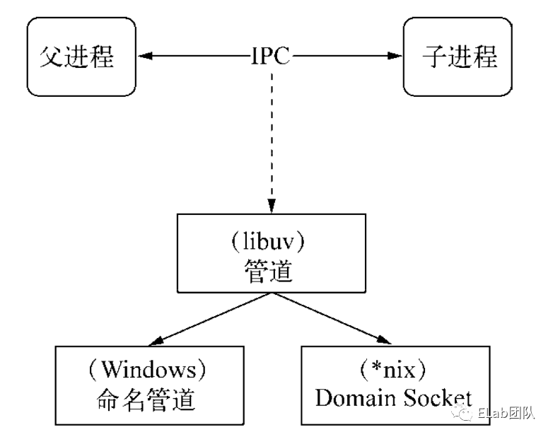
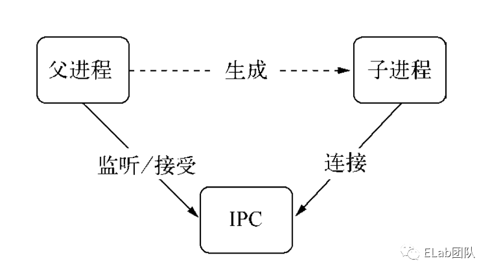
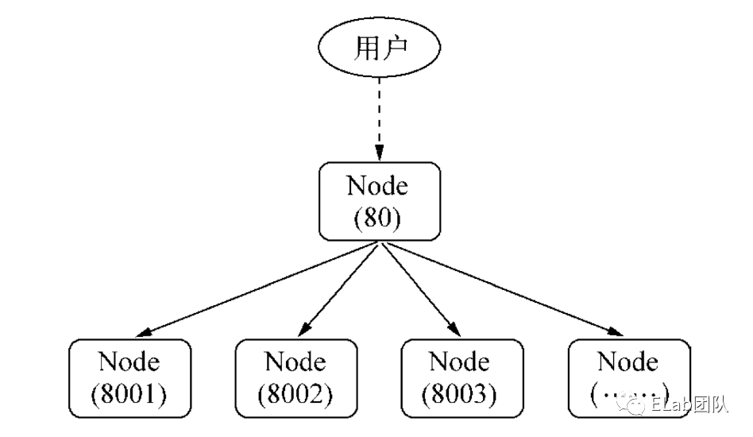
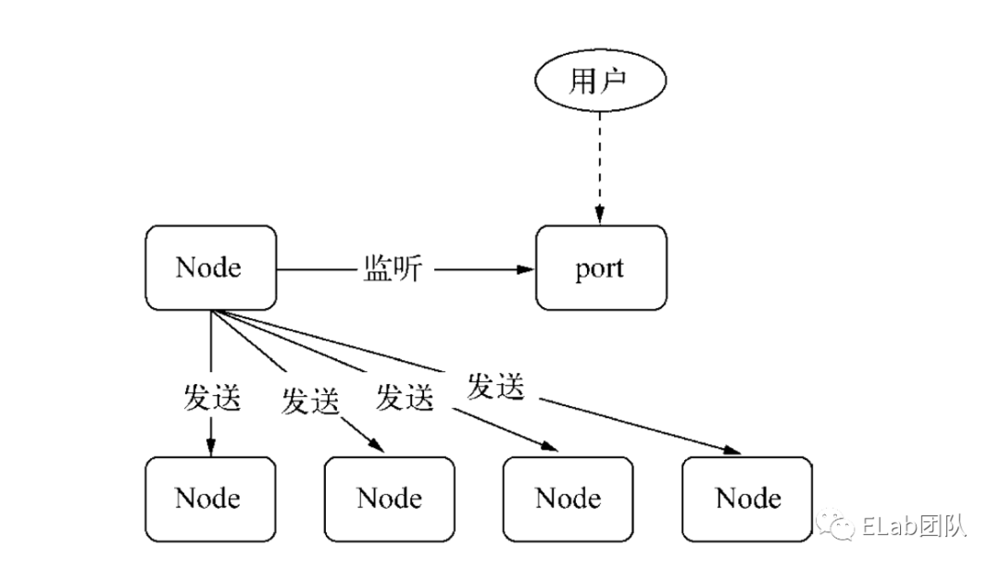

# Node

## worker_threads

> worker_threads的应用主要聚焦在高CPU计算，低I/O的场景上，比如像现在比较火热的AI，挖矿计算。
>
> Note: worker_threads 是在 10. x 版本提出的，但是在使用时，还需要加上`--experimental-worker` flag, 不过不想加flag的话，把node版本切到11.7以上就行。

worker_threads抽象上提供mainThread和worker。其中：

* mainThread相当于就是nodejs的主线程
* worker是单独吊起的worker子线程

mainThread通过`newWorker`去实例化子线程，然后通过MessageChannel来和worker通信。

这里参考官网栗子，下面的demo code，描述的是一个文件即作为mainThread，也作为worker的执行。

```js
const {  Worker, isMainThread, parentPort, workerData } = require('worker_threads');

if (isMainThread) {
 // 通过 isMainThread 判断，是否是 worker 还是 mainthread
  module.exports = async function parseJSAsync(script) {
    return new Promise((resolve, reject) => {
        // 通过 __dirname 引用自身文件创建 worker
      const worker = new Worker(__filename, {
        workerData: script
      });
      worker.on('message', resolve);
      worker.on('error', reject);
      worker.on('exit', (code) => {
        if (code !== 0)
          reject(new Error(`Worker stopped with exit code ${code}`));
      });
    });
  };
} else {
  // 执行高 CPU 计算
  const { parse } = require('some-js-parsing-library');
  const script = workerData;
  parentPort.postMessage(parse(script));
}
```

#### 初始化 worker

官方提供了Worker类，用来进行 Worker 的初始化工作。 基本格式为：

```js
new Worker(filename[,options])
```

这里，可以通过两种方式来写一个worker内容，一种是文件、另一种是eval代码。

* 使用文件初始化worker

  现在已经写好了worker.js ， 文件路径为`/abs/to/worker.js`。那么，在mainThread就可以初始化一个worker.js

  ```js
  let workerr = new Worker("/abs/to/worker.js")
  ```

* 使用eval初始化worker

  使用eval执行的话，需要设置一下new Worker的eval参数，将其手动设置为true

  ```js
  new Workerr(code, {  eval: true })
  ```

  可以看一下实例代码：

  ```js
  let code = `
  	fib(8);
  	function fib(n) {
  		if(n<2) {
  			return n;
  		}
  		return fib(n-1) + fib(n-2);
  	}
  `;
  // 使用eval代码执行
  let worker = new Worker(code, { eval: true});
  ```

  有时候在进行初始化时，worker其实还依赖于mainThread传入的一些常用变量。nodejs提供了worker data来帮助coder完成这件事。

#### 传递给worker的初始数据

worker data的传递，只需要将对应的数据，赛格 new Worker的初始化 `worker data`参数。

```js
new Worker(path, { workerData: data })
```

需要注意的是， worker data遵循的是HTML structured clone algorithm， 传递给 worker时， 会deep-clone一份，防止数据的循环引用和保证两个线程之间的数据独立性。也就是说，该worker data中的数据只能包含一些基础类型：

* 不能传递函数， 保证两个线程的独立性
* 可以传 Object， Array， Buffer之类的

#### 在worker中，如何调用work data的具体数据呢

在workerr.js里面， 通过worker_threads模块提供的workerData来获取。

```js
// mainThread.js
new Worker('worker.js', { 
    workerData: {
    	website: 'aaa.com'
    }
})
// worker.js
const {
    workerData
} = require("worker_threads");

// 直接通过workerData来获取
let { website } = workerData
```

#### worker 的通信

Worker 的通信主要是IPC模式， 和 webWorker一样，也是通过MessagePort来互传消息。


#### Mainthread 向 threadWorker发消息

主要利用worker实力上挂载的postMessage方法来实现。

```js
let worker = new Worker('worker.js');
worker.postMessage("欢迎，HelloWorld！")
```

worker上接收mainThread 传递的消息，利用`worker_threads`模块提供的`parentPort` 成员对象来。

```js
const {
    parentPort
}  = require("worker_threads");
parentPort.on("message", msg => {
    console.log(msg); // 欢迎，HelloWorld！
})
```

Node: 这里有个很重要的点需要注意下，如果你通过`parentPort`监听了`message`事件，那么该workerr是不会自动中断的，除非你手动`terminate`掉它。

#### threadWorker 向 mainThread发消息

那么返回来，在worker中，怎么个mainThread传递消息？ 还是需要利用`parentPort`对象上， 挂载的postMessage方法。

```js
// worker.js
const {
    parentPort
}  = require('worker_threads');
// 向mainThread 传递信息
parentPort.postMessage("received")
```

#### worker_threads最佳实践

在使用worker的过程中，通常是将高CPU的计算放在worker中运行。根据通信的模式，可以分为两种：

* 每次接受任务时，单独创建一个原始的worker任务， 使用完毕后销毁
* 预先根据cpu核数，创建线程池，去执行所有的任务

上面两种模式的选取主要是根据业务的模式，不过一般情况下使用线程池会更高效些，因为，重复创建相同的worker的话， 每次都要经过一遍js code 的解码，编译， 执行的过程，还是有一定的性能损耗的。

所以，官方是能用线程池，就不要每次创建worker。线程池的实现，主要在于worker_pool的算法，里面最重要功能是需要实现worker的调度。

**推荐：**worker_pool, node-worker-threads-pool, 这个库判断worker是否 空闲， 有个取巧的办法，就是当worker调用`parentPort.postMessage("xxx")`API， 返回结果时，就认为该worker已经处于空闲状态了。


## workerThread vs cluster vs childprocess

说到压榨CPU性能的点，nodejs中，除了使用worker_threads之外，还有两个模块也能做到，一个是`cluster`、一个是`child_process`。

#### cluster

cluster是一个master process中，通过`cluster.fork()`来实例化多个node v 8实例。可以说 cluster 是多进程的模块， 常常用来处理多进程的node服务，比如像pm 2。

它的使用方式比较重，每次都需要创建一个进程，并初始化自身的node实例，像event-loop，每个进程都是独立的，所以单个进程发生失败，并不会影响到主进程的稳定性。

#### child_process

child_process 模块你可以只理解为，它就是一个进程吊起的模块，比如，常常用到的：

* fork
* exec
* spawn

它的执行并不仅仅限于nodejs， 你用其他语言实现也可以，比如说 python， c++二进制文件等。而child_process里面就不存在所谓的通信，父进程通过获得紫禁城的stderr, stdout, stdio, stdin来输出。它进程之间传输数据比较难用，没有所谓的 structure clone 的方式去传递一些对象数据之类的。

#### worker_threads

worker_threads和上面两者其实都不同，它并没有脱离当前v 8 的晋城市里， 而是在其中，创建线程，而这些线程和进程类似，都有自己独立的OS-level API, 兵器可以使用绝大多数node模块。较上面说，worker_threads有以下优势：

* 单进程，多线程
* 线程间通信方便，通过MessageChannel模式，实现基于时间的跨线程通信
* 可以使用SharedArrayBuffer，实现多个worker公用高效内存
* 使用简单，在一个node v 8 实例中， 共用同一个event-loop队列。


## IPC 通信

IPC即进程间通信，可以让不同进程之间能够相互访问资源并协调工作。




实际上，父进程会在创建子进程之前， 会先创建IPC通道并监听这个IPC，然后再创建子进程，通过环境变量（NODE_CHANNEL_FD）告诉子进程和IPC通道相关的文件描述符，子进程启动的时候根据文件描述符连接IPC通道，从而和父进程建立连接。




## 句柄传递

句柄是一种可以用来标识资源的引用的，它的内部包含了指向对象的文件资源描述符。

一般情况下，当我们想要多个进程监听到一个端口下，可能会考虑使用主进程代理的方式处理：



然而， 这种代理方案会导致每次请求的接收和代理转发用掉两个文件描述符，而系统的文件描述符是有限的，这种方式会影响系统的扩展能能力。

所以，为什么要使用句柄？原因是在实际应用场景下，建立IPC通信后可能会涉及到比较复杂的数据处理场景，句柄可以作为`send()`方法的第二个可选参数传入，也就是说可以直接将资源的标识通过IPC传输，避免了上面所说的代理转发造成的文件描述符的使用。




以下是支持发送的句柄类型：

* net.Socket
* net.Server
* net.Native
* dgram.Socket
* dgram.Native
