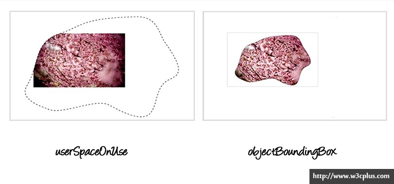

# SVG

## clip-path

> CSS 和 SVG 有很多共同之处。 CSS 有很多特性都是从SVG中引入过来的。其中就有“剪切”的特性。CSS 和 SVG 都允许我们对一个元素进行非矩形的剪切。以下将介绍CSS 和 SVG中的剪切技术。

### 剪切是什么

剪切是一个图形化操作，可以隐藏元素，被剪切的元素可以是一个容器也可以是一个image。元素的哪些部分显示是由剪切路径来决定的。


`剪切路径`定义了一块区域，区域外的内容会被隐藏，区域内的信息会被显示。该区域被称为**裁剪区域**


### CSS中的剪切 -- clip-path属性

`clip-path`属性是CSS MASKING模块的一部分。自从2000年以来，剪切都只是SVG中的一部分，现在将这个功能引入到CSS的Masking模块中，所以现在可以对HTML元素和SVG元素进行剪切。


`clip-path`属性是指顶一个应用到元素上的剪切路径。 应用在SVG中`<clipPath>` 元素上的属性值可以完全运用在`clip-path`的属性上。你还可以使用CSS Shapes模块中的`基本形状`来定义剪切路径。 这些形状你可以使用形状函数来创建。这些形状函数包括`polygon()`、 `circle()`、`inset()` 和 `ellipse()`。


使用`clip-path`属性讲一个剪切路径运用在一个元素上非常的简单：

```html
<style>
    /* SVG中的clipPath的使用 */
    .element { clip-path: url(#svgClipPathID); } 
    
    /* 使用CSS中的基本图形函数 */
    .element { clip-path: polygon(...);}
    
    img { clip-path: polygon(626px 463px,765px 236px,687px 31px,271px 100px,70px 10px,49px 250px,133px 406px,374px 462px,529px 393px); }
</style>
<body>
    
</body>

```

应用上面的代码之后，图像将显示如下


​																			[查看DEMO](http://codepen.io/airen/pen/wglAe)


`<clipPath>`元素包括很多个基本图形（`<rect>`，`<circle>`等），`<path>`元素，甚至是`<text>`元素。

如果在`<clipPath>`中通过`<text>`指定文本，那么这个文本会被当成是一个剪切路径，不管文本是否课件，文本外的区域都将被剪切掉。

**注意**：你可以使用任何文本作为剪切路径。例如：使用动画图片（gif），甚至是视频，然后选择你需要的文本进行剪切。这里是没有任何的限制。看以下示例：

```html
<svg height="0" width="0">
    <defs>
        <clipPath id="svgTextPath">
            <text x="0" y="300" textLength="800px" lengthAdjust="spacing" font-family="Vollkorn" font-size="230px" font-weight="700" font-style="italic"> Blossom </text>
        </clipPath>
    </defs>
</svg>
```


​																			[查看DEMO](http://codepen.io/airen/pen/vyEzH)

### 剪切路径的参考盒子

除了剪切路径本身，还可以给剪切路径应用一个`<basic-shape>`顶一个一个剪切路径的参考盒子。也就是说，可以使用一个剪切的基本函数创建一个剪切路径。其中餐你考盒子只能使用CSS的 `clip-path`来指定形状路径， 而不能使用SVG的 `<clipPath>`。 对于SVG的 `<clipPath>`参考盒子是一个`border-box`元素。

如果`<basic-path>`制作的剪切路径运用在一个SVG元素上，参考盒子可以是：

* **fill-box**：使用对象的边缘作为参考盒子
* **stroke-box**：使用路径作为参考盒子
* **view-box**：如果没有指定`viewBox`将使用最近的SVG视窗作为参考盒子，如果`viewBox`创建了，则会根据`viewBox`的原点坐标和维度来创建参考盒子。

如果为SVG元素设置CSS盒子模型中的任何一种作为参考盒子，则会使用`fillBox`值，如果使用SVG来作为一个HTML元素的参考盒子，则会使用`border-box`盒模型。

```css
.element { 
    clip-path: polygon(...) padding-box; 
}

```

如果参考盒子没有使用`clip-path`来指定， 浏览器会使用指定的盒子的边缘，包括圆角图形（border-radius）作为剪切路径。

如以下示例：

```css
.el {
    clip-path: border-box;
    border-radius: 25%; 
}

```


### 叠加情况、指针事件和动画下的clip-path的注意事项

特别注意， 如果任何都设置默认值， `clip-path`属性将会创建一个类似于透明元素。

此外，根据Masking规范，鼠标事件在图形的`clipped-out`区域外是无效的。


绿色区域表示可以相应鼠标事件。左图为标签规范的行为，右图表示非标签规范行为。

剪切路径还可以使用动画效果。[详情了解](http://sarasoueidan.com/blog/animating-css-shapes/)

​																			[查看DEMO](http://codepen.io/airen/pen/wqIhC)


### SVG中的剪切--- `<clipPath>` 元素

一个`<clipPath>`可以包含一个`<use>`元素或者`<script>`。

注意， 在`<clipPath>`元素中使用`<use>`元素，只能引用一些简单的SVG的图形。

`<clipPath>`可以包括一个使用`<animate>`,`<animateColor>`，`<animateMotion>`，`<animateTransform>`或`<set>`创建的动画。

使用多个`<circle>`制作的剪切路径，并且添加了一个简单的动画效果作为演示。

```html
<svg height="0" width="0"> 
    <defs> 
        <clipPath id="svgPath"> 
            <circle stroke="#000000" stroke-miterlimit="10" cx="50" cy="50" r="40"> 
                <animate attributeName="r" attributeType="XML" from="0" to="250" begin="0s" dur="3s" fill="freeze" repeatCount="indefinite"/> 
            </circle> 
            <circle stroke="#000000" stroke-miterlimit="10" cx="193.949" cy="235" r="74.576"> 
                <animate attributeName="r" attributeType="XML" from="0" to="250" begin="0s" dur="3s" fill="freeze" repeatCount="indefinite"/> 
            </circle>
        </clipPath> 
    </defs> 
</svg> 
```

​																		[查看DEMO](http://codepen.io/airen/pen/GAgqw)

**请注意**，`<clipPath>`的内容也不能包括`<g>`。例如我们给多个圆`<circle>`放在一个组里`<g>`，那么它不能正常工作，剪切路径不会运用到图片上。

### clipPathUnits属性

`<clipPath>`元素包括很多个属性，比如`id`,`class`,`transform`和像`fill`和`stroke`这样的[显示属性](http://www.w3.org/TR/2011/REC-SVG11-20110816/intro.html#TermPresentationAttribute)以及[其他更多属性](http://www.w3.org/TR/2011/REC-SVG11-20110816/styling.html#SVGStylingProperties)。其中最有用的是`clipPathUnits`属性。

`clipPathUnits`主要用来给`<clipPath>`元素内容指定一个坐标系统。

它具有两个值：`objectBoundingBox`和`userSpaceOnUse`，其中`userSpaceOnUse`是默认值。

* userSpaceOnUse

  `clipPathUnits`主要用来给`<clipPath>`元素内容指定一个坐标系统。它具有两个值：`objectBoundingBox`和`userSpaceOnUse`，其中`userSpaceOnUse`是默认值。

* objectBoundingBox

  坐标系统的原点是在元素的边框盒子的左上角顶点处，同样适于剪切路径。这个边框是SVG元素对象的边框(它只是包含了一个或多个几何图形形状)和一个HTML元素设置`border-box`的盒模型是相关联的。




`<clipPath>`元素不会直接在页面上呈现，他唯一的作用就是可以通过`clip-path`来引用。`display`属性不能运用于`<clipPath>`元素上，因此，就算`display`设置`none`外的其他值，`<clipPath>`元素也不会直接呈现。


## feColorMatrix

当谈到颜色处理，`feColorMatrix`是最好的选择。`feColorMatrix`是过滤中的一种类型，使用矩阵来影响颜色的每个通道（基于RGBA），你可以将其想象成Photoshop中通道编辑一样。

```html
<filter id="linear"> 
    <feColorMatrix 
                   type="matrix"
                   values="R 0 0 0 0 
                           	    0 G 0 0 0 
                           	    0 0 B 0 0 
                           	    0 0 0 A 0 ">
    </feColorMatrix> 
</filter>
```

矩阵计算RGBA自己每行的最终值，每个RGBA通道有自身的RGBA通道。最后一个是乘数。最后RGBA的值从上向下读，如下表：

```js
/* R G B A 1 */
1 0 0 0 0 // R = 1*R + 0*G + 0*B + 0*A + 0
0 1 0 0 0 // G = 0*R + 1*G + 0*B + 0*A + 0 
0 0 1 0 0 // B = 0*R + 0*G + 1*B + 0*A + 0 
0 0 0 1 0 // A = 0*R + 0*G + 0*B + 1*A + 0
```


### RGB 值

#### 着色

你可以遗漏或混合颜色通道给图像着色，like this ↓

```html
<!-- lacking the B & G channels (only R at 1) --> 
<filter id="red"> 
    <feColorMatrix 
                   type="matrix" 
                   values="1 0 0 0 0 
                                 0 0 0 0 0 
                           	    0 0 0 0 0
                           	    0 0 0 1 0 "/> 
</filter> 
<!-- lacking the R & G channels (only B at 1) --> 
<filter id="blue"> 
    <feColorMatrix 
                   type="matrix" 
                   values="0 0 0 0 0 
                           	    0 0 0 0 0 
                           	    0 0 1 0 0 
                           	    0 0 0 1 0 "/> 
</filter> 
<!-- lacking the R & B channels (only G at 1) --> 
<filter id="green"> 
    <feColorMatrix 
                   type="matrix" 
                   values="0 0 0 0 0
                                 0 1 0 0 0 
                           	    0 0 0 0 0 
                           	    0 0 0 1 0 "/> 
</filter>

```

这就是将`green`过滤器添加到图像上，其结果看起来如下：


#### ALPHA值

我们可以通过`alpha`（第四列）来突出阴影和亮度。第四行受`alpha`通道影响，而第四列将影响每个通道的亮度值，如：

```html
<!-- Acts like an opacity filter at .5 --> 
<filter id="alpha"> 
    <feColorMatrix 
                   type="matrix" 
                   values="
                           1 0 0 0 0 
                           0 1 0 0 0 
                           0 0 1 0 0 
                           0 0 0 .5 0 "/> 
</filter> 

<!-- increases green opacity to be on the same level as overall opacity --> 
<filter id="hard-green"> 
    <feColorMatrix 
                   type="matrix" 
                   values="
                           1 0 0 0 0 
                           0 1 0 1 0 
                           0 0 1 0 0 
                           0 0 0 1 0 "/> 
</filter> 

<filter id="hard-yellow">
    <feColorMatrix 
                   type="matrix" 
                   values="
                           1 0 0 1 0
                           0 1 0 1 0
                           0 0 1 0 0 
                           0 0 0 1 0 "/> 
</filter>
```

在接下来的示例中，红色的矩阵基础上给`blue`的通道添加了`100%`的`alpha`。我们还保留`red`值，覆盖任何`red`的痕迹，会变成`blue`，而红色的亮度值中`blue`和`red`混合将成为`magenta`。

```html
<filter id="blue-shadow-magenta-highlight"> 
    <feColorMatrix 
                   type="matrix" 
                   values="
                           1 0 0 0 0
                           0 0 0 0 0 
                           0 0 1 1 0 
                           0 0 0 1 0 "/> 
</filter>

```


如果最后一个值小于`0`(变成`-1`)，就会得到相反效果。`blue`的痕迹就会变成`red`。下面就是取值为`-1`的效果：

```html
<filter id="red-overlay"> 
    <feColorMatrix 
                   type="matrix" 
                   values="
                           1 0 0 0 0 
                           0 0 0 0 0 
                           0 0 1 -1 0 
                           0 0 0 1 0 "/> 
</filter>
<filter id="identical-red-overlay"> 
    <feColorMatrix 
                   type="matrix" 
                   values="
                           1 0 0 0 0 
                           0 0 0 0 0 
                           0 0 0 0 0 
                           0 0 0 1 0 "/> 
</filter>
```


#### Blowing out channels

我们也可以通过第四行的个人通道影响整个`alpha`通道。示例中有一个蓝色的天空，可以将蓝色的天空变成白色，如下：

```html
<filter id="elim-blue"> 
    <feColorMatrix 
                   type="matrix"
                   values="
                           1 0 0 0 0
                           0 1 0 0 0
                           0 0 1 0 0
                           0 0 -2 1 0 "/>
</filter>
```


下面演示几个混合通道的示例：

```html
<!-- No G channel, Red is at 100% on the G Channel, so the G channel looks Red (luminosity of G channel lost) -->
<filter id="no-g-red">
	<feColorMatrix 
		type="matrix" 
		values="
			1 1 0 0 0
		 	 0 0 0 0 0
			0 0 1 0 0 
			0 0 0 1 0 " />
</filter>
<!-- No G channel, Red and Green is at 100% on the G Channel, so the G Channel looks Magenta (luminosity of G channel lost) -->
<filter id="no-g-magenta">
	<feColorMatrix 
		type="matrix" 
		values="
			1 1 0 0 0
		 	 0 0 0 0 0
			0 1 1 0 0 
			0 0 0 1 0 " />
</filter>
<!-- G channel being shared by red and blue values. This is a colorized magenta effect (luminosity maintained) -->
<filter id="yes-g-colorized-magenta">
	<feColorMatrix 
		type="matrix" 
		values="
			1 1 0 0 0
		 	 0 1 0 0 0
			0 1 1 0 0 
			0 0 0 1 0 " />
</filter>
```


### 颜色矩阵常用效果

***1、调整亮度：***

亮度(N取值为-255到255) 
1,0,0,0,N
0,1,0,0,N
0,0,1,0,N
0,0,0,1,0

我们只需要设置一下RGB的色彩偏移就能调节其亮度。


**2、颜色反向**
-1,0,0,0,255

0,-1,0,0,255

0,0,-1,0,255

0,0,0,1,0

先解释一下颜色反向：就是把0变为255，255变为0，1变为254，254变为1.....

因此，我们只需把RGB通道的原通道乘数设为－1，然后再把色彩偏移量设为255就行了。


**3、图像去色：**

0.3086, 0.6094, 0.0820, 0, 0
0.3086, 0.6094, 0.0820, 0, 0
0.3086, 0.6094, 0.0820, 0, 0
0  , 0  , 0  , 1, 0

1）、首先了解一下去色原理：只要把RGB三通道的色彩信息设置成一样；即：R＝G＝B，那么图像就变成了灰色，并且，为了保证图像亮度不变，同一个通道中的R+G+B=1:如：0.3086+0.6094+0.0820＝1；

2）、三个数字的由来：0.3086, 0.6094, 0.0820；

按理说应该把RGB平分，都是0.3333333。三个数字应该是根据色彩光波频率及色彩心理学计算出来的（本人是这么认为，当然也查询了一些资料，目前尚未找到准确答案。

在作用于人眼的光线中，彩色光要明显强于无色光。对一个图像按RGB平分理论给图像去色的话，人眼就会明显感觉到图像变暗了（当然可能有心理上的原因，也有光波的科学依据）另外，在彩色图像中能识别的一下细节也可能会丢失。我假想：可能绿色的一些东西会丢失。


同样的RGB，给人的感觉是绿色最亮，红色次之，蓝色最暗。它们的比例大概是3：6：1，即： 0.3086, 0.6094, 0.0820

所以，在给图像去色时我们保留了大量的G通道信息，使得图像不至于变暗或者绿色信息不至于丢失（我猜想）。


**4、色彩饱和度**

N取值为0到2，当然也可以更高。
0.3086*(1-N) + N, 0.6094*(1-N)  , 0.0820*(1-N)  , 0, 0,
0.3086*(1-N)  , 0.6094*(1-N) + N, 0.0820*(1-N)  , 0, 0,
0.3086*(1-N)  , 0.6094*(1-N)  , 0.0820*(1-N) + N 0, 0,
0    , 0    , 0    , 1, 0

分析：

1、当色彩饱和度低到一定成度的时候，就想当于给图像去色，所以跟第3条：图像去色，有着千丝万缕的联系，在此不想过多解释；

2、N为原有通道信息保留量；可以理解为百分之几，等于0时完全去色，小于1时降低色度，大于1时增加色度，等于2时色度翻一倍，等于3时……。注意：RGB的原有通道信息保留量都应该相等，不然会产生偏色。

3、为什么是这样的计算公式：

N是原通道色彩保留量：所以，在原通道中，我们都 + N，这是不能被别的通道瓜分的。剩余的就是（ 1－N），就让RGB按0.3086, 0.6094, 0.0820的比例还瓜分这个剩余量吧。


 **5、对比度**

N取值为0到10
N,0,0,0,128*(1-N)
0,N,0,0,128*(1-N)
0,0,N,0,128*(1-N)
0,0,0,1,0

分析：

所谓对比度就是让红的更红，绿的更绿……或反之。初一想，我们只需要修改RGB的乘数（要一至，不然偏色）。可仔细一琢磨，不对。如果只增加乘数，那么整个图像就会被漂白，（或反之）。好，有办法了，设置色彩偏移量，offset。具体要偏移多少呢，我们找到了一个折中的方案：128（1－N);即：一幅图像，不论很亮或很黑，但对比度为0了，最终得到的都是一幅中性灰度的图像（128），


**6、阈值**

所谓阈值，就是以一个色度值为基准对图像作非黑即白的处理（注意没有灰色），由于不去除了彩色属性，因此，也离不开0.3086, 0.6094, 0.0820这三组神奇的数字。

(N取值为0到255)

下面的256也可以改成255；（那样就能看到图一和图五的小黑点和小白点）；
0.3086*256,0.6094*256,0.0820*256,0,-256*N
0.3086*256,0.6094*256,0.0820*256,0,-256*N
0.3086*256,0.6094*256,0.0820*256,0,-256*N
0, 0, 0, 1, 0

分析：

先不看最后面的色彩偏移：-256*N

前面我们提及过，当RGB三个通道的色彩信息一模一样时，图像就失去了色彩（去色），从0.3086*256,0.6094*256,0.0820*256,0,-256*N可以看出：图像已经去色了，并且，（*256）亮度已经翻了256倍（当然也可以是255）；我们知道，RGB的有效值是0－255，即：0，1，2……255，把这些值乘以255以后会出现什么情况呢？但是除了0之外，别的全都大于或等于255了，所以此时的图像除了剩有几个黑点外，其它的全都变成白色了如图一（N＝0）；那么现在我们再作色彩偏移处理：把RGB都减去255；上次值为255（白色）的现在又变成0（黑色了）超过255的仍然是白色，我们不断的反复减255，图2，图3，图4，图5，分别是N＝64，N＝128，n=192,n=255时的图像


**7、色彩旋转**

所谓色彩旋转就是让某一个通道的色彩信息让另一个通道去显示；比如，R显示G的信息，G显示B的信息，B显示R的信息，也可以只拿出一部份信息让给别的通道去显示，至于参数的瓜分可以平分。不必太讲究，但是，始终要坚持的一个原则就是每一个通道中的RGB信息量之和一定要为1，不然将会生偏色，如果您要制作偏色效果又另当别论；请偿试下面的参数：

0,1,0,0,0
0,0,1,0,0
1,0,0,0,0
0,0,0,1,0

//---------------

0,0,1,0,0
1,0,0,0,0
0,1,0,0,0
0,0,0,1,0

 

**8、只显示某个通道**

1,0,0,0,0