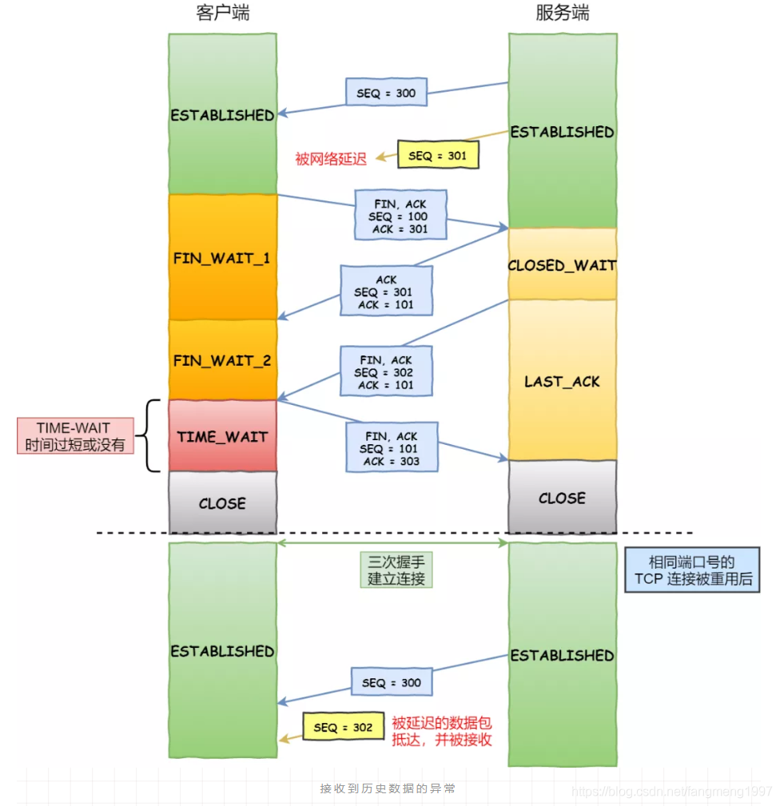
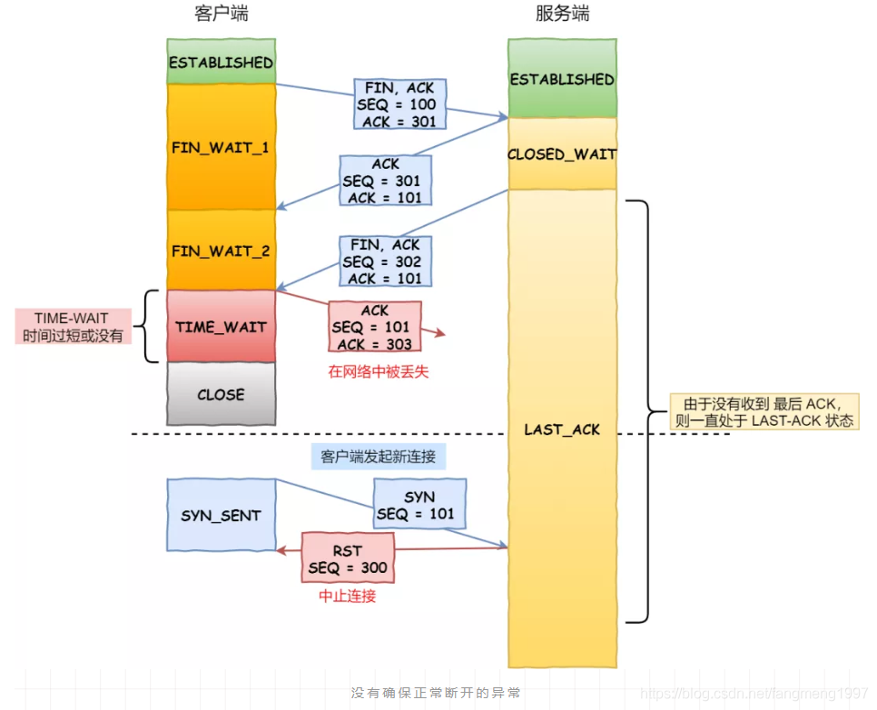

# TCP & UDP & HTTPS

## TCP三次握手

* 第一次，客户端发送了一个TCP，标志位为SYN，序列号为0，表示客户端请求建立连接，如下：

  

**关键参数**

> 1. SYN ：标志位，表示请求建立连接
> 2. Seq = 0 ：初始建立连接值为0，数据包的相对序列号从0开始，表示当前还没有发送数据
> 3. Ack = 0：初始建立连接值为0，已经收到包的数量，表示当前没有接收到数据


* 第二次，服务器发回确认包, 标志位为 SYN,ACK. 将确认序号(Acknowledgement Number)设置为客户的ISN加1以.即0+1=1, 如下图如下：

  


**关键参数**

> 1. [ SYN + ACK ] ：标志位，同意建立连接，并回送SYN+ACK
> 2. Seq = 0 ：初始建立值为0，表示当前还没有发送数据
> 3. Ack = 1：表示当前端成功接收的数据位数，虽然客户端没有发送任何有效数据，确认号还是被加1，因为包含SYN或FIN标志位。（并不会对有效数据的计数产生影响，因为含有SYN或FIN标志位的包并不携带有效数据）


* 第三次，客户端再次发送确认包(ACK) SYN标志位为0,ACK标志位为1.并且把服务器发来ACK的序号字段+1,放在确定字段中发送给对方.并且在数据段放写ISN的+1，如下图如下：

​	


> 1. ACK ：标志位，表示已经收到记录
> 2. Seq = 1 ：表示当前已经发送1个数据
> 3. Ack = 1 : 表示当前端成功接收的数据位数，虽然服务端没有发送任何有效数据，确认号还是被加1，因为包含SYN或FIN标志位（并不会对有效数据的计数产生影响，因为含有SYN或FIN标志位的包并不携带有效数据)。


## 四次揮手

1. Client端发起中断连接请求，也就是发送FIN报文。
2. Server端接到FIN报文后，意思是说"我Client端没有数据要发给你了"，但是如果你还有数据没有发送完成，则不必急着关闭Socket，可以继续发送数据。所以你先发送ACK，"告诉Client端，你的请求我收到了，但是我还没准备好，请继续你等我的消息"。这个时候Client端就进入FIN_WAIT状态，继续等待Server端的FIN报文。
3. 当Server端确定数据已发送完成，则向Client端发送FIN报文，"告诉Client端，好了，我这边数据发完了，准备好关闭连接了"。
4. Client端收到FIN报文后，"就知道可以关闭连接了，但是他还是不相信网络，怕Server端不知道要关闭，所以发送ACK后进入TIME_WAIT状态，如果Server端没有收到ACK则可以重传。“，Server端收到ACK后，"就知道可以断开连接了"。Client端等待了2MSL后依然没有收到回复，则证明Server端已正常关闭，那好，我Client端也可以关闭连接了。Ok，TCP连接就这样关闭了！


## 【问题1】为什么连接的时候是三次握手，关闭的时候却是四次握手？
* 三次握手是为了防⽌出现失效的连接请求报⽂段被服务端接收的情况，从⽽产⽣错误。
* 关闭连接
  - 关闭连接时，客户端向服务端发送 FIN 时，仅仅表示客户端不再发送数据了但是还能接收数据。
  - 服务器收到客户端的 FIN 报文时，先回一个 ACK 应答报文，而服务端可能还有数据需要处理和发送，等服务端不再发送数据时，才发送FIN 报文给客户端来表示同意现在关闭连接。

## 为什么 TIME_WAIT 等待的时间是 2MSL？
MSL 是 Maximum Segment Lifetime，报文最大生存时间，它是任何报文在网络上存在的最长时间，超过这个时间报文将被丢弃。因为TCP 报文基于是 IP 协议的，而 IP 头中有一个 TTL 字段，是 IP 数据报可以经过的最大路由数，每经过一个处理他的路由器此值就减 1，当此值为 0 则数据报将被丢弃，同时发送 ICMP 报文通知源主机。

MSL 与 TTL 的区别：MSL 的单位是时间，而 TTL 是经过路由跳数。所以 MSL 应该要大于等于 TTL 消耗为 0 的时间，以确保报文已被自然消亡。

TIME_WAIT 等待 2 倍的 MSL，比较合理的解释是：网络中可能存在来自发送方的数据包，当这些发送方的数据包被接收方处理后又会向对方发送响应，所以一来一回需要等待 2 倍的时间。

比如，如果被动关闭方没有收到断开连接的最后的 ACK 报文，就会触发超时重发 Fin 报文，另一方接收到 FIN 后，会重发 ACK 给被动关闭方， 一来一去正好 2 个 MSL。

2MSL 的时间是从客户端接收到 FIN 后发送 ACK 开始计时的。如果在 TIME-WAIT 时间内，因为客户端的 ACK 没有传输到服务端，客户端又接收到了服务端重发的 FIN 报文，那么 2MSL 时间将重新计时。

在 Linux 系统里 2MSL 默认是 60 秒，那么一个 MSL 也就是 30 秒。Linux 系统停留在 TIME_WAIT 的时间为固定的 60 秒。

其定义在 Linux 内核代码里的名称为 TCP_TIMEWAIT_LEN：

#define TCP_TIMEWAIT_LEN (60*HZ) /* how long to wait to destroy TIME-WAIT 
                                    state, about 60 seconds  */
1
2
如果要修改 TIME_WAIT 的时间长度，只能修改 Linux 内核代码里 TCP_TIMEWAIT_LEN 的值，并重新编译 Linux 内核。

## 为什么需要 TIME_WAIT 状态？

主动发起关闭连接的一方，才会有 TIME-WAIT 状态。

需要 TIME-WAIT 状态，主要是两个原因：

* 防止具有相同「四元组」的「旧」数据包被收到；
* 保证「被动关闭连接」的一方能被正确的关闭，即保证最后的 ACK 能让被动关闭方接收，从而帮助其正常关闭；

#### 原因一：防止旧连接的数据包

假设 TIME-WAIT 没有等待时间或时间过短，被延迟的数据包抵达后会发生什么呢？



* 如上图黄色框框服务端在关闭连接之前发送的 SEQ = 301 报文，被网络延迟了。
* 这时有相同端口的 TCP 连接被复用后，被延迟的 SEQ = 301 抵达了客户端，那么客户端是有可能正常接收这个过期的报文，这就会产生数据错乱等严重的问题。

所以，TCP 就设计出了这么一个机制，经过 2MSL 这个时间，足以让两个方向上的数据包都被丢弃，使得原来连接的数据包在网络中都自然消失，再出现的数据包一定都是新建立连接所产生的。

#### 原因二：保证连接正确关闭

`TIME-WAIT 作用是等待足够的时间以确保最后的 ACK 能让被动关闭方接收，从而帮助其正常关闭。`

假设 TIME-WAIT 没有等待时间或时间过短，断开连接会造成什么问题呢？




* 如上图红色框框客户端四次挥手的最后一个 ACK 报文如果在网络中被丢失了，此时如果客户端 TIME-WAIT 过短或没有，则就直接进入了 CLOSE 状态了，那么服务端则会一直处在 LASE-ACK 状态。
* 当客户端发起建立连接的 SYN 请求报文后，服务端会发送 RST 报文给客户端，连接建立的过程就会被终止。

如果 TIME-WAIT 等待足够长的情况就会遇到两种情况：

* 服务端正常收到四次挥手的最后一个 ACK 报文，则服务端正常关闭连接。
* 服务端没有收到四次挥手的最后一个 ACK 报文时，则会重发 FIN 关闭连接报文并等待新的 ACK 报文。

所以客户端在 TIME-WAIT 状态等待 2MSL 时间后，就可以保证双方的连接都可以正常的关闭。

## TIME_WAIT 过多有什么危害？

如果服务器有处于 TIME-WAIT 状态的 TCP，则说明是由服务器方主动发起的断开请求。

过多的 TIME-WAIT 状态主要的危害有两种：

* 第一是内存资源占用；
* 第二是对端口资源的占用，一个 TCP 连接至少消耗一个本地端口；

第二个危害是会造成严重的后果的，要知道，端口资源也是有限的，一般可以开启的端口为 32768～61000，也可以通过如下参数设置指定：

```shell
net.ipv4.ip_local_port_range
```

**如果服务端 TIME_WAIT 状态过多，占满了所有端口资源，则会导致无法创建新连接。**


## UDP 与 TCP 的区别是什么？

#### 1. ⾯向⽆连接

⾸先 UDP 是不需要和 TCP ⼀样在发送数据前进⾏三次握⼿建⽴连接的，想发数据就可以开始发送了。

并且也只是数据报⽂的搬运⼯，不会对数据报⽂进⾏任何拆分和拼接操作。


#### 2. 不可靠性

⾸先不可靠性体现在⽆连接上，通信都不需要建⽴连接，想发就发，这样的情况肯定不可靠。

并且收到什么数据就传递什么数据，并且也不会备份数据，发送数据也不会关⼼对⽅是否已经正确接收到数据了。

再者⽹络环境时好时坏，但是 UDP 因为没有拥塞控制，⼀直会以恒定的速度发送数据。即使⽹络条件不好，也不会对发送速率进⾏调整。这样实现的弊端就是在⽹络条件不好的情况下可能会导致丢包，但是优点也很明显，在某些实时性要求⾼的场景（⽐如电话会议）就需要使⽤ UDP ⽽不是 TCP。

#### 3. 高效

UDP 的头部开销小，只有八字节，相⽐ TCP 的至少二十字节要少得多，在传输数据报⽂时是很⾼效的

UDP 头部包含了以下几个数据：

* 两个十六位的端⼝号，分别为源端口（可选字段）和目标端口
* 整个数据报⽂的⻓度
* 整个数据报⽂的检验和（IPv4 可选 字段），该字段⽤于发现头部信息和数据中的错误

#### 4. 传输方式

UDP 不⽌⽀持⼀对⼀的传输⽅式，同样⽀持⼀对多，多对多，多对⼀的⽅式，也就是说 UDP 提供了单播，多播，⼴播的功能。


#### 5. 适合使用的场景
UDP 虽然对⽐ TCP 有很多缺点，但是正是因为这些缺点造就了它⾼效的特性，在很多实时性要求⾼的地⽅都可以看到 UDP 的身影。

* 直播
* 遊戲


## HTTPS

### https连接过程

1. 客户端发送请求到服务器端
2. 服务器端返回证书和公开密钥，公开密钥作为证书的一部分而存在
3. 客户端验证证书和公开密钥的有效性，如果有效，则生成共享密钥并使用公开密钥加密发送到服务器端
4. 服务器端使用私有密钥解密数据，并使用收到的共享密钥加密数据，发送到客户端
5. 客户端使用共享密钥解密数据
6. SSL加密建立………


### https使用上的一些问题

- 怎样保证公开密钥的有效性 

  你也许会想到，怎么保证客户端收到的公开密钥是合法的，不是伪造的，证书很好的完成了这个任务。证书由权威的第三方机构颁发，并且对公开密钥做了签名。

- https的缺点 

  https保证了通信的安全，但带来了加密解密消耗计算机cpu资源的问题 ，不过，有专门的https加解密硬件服务器

- 各大互联网公司，百度、淘宝、支付宝、知乎都使用https协议，为什么？ 

  支付宝涉及到金融，所以出于安全考虑采用https这个，可以理解，为什么百度、知乎等也采用这种方式？为了防止运营商劫持！http通信时，运营商在数据中插入各种广告，用户看到后，怒火发到互联网公司，其实这些坏事都是运营商(移动、联通、电信)干的,用了https，运营商就没法插播广告篡改数据了。

