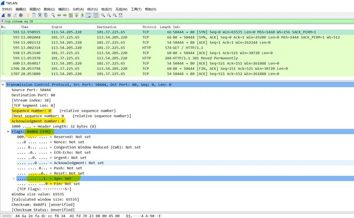
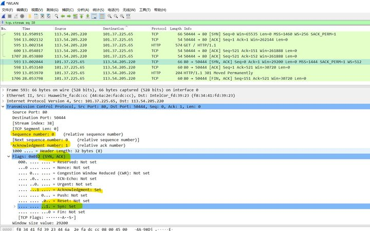
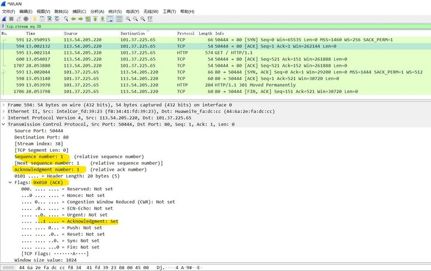

# TCP & UDP

## TCP三次握手

* 第一次，客户端发送了一个TCP，标志位为SYN，序列号为0，表示客户端请求建立连接，如下：

  

**关键参数**

> 1. SYN ：标志位，表示请求建立连接
> 2. Seq = 0 ：初始建立连接值为0，数据包的相对序列号从0开始，表示当前还没有发送数据
> 3. Ack = 0：初始建立连接值为0，已经收到包的数量，表示当前没有接收到数据

* 第二次，服务器发回确认包, 标志位为 SYN,ACK. 将确认序号(Acknowledgement Number)设置为客户的ISN加1以.即0+1=1, 如下图如下：

  

**关键参数**

> 1. [ SYN + ACK ] ：标志位，同意建立连接，并回送SYN+ACK
> 2. Seq = 0 ：初始建立值为0，表示当前还没有发送数据
> 3. Ack = 1：表示当前端成功接收的数据位数，虽然客户端没有发送任何有效数据，确认号还是被加1，因为包含SYN或FIN标志位。（并不会对有效数据的计数产生影响，因为含有SYN或FIN标志位的包并不携带有效数据）

* 第三次，客户端再次发送确认包(ACK) SYN标志位为0,ACK标志位为1.并且把服务器发来ACK的序号字段+1,放在确定字段中发送给对方.并且在数据段放写ISN的+1，如下图如下：

​	

> 1. ACK ：标志位，表示已经收到记录
> 2. Seq = 1 ：表示当前已经发送1个数据
> 3. Ack = 1 : 表示当前端成功接收的数据位数，虽然服务端没有发送任何有效数据，确认号还是被加1，因为包含SYN或FIN标志位（并不会对有效数据的计数产生影响，因为含有SYN或FIN标志位的包并不携带有效数据)。

## 四次揮手

1. Client端发起中断连接请求，也就是发送FIN报文。
2. Server端接到FIN报文后，意思是说"我Client端没有数据要发给你了"，但是如果你还有数据没有发送完成，则不必急着关闭Socket，可以继续发送数据。所以你先发送ACK，"告诉Client端，你的请求我收到了，但是我还没准备好，请继续你等我的消息"。这个时候Client端就进入FIN_WAIT状态，继续等待Server端的FIN报文。
3. 当Server端确定数据已发送完成，则向Client端发送FIN报文，"告诉Client端，好了，我这边数据发完了，准备好关闭连接了"。
4. Client端收到FIN报文后，"就知道可以关闭连接了，但是他还是不相信网络，怕Server端不知道要关闭，所以发送ACK后进入TIME_WAIT状态，如果Server端没有收到ACK则可以重传。“，Server端收到ACK后，"就知道可以断开连接了"。Client端等待了2MSL后依然没有收到回复，则证明Server端已正常关闭，那好，我Client端也可以关闭连接了。Ok，TCP连接就这样关闭了！

## 【问题1】为什么连接的时候是三次握手，关闭的时候却是四次握手？
* 当Server端收到Client端的SYN连接请求报文后，可以直接发送SYN+ACK报文。
  * ACK报文是用来应答的
  * SYN报文是用来同步的。
* 关闭连接时，当Server端收到FIN报文时
  * 并不会立即关闭SOCKET，只能先回复一个ACK报文，告诉Client端，"你发的FIN报文我收到了"。
  * 只有等到我Server端所有的报文都发送完了，我才能发送FIN报文，因此不能一起发送。故需要四步握手。