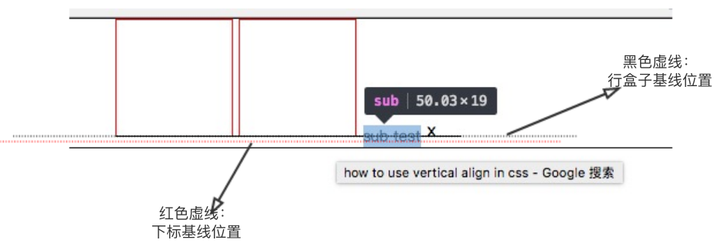

# vertical-align


> 行盒的高度由其内容最高的一个决定。如果是都是纯 inline 元素，则其高度由最高的 line-height 计算值决定；而如果包括了 inline-block，则 inline-block 的 margin（上下），border（上下），padding（上下），height 都会影响整体行盒的高度

## vertical-align

与vertical-align对应的是text-align，text-align设置元素里内容在水平方向上的对齐方式。而vertical-align属性，通常我们的理解是设置钙元素里面内容在竖直方向上的对齐方式，这种理解是**错误的**。

看四组栗子：

第一组: 父元素div内两个子div，子div内容为空，只是单纯的给定宽高，不改变vertical-align属性。

第二组: 父元素内两个子div，第二个子div内容有一个<span>right-span</span>，不改变vertical-align属性。

第三组: 父元素内两个子div，第二个子div内容有一个<span>right-span</span>，vertical-align属性设置为top。

第四组: 父元素内两个子div，两个子div里各有span标签，不改变vertical-align属性。


**解释一下：**

* 第一组:行盒子(子div的父元素)里，是两个没有内容的div（display:inline-block）,这两个div（inline box）的基线（baseline）值都是盒子margin-bottom的边界。两者对齐方式以baseline对齐，所以两个div水平对齐。

* 第二组:行盒子里，第一个div没有内容，基线是盒子的margin-bottom边界。第二个div内里有line box，所以基线就是内容文字"right-span"的基线。默认对齐方式也是以baseline对齐（vertical-align默认值baseline）,所以会呈现上述样子。

* 第三组: 设置第二个div的vertical-align为top，两个div就会水平对齐。设置为top，就不再是按照baseline对齐了，设置vertical-align:top，会让该元素的顶部（盒子的顶部边界，如果有设置margin-top值，那么顶部边界也就包括margin-top）与行盒子(line box)的顶部对齐。

  也可以设置两个div的vertical-align的值都为middle，那么原理是？设置vertical-align:middle，会让该元素盒子的垂直中点与父元素(行盒子)的baseline值+x-height的一半（字母x高度的一半）位置对齐。现在只设置第一个div的vertical-align为middle，那么效果如下图左侧显示，该元素盒子的垂直中点与行盒子的baseline+x-height一半对齐（行盒子的baseline的定位请看下文解释）。

  如果此时继续设置第二个div的vertical-align为middle，那么效果如下图右侧显示，两个div就水平对齐了，因为第二个div的垂直中点要继续和行盒子的baseline+x-height一半对齐（该线，接下来我将称其为对齐线），对齐线在设置第一个div vertical-align为middle时已经确定下来了，也就是下图长长的红线。因而两个div水平就对齐了。

  

* 第四组：两个div都有内容元素，vertical-align默认值是baseline，每个div的基线就是盒子里最后一个内容元素的baseline。两个div的基线对齐，因而两个div水平对齐。

## vertical-align是什么，干什么？

w3c定义：

```text
'vertical-align'
Value:  	baseline | sub | super | top | text-top | middle | bottom | text-bottom | <percentage> | <length> | inherit
Initial:  	baseline
Applies to:  	inline-level and 'table-cell' elements
Inherited:  	no
Percentages:  	refer to the 'line-height' of the element itself
Media:  	visual
Computed value:  	for <percentage> and <length> the absolute length, otherwise as specified
This property affects the vertical positioning inside a line box of the boxes generated by an inline-level element.
```

最后一句介绍vertical-align这个属性影响由inline-level（内联级）元素生成的盒子，在行盒子中竖直方向的对齐位置。

解释两个名词：

1. inline-level element（内联级元素）。内联级元素包括display属性计算值为

   * inline 内联元素一般是用来包裹文本的元素，比如span、strong、em标签等
   * inlin-block 内联-块元素（内嵌的块元素）可以在一行中排列显示，以具有width，height（也有可能是通过其内容确定的）和 padding，border及margin。比如img、input标签等
   * inline-table（先不考虑）

2. line box（行盒子）： 内联级元素(inline-level elements)在一行中一个挨一个地排列，一旦当前行放不下了，就在它下方创建一个新行，所有这些都是所谓的行盒（line box），用来包住这一行的所有内容。不同大小的内容意味着不等高的行盒。下图中行盒的上下边界用红线标出来了：

   

   在每一个line box中，我们都可以使用vertical-align来对齐line box之中的元素。

   

## 什么是baseline

字母 **X** 与 baseline的关系： 字母x的下边缘（线）就是基线。

下图是英文字母在四线格中，每条线的含义（常用的英文本就是四线格的）。


## 如何确定 inline-level elements（内联级元素） 盒子的baseline位置。

display属性计算值为

* inline，内联元素的baseline，是里面文本（即使没有字母x， 可以想象文本中有个字母x）字母x的下边缘线

* inline-block, 内联块元素baseline位置的确定规则又分为以下三种（baseline位置参照下图）：

  1. inline-block元素盒子里，没有内容（流内内容），是一个空的盒子时，baseline位置就是该盒子margin-bottom的边界（没有margin-bottom值，就是盒子的边界值）。如下图左侧div

  2. inline-block元素盒子里，有内容元素，并且overflow属性值为visible时（默认值），那么该盒子的baseline位置就是里面最后一个内容元素的baseline。如下图中间div

  3. inline-block元素盒子里，由内容元素，并且overflow属性值为非visible时（比如：overflow：hidden）， 那么该盒子的baseline位置就是该盒子margin-bottom的边界。如下图右侧div

     


## 如何确定父元素（行盒子）的baseline位置。

有人说是父元素里最后一个没有设置任何对齐方式的inline-level box（内联级盒子元素）的baseline

由于行盒子的baseline是不可见的，无法直观的确定，如果所有子元素都设置对齐方式了，可以通过在父元素内容最后添加一个字符‘x’来确定父元素的baseline。如果象直观的看下行盒子baseline的位置，可以通过在行盒子css类上添加一个after伪元素选择器，内容为‘x’字符，那么行盒子的baseline就是‘x’字母的下边缘线。但是行盒子的baseline位置会受到里面子元素影响而移动（响应字母x的位置也就变动了）


## 元素vertical-align取不同的值，与行盒（父元素）baseline的对齐关系

**小结**：设置元素的vertical-align属性，并没有改变元素的baseline位置（元素baseline位置确定参照上一小结`如何确定父元素的baseline位置`），改变的只是与父元素极限对齐的位置，所以父元素的基线位置是会移动的。

```css
 .line-box {
        position: relative;
        padding-left: 100px;
        border: 1px solid black;
    }
    .child-box1, .child-box2 {
        display: inline-block;
        width: 100px;
        height: 100px;
        border: 1px solid red;
    }
    .line {
        position: absolute;
        top: 100px;
        height: 1px;
        width: 300px;
        background: black;
    }
```

```html
<div class="line-box">
         <!-- 横线，测试用，用来比对两个子元素和父元素对齐的位置 -->
        <div class="line"></div>
        <div class="child-box1"></div>
        <div class="child-box2"></div>
</div>
```


两个子元素（红色边框的盒子）内容都为空，因此两个子元素（红色边框的盒子）的极限（baseline）都为盒子的底部边界（若有margin-bottom，则为margin-bottom）

那么为什么红色边框的盒子与行盒子之间会有缝隙？

先给行盒子内容最后添加一个字母‘x’来直观的确定下行盒子的baseline位置。

具体代码如下

```css
.line-box ::after {
    content: 'x';
}
```

效果如下：


用来测试的横线的位置就是上图那条虚线的位置，两个子元素以各自的极限和父元素的基线对齐。

可以看到两个子元素的baseline和行盒子的baseline对齐，其实字母‘x’所占据的空间，在baseline的下方还会有一部分。字母x的整个空间大小如图上蓝色区域所示。所以就会有那么一条空白缝隙存在。

如何去掉这个缝隙呢？

现在是子元素的baseline基于行盒子的baseline对齐，导致行盒子里的字母‘x’临近行盒子底部，字母‘x’baseline以下部分所占据的空间撑起这条缝隙。所以我们可以让子元素以别的位置（vertical-align：除了baseline以外其他任何值）对齐行盒子的baseline，这样字母‘x’就不会临近行盒子底部，也就不会有缝隙了。

即使父元素里没有字母‘x’，只有两个子元素盒子，还会存在盖缝隙。所以我们可以假想一下，父元素里面，内容最后总是存在一个没有任何对齐方式的内联元素。


## vertical-align: middle

> 子元素盒子垂直中点与行盒子的baseline + 字母‘x’高度的一半对齐

```html
 <div class="container">
    <div class="box1 align-middle"></div>
    <div class="box2 align-middle">123xyt</div>
    <div class="line"></div>
    x
  </div>
```

```less
.container {
  position: relative;
  margin: 30px;
  border: 1px solid #ccc;
  .box1,
  .box2 {
    display: inline-block;
    width: 50px;
    height: 50px;
    border: 1px solid #131313;
  }
  .line {
    position: absolute;
    top: 50%;
    width: 100%;
    height: 1px;
    background: #000;
  }
}
.align-middle {
  vertical-align: middle;
}
```


**两个子元素以垂直中点和父元素的基线+字母‘x’高度的一半对齐**


## vertical-align: text-top

> 子元素的顶部和行盒子里内容区域的顶部对齐

```less
.container {
  position: relative;
  margin: 30px;
  border: 1px solid #ccc;
  .box1,
  .box2 {
    display: inline-block;
    width: 50px;
    height: 50px;
    border: 1px solid #131313;
  }
}
.line {
  position: absolute;
  width: 100%;
  height: 1px;
  background: red;
}
.line-top {
  .line;
  top: 0px;
}
.align-text-top {
  vertical-align: text-top;
}
```

```html
<div class="container baseline">
    <div class="box1 align-text-top"></div>
    <div class="box2 align-text-top"></div>
    <div class="line-top"></div>
  </div>
```


**两个子元素以各自盒子的顶部和盒子内容区域的顶部对齐**


## vertical-align： text-bottom

> 子元素盒子的底部和行盒子里内容区域的底部对齐

```less
.line-bottom {
  .line;
  top: 51px; // 子元素盒子的底部包包括1像素的底部边框
}
.align-text-bottom {
  vertical-align: text-bottom;
}
```


**两个子元素以各自盒子的底部和行盒子内容区域的底部对齐**


## vertical-align:sub

> 降低子元素盒子的基线到父元素盒子下标的位置

`这里说明一下下标的概念。我们可以在父元素盒子里直接添加一个sub标签<sub>sub text</sub>,看下效果就明白了`

eg:子元素盒子未设置vertical-align:sub;

```less
.line{
    top: 50px;
}
```

```html
<div class="container baseline">
      <div class="box1"></div>
      <div class="box2"></div>
      <div class="line-bottom"></div>
      <sub>sub test</sub>
</div>
```




eg: 设置第一个子元素盒子的vertical-align:sub

```less
.align-sub {
  vertical-align: sub;
}
```

```html
<div class="container baseline">
      <div class="box1 align-sub"></div>
      <div class="box2"></div>
      <div class="line-bottom"></div>
      <sub>sub test</sub>
</div>
```


可以看见，设置vertical-align:sub的第一个元素盒子的基线和父元素盒子下标内容的基线对齐。第二个元素没有设置vertical-align属性（默认值baseline）基线和行盒子的基线对齐。


## vertical-align:super

> 升高子元素盒子的基线到父元素盒子上标的位置

```less
.align-sup {
  vertical-align: super;
}
```

```html
 <div class="container baseline">
      <div class="box1 align-sup"></div>
      <div class="box2"></div>
      <div class="line-bottom"></div>
      <sup>sup test</sup>
    </div>
```


**第一个子元素（设置vertical-align:super）**盒子的基线和行盒子上标内容基线位置对齐。第二个子元素为设置任何值，基线和行盒子基线对齐


## vertical-align：percentage

> 百分比的值是相对该元素的line-height数值的（元素有默认行高的），具体的升高/降低数值由该元素的line-height的值乘以百分比计算得出。相对自己的baseline，升高或降低该元素的一定距离。

0%位置就是默认的baseline

```less
.line-bottom2 {
  .line;
  top: 52px; // 子元素盒子高度50px + 2px上下两边框 + 相对自己baseline位置向上移动5px
}
.align-percentage {
  vertical-align: 10%;
  line-height: 50px;
}
```

```html
<div class="container baseline">
      <div class="box1 align-percentage"></div>
      <div class="box2"></div>
      <div class="line-bottom2"></div>
    </div>
```


## vertical-align: length

> 该值为一定的像素数值，与vertical-align:percentage效果类似，除了移动的距离是被计算出来的。

接下来两个值是子元素盒子的边界相对于盒子的边界进行对齐


## vertical-align: top

> 子元素盒子的顶部相对行盒子的顶部对齐

eg： 第一个元素盒子未设置vertical-align:top

```less
.mt20 {
  margin-top: 20px;
}
```

```html
<div class="container baseline">
      <div class="box1 mt20"></div>
      <div class="box2"></div>
      <div class="line-bottom2"></div>
 </div>
```

设置第一个子元素盒子的margin-top为20px，效果图如下


虽然一个子元素盒子，设置margin-top值，但是该子元素盒子的基线没有改变（任何时候都不会改变），最终基线对齐行盒子基线。

而第二个子元素盒子虽然没设置margin-top值，但是最终也是以底部基线对齐行盒子基线，所以效果图如上。

eg2: 第一个子元素盒子设置vertical-align:top，也设置margin-top:20px;

效果如下图：


第一个子元素设置vertical-align:top，以盒子顶部和行盒子顶部对齐，所以该元素也就不是基于基线对齐了。那么第二个子元素和字母x位置就变动了（整体上移）


eg3: 如果字母x也以vertical-align:top对齐行盒子顶部，效果会怎么样？第二个子元素盒子如何对齐？

```less
.baseline-top {
  &::after {
    content: 'x';
    vertical-align: top;
  }
}
```

```html
<div class="container baseline-top">
      <div class="box1 mt20 align-top"></div>
      <div class="box2"></div>
      <span>xxxx</span>
</div>
```


行盒子基线，并没有因为最后一个字母x设置vertical-align:top顶部对齐而改变。

其实**行盒子的基线**，是`最后一个没有设置任何对齐方式的内联级元素的基线`。


## vertical-align:bottom

> 子元素盒子的底部和行盒子的底部对齐


**总结：**

* `如何确定基线`
* `了解各个属性都是基于什么对齐`


## 使用vertical-align常见的案例

1.  左侧是一个文字，右侧是一个图标，进行水平对齐。

   初始情况，未设置任何值

   ```html
    <div class="line-box">
           <span class="label">颜色xx</span>
           <span class="icon"></span>
       </div>
   ```

   ```css
   .line-box {
           padding-left: 100px;
           border: 1px solid black;
       }
       .icon {
           display: inline-block;
           width: 20px;
           height: 20px;
           background: blue;
       }
       .label {
       }
   ```

   

   可以看见，是文字的baseline（字母x的下边缘）和蓝色盒子的底部边界值（baseline）对齐

2. 接下来，让我们设置文字和图标的vertical-align：middle

   ```css
   .icon, .label {
      vertical-align: middle;
   }
   ```

   

   现在文字和图标已经水平对齐了。

   但是，文字上方与行盒子上方有缝隙。为什么会有缝隙？给行盒子价格伪元素看下行盒子基线的位置。

   ```css
   .line-box :: after {
       content: 'x';
   }
   ```

   

   

   其实行盒子最后，会存在一个我们看不见的文本盒子（w3c称作struct），这里通过添加一个伪元素，添加一个字母‘x’，直观模拟下，文本盒子也会有默认大小（除非设置font-size：0）。所以，该缝隙就是由于文本盒本身空间所占据的。

3. 我们试图将图标放大一下

   ```css
   .icon{
       height: 100px;
   }
   ```

   

   可以看见，图标高度变大，图标撑高行盒子，缝隙就不存在了。

4. 我们试试设置行盒子的font-size:0，文字和图标的字体大小单独设置。

   ```css
   .line-box {
      font-size: 0;
   }
   .label {
      font-size: 14px;
   }
   ```

   

5. 我们再试试将文字放大

   ```css
   .label {
       font-size: 20px;
   }
   ```

   

**至此我们可以知道行内元素的缝隙到底是哪里来的了吧，为什么div下的image标签下方会有空隙。**


