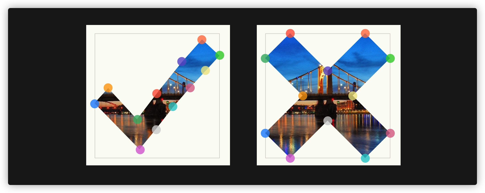

# 动效

## 使用CSS创建变形动效

使用CSS创建变形动效主要采用的是CSS的`clip-path`属性，如果你阅读过《[使用`clip-path`制作Web动效](https://www.w3cplus.com/animation/web-animation-with-clip-path.html)建变形动效了。这里简单地再向大家阐述一下。

使用`clip-path`制作变形动效主要依赖于该属性的`polygon()`函数和`path()`函数：

* 使用`polygon()`函数制作变形动效，有个必要条件，那就是`polygon()`中使用的顶点数必须是相同的
* 使用`path()`函数制作变形动效，可以将SVG的`path`路径来作为其值，但目前仅Firefox 71+版本支持


先看下`polygon`函数实现的变形动效。 比如：



上图对应的 `polygon`的值是：

```js

clip-path: polygon(50% 48%, 34% 69%, 11% 44%, 0 56%, 36% 93%, 49% 77%, 63% 59%, 76% 44%, 89% 30%, 100% 18%, 86% 5%, 70% 23%);

clip-path: polygon(20% 0%, 0% 20%, 30% 50%, 0% 80%, 20% 100%, 50% 70%, 80% 100%, 100% 80%, 70% 50%, 100% 20%, 80% 0%, 50% 30%);

```

他们图形效果不同，但是 `polygon()`用的定点数是相同的。基于这两个图形，制作一个简单的变形动效：

```css
.button::before {
    content: "";
    display: block;
    background-color: #fff;
    margin-right: 5px;
    filter: drop-shadow(1px 1px 0 rgba(0, 0, 0, 0.5));
    width: 36px;
    height: 36px;
    clip-path: polygon(50% 48%, 34% 69%, 11% 44%, 0 56%, 36% 93%, 49% 77%, 63% 59%, 76% 44%, 89% 30%, 100% 18%, 86% 5%, 70% 23%);
    transition: clip-path 0.28s linear;
}

.button.active::before {
    clip-path: polygon(20% 0%, 0% 20%, 30% 50%, 0% 80%, 20% 100%, 50% 70%, 80% 100%, 100% 80%, 70% 50%, 100% 20%, 80% 0%, 50% 30%);
    transition: clip-path 0.28s linear;
}

```


​																				[查看DEMO]([Morphing Animation with CSS clip-path: polygon() (codepen.io)](https://codepen.io/airen/pen/LYNoVRe))


使用`polygon()`虽然能实现部分图形之间的形变，但他还是有自身的局限性的，比如说绘制的图形只能是多边形，如果要像下面这样的矢量图形之间的形变，那他就显得束手无策了：

