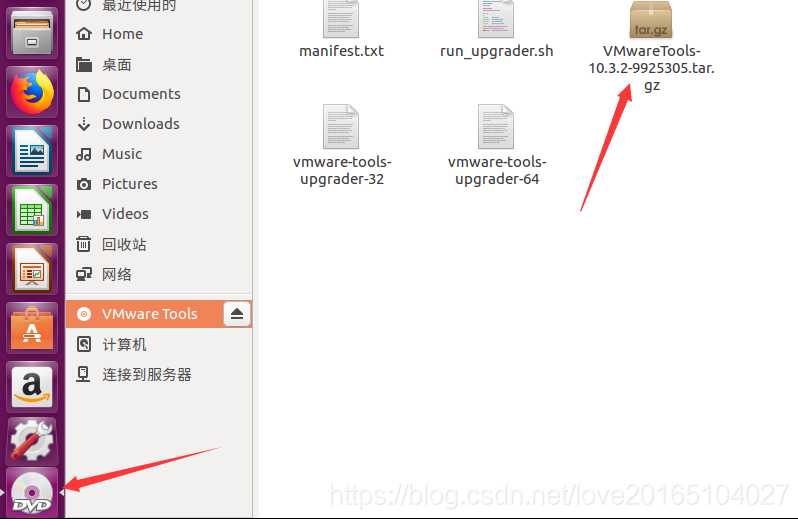
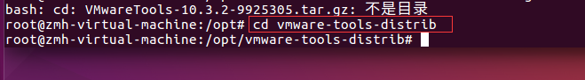
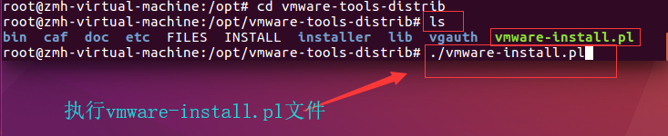
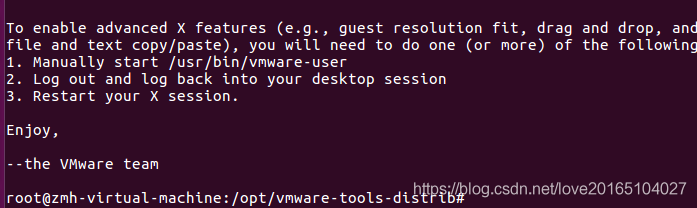

# 虚拟机 - Ubuntu

## 安装VMware Tools


#### 1. 点击VMware菜单上的虚拟机 ，弹出的菜单中点击安装VMware Tools（注意要在你的Ubuntu操作系统开启的情况下安装）


#### 2. 然后点击的右边任务栏DVD图标，可以找到VMware Tools压缩文件



#### 4. 把这个VMware Tools压缩文件复制到opt文件夹（需要root权限）

#### 5. 进入opt文件夹，解压安装包，安装包为 tar.gz 使用命令：tar -xvzf，格式：　tar -xzvf  file.tar.gz 

#### 6. 安装vmware-install.pl 

- 先进入到我们解压出的文件夹中

  

- 使用ls命令查看解压出的VMware-tools-distrib文件夹下有哪些文件，可以看到有一个vmware-install.pl文件，执行它就行了

  

- 一路 yes 安装

  

- 重启生效


## 启用SSH访问

```shell
 sudo apt updatesudo apt install openssh-serverps -aux | grep ssh // 查看 ssh 服务是否已经开启
```

