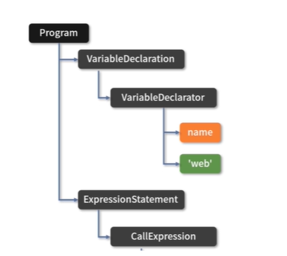
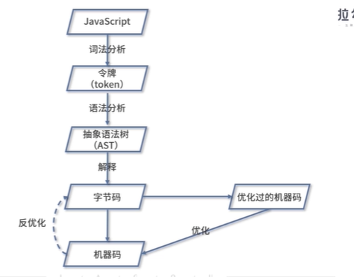

# 浏览器如何执行JavaScript 代码

## 编译过程

* 解析
* 转换
* 代码生成

### 解析

词法分析： 将JavaScript代码解析成一个个的令牌（Token）

语法分析： 将令牌组装成一棵抽象的语法树（AST）

```js
var name = "web"
console.log(name);
// 解析
Keyword(var)
Identifier(name)
Punctuator(=)
String("web")
Punctuator(.)
Identifier(log)
....
```



## 优化

**解释器**在得到AST之后，会按需进行解释和执行，即某个函数没有被调用，则不会去解释执行它

解释器会将一些重复可优化的操作（比如类型判断）收集起来生成分析数据，然后将生成的字节码和分析数据传给 **编译器** ，**编译器**会依据分析数据来生成高度优化的机器码。




### 栈

> 临时存储空间， 主要存储 **局部变量** 和 **函数调用**（对于全局表达式会创建匿名函数并调用）