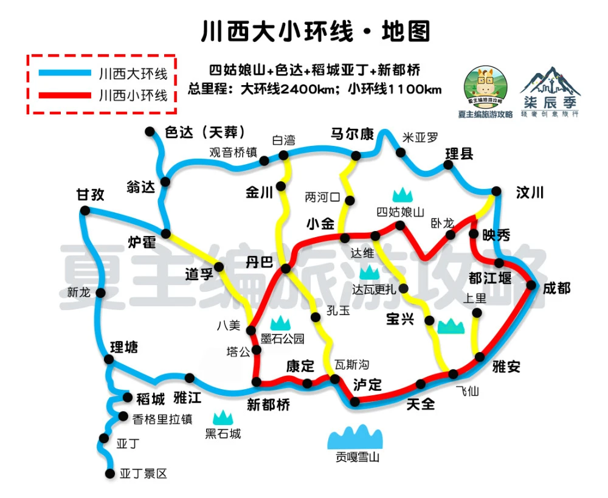
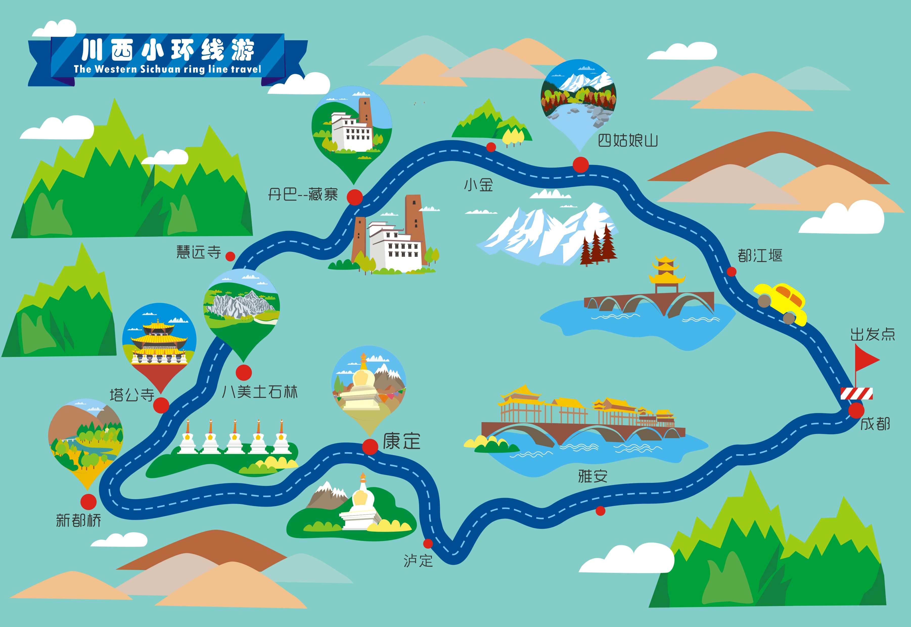
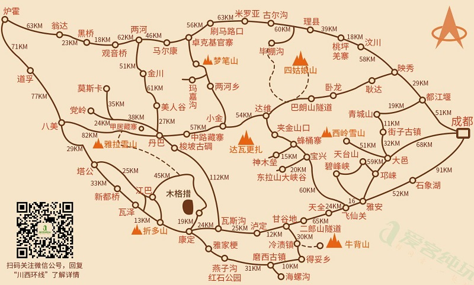
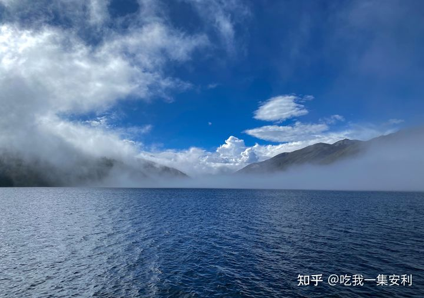
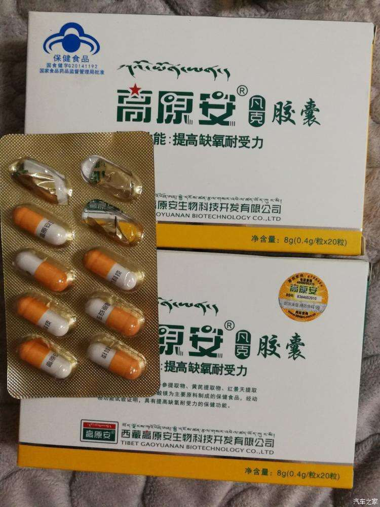

# 川西

**川西大小环线图**

**川西小环线图**

**超详细川西3日小环线自驾游**

这是一条翻越折多山，途径新都桥，游览墨石公园以及木格措的美丽环线

建议走木格措红海子那段路到塔公草原，沿途可以看到雅拉雪山

第一天需要早点出发，坚决不走回头路；时间有点赶，但最美的风景在路上

**推荐线路安排**

**路线一：**

Day 1 ：预计路程7小时 ，大约390公里（含鱼子西）

成都 - 康定 - 折多山 - 新都桥 - 鱼子西 - 新都桥

Day 2 ：预计路程5小时 ，大约210公里

新都桥 - 墨石公园（2小时） - 塔公草原（1小时） - 康定机场（30分钟） - 木格措（不停留） - 康定

Day 3 ：预计路程5小时 ，大约300公里

康定 - 木格措（预计2小时） - 成都

**路线二：**

Day 1 ：

成都-康定-折多山-新都桥-九龙县

Day 2 ：

九龙-五须海-新都桥

Day 3 ：

新都桥-墨石公园-塔公草原-成都

**路线三：**

Day 1 ：

成都-四姑娘山

Day 2 ：

四姑娘山-丹巴

Day 3 ：

丹巴-墨石公园-新都桥-成都

**沿途小众景点**

✔︎	折多山

西出折多，进藏必须翻过的第一座海拔4000米以上的高山，冬季叫雪山。

✔︎	新都桥

号称摄影师的天堂，新都桥附近超赞的星空摄影地，可以零徒步，驱车直接到山顶看银河。主要景色是镇周围的几条公路边风景，适合早晚拍照

✔︎	墨石公园

新晋网红打卡地，非常适合旅拍打卡的地方，可以拍出网络ins风的旅拍照。

✔︎	红海子

康定机场附近的一处高山海子，这里冬季超美，可以拍摄贝加尔湖的蓝冰。

✔︎	木格措

木格措风景区又叫做康定情歌风景区，景区海拔2600--3780米，景区由木格措、红海草原、芳草坪、药池沸泉、杜鹃峡、七色海等景点组成。一年四季景色变幻无穷，春季杜鹃似锦，青峰滴翠；夏季雪山花海，避暑天堂；

✔︎	四姑娘山

四姑娘山由四座绵延不断的山峰组成，从幺姑娘山（幺妹峰）、三姑娘山、二姑娘山到大姑娘山，其中幺姑娘山海拔6250米，为 四川省第二高峰。 风景区由 四姑娘山、双桥沟、长坪沟、海子沟组成，有主要景点120余个，要想全部游览完是不可能的，一般游客都选择游览**长坪沟**。

✔︎	海螺沟

海螺沟冰川是地球上的冰川，几乎全部存在于远离人类聚居的南极地区。其余极少部分，虽分布于各个纬度，但又大多处于高寒、高海拔地区，使一般人难以到达。而中国四川的海螺沟冰川，其最下端的海拔高度仅为2850米，是亚洲最低海拔的冰川，也是离城市最近的一条现代冰川。

**预计费用明细**

油费 ：往返大概1000元（注：预计900公里）

过路费 ：300元（注：单边140元，节假日免费）

门票 ：476元（墨石公园58/人 ，木格措180/人）

**建议行李用品**

证件：身份证 、银行卡、驾驶证、行驶证、钱包（现金）

电子：手机、充电头数据线、充电宝、相机（电池）

衣服：口罩、羽绒服、外套、冲锋衣、毛衣、牛仔裤、手套、围巾。建议携带上手电筒、雨具等。鞋子建议穿登山鞋。

防晒：防晒霜(紫外线特强)、太阳帽、墨镜、润肤霜、唇膏等。

食物：因路途遥远，有可能不能按时用餐，请带好干粮，自煮火锅

洗护：漱口水、洗面奶、防晒霜、润唇膏

生活：卫生纸、湿纸巾、常备药、感冒冲剂、保温杯

食品：巧克力、牛肉干、糖果、饼干等高热量食物。

药品：

* `抗高原反应药`：红景天(至少提前10天服用)、诺迪康胶囊(对缓解极度疲劳很有用)、西洋参(对缓解极度疲劳很有用)、高原安、肌苷口服液(对高原反应有特效)等。
* `感冒药`：百服宁、芬必得(缓解高原反应引起的头疼)等;
* `胃肠药`：保济丸、吗叮林、泻利停、藿香正气水等。

`重要提醒：沿途商店很少，藏民的卫生生活习惯都与汉族有所不同，所以最好提前要带足这些东西。`