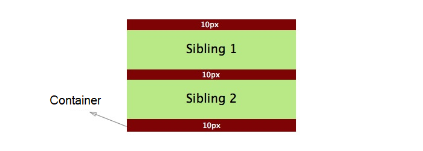
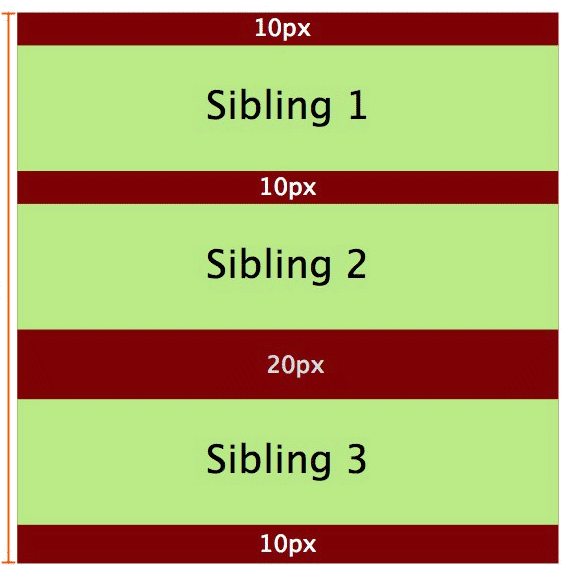

# 知识点总结

## Worker

> 兼容性

PC： IE 10+

Phone: no support

> 创建

```js
const worker = new Worker(path) // 返回一个worker对象
```

> 销毁

```js
// 有以下三种方式
// 1. 主页面
worker.terminate();
// 2. 自销毁
self.close()
// 3. 关闭页面
```

> 内部引用文件的方法

使用importScripts加载文件，并可以动态加载文件。

> 环境

worker拥有一个独立的运行环境Workerglobalscope

* 局限性

  * 同源限制。不能跨域加载js
  * dom限制。worker内代码不能访问dom
  * 文件限制。子线程无法读取本地文件，即worker只能加载网络文件。
  * 各个浏览器对worker的实现不大一致， 例如FF允许worker中创建新的worker，而Chrome不行
  * 通信限制。Worker线程和主线程不在同一个上下文环境，他们不能直接通信，必须通过消息完成。

* API

  ```js
  worker.onerror： 指定 error 事件的监听函数。
  worker.onmessage： 指定 message 事件的监听函数， 发送过来的数据在 Event.data 属性中。
  worker.onmessageerror： 指定 messageerror 事件的监听函数。发送的数据无法序列化成字符串时， 会触发这个事件。
  worker.postMessage： 向 worker 线程发送消息。
  worker.terminate： 立即终止 worker 线程。
  ```

* worker 线程 API

  ```js
  self.name： Worker 的名字。该属性制度， 由构造函数指定。
  self.onmessage： 指定 message 事件的监听函数。
  self.onmessageerror： 指定messageerror事件的监听函数。 发送的数据无法序列化成字符串时，会触发这个事件。
  self.close：关闭worker线程。
  self.postMessage： 向产生这个 worker 线程发送消息。
  self.importScripts： 加载 js 脚本。
  ```


## ServiceWorker

Service Worker 是基于Web Worker的事件驱动的， 他们执行的极值都是新开的一个线程去处理一些额外的，以前不能直接处理的任务。对于Web Worker，我们可以使用它来进行复杂的计算，因为它并不阻塞浏览器主线陈的渲染。 而Service Worker，我们可以用它来进行本地缓存或者请求转发，相当于一个浏览器端本地的proxy。

> 1. 兼容性

> 2. 介绍

Service Worker Global Scope 部分作用域定义如下：

scriptCache： worker 的文件一旦注册使用， 会被缓存到浏览器中， 需要手动清理掉， 例如： 注册使用了 sw.js ， sw.js 修改后必须清理缓存后才生效。


> 3. 应用场景

1. 离线缓存：可以将H5应用中**不变化的资源或者很少变化的资源**长久的存储在用户端，提升加载速度、降低流量消耗、降低服务器压力。如中重度的H5游戏、框架数据独立的web资讯客户端、web邮件客户端等

2. 消息推送：激活沉睡的用户，推送即时消息、公告通知，激发更新等。如web资讯客户端、web即时通讯工具、H5游戏等运营产品。

3. 事件同步：确保web端产生的任务即使在用户关闭了web页面也可以顺利完成。如web邮件客户端、web即时通讯工具等。

4. 定时同步：周期性的触发Service Worker脚本中的定时同步事件，可借助它提前刷新缓存内容。如web资讯客户端。


## Promise

> 1. Promise.all


> 2. Promise.allsetted


> 3. Promise 原理


## BFC

```html
<div class="box1" id="HM_bfc1">
    <div class="box2"></div>
    <div class="box3"></div>
    <div class="box4"></div>
    <div class="box5" id="HM_bfc2">
        <div class="box6"></div>
        <div class="box7"></div>
        <div class="box8"></div>
    </div>
</div>
```

> 这段代码来解释BFC定义的话，就是 #HM_bfc1是一块BFC区域， 这块区域包含了box2，box3， box4， box5，也就是所有#HM_bfc1的子元素。同时#HM_bfc2也创造了一块BFC区域，包含了box6，box7，box8。

**注意**： 第一个box1的BFC，只包括box1的子元素box2345， 不包括box678. #HM_bfc2这个BFC同样也津津是包括自己的子元素box678.

**重点**：

* 每一个BFC区域只包括其子元素，不包括其子元素的子元素。
* 每一个BFC区域都是独立隔绝的，互不影响！

#### 触发BFC条件

* body根元素
* 设置浮动，不包括 float: none
* 设置定位，absolute 或者 fixed
* 行内块显示模式， inline-block
* 表格单元格， table-cell
* 弹性布局，flex
* 设置overflow （hidden, auto, scroll） 

**重点**： 并不是所有的元素都是BFC，只有满足了上面任意一个条件之后，这个元素才成为一个BFC。

一个BFC区域，只包含其所有子元素，不包含子元素的子元素。

#### BFC 特性

1. BFC 是一个独立的容器， 容器内子元素不会影响容器外的元素。反之亦是如此。
2. 盒子从顶端开始垂直地一个接一个地排列，盒子之间垂直地间距是由margin决定的。
3. 在同一个BFC中，**两个相邻的块级盒子的垂直外边距会发生重叠**
4. BFC区域不会和float box 发生重叠。
5. BFC能够识别并包含浮动元素， 当计算其区域的高度时，浮动元素也可以参与计算了。

 #### 利用BFC解决问题

1. 外边距垂直塌陷问题

   

   HTML：

   ```html
   <div class="container">
       <p>
           Sibling 1
       </p>
       <p>
           Sibling 2
       </p>
   </div>
   ```

   CSS:

   ```css
   .container {
       background-color: red;
       overflow: hidden;
   }
   p {
       background-color: lightgreen;
       margin: 10px 0;
   }
   ```

   

   如上图所示： 红色盒子（container） 中包含了两个绿色的星弟元素（p）， 并且红色盒子设置了overflow : hidden; 则一个BFC已经被创建， 即导致**在同一个BFC中，两个相邻的块级盒子的垂直外边距会发生重叠**

   理论上两个兄弟元素之间的编剧应该是两个元素的边距之和（20px）， 但是实际上是10px。这就是外边距折叠导致的。

   折叠外边距的值：

   * 两个相邻的外边距都是**正数**时， 折叠外边距是两者中较大的值。
   * 两个相邻的外边距都是负数时， 折叠外边距是两者中绝对值较大的值。
   * 两个相邻的外边距是**一正一负**时， 折叠外边距是两者相加的和。

   折叠外边距的条件是 margin 必须相邻。

   **避免外边距折叠：** 

   解决方案： 外边距折叠 只会发生在属于同一个BFC的块级元素之间。 如果它们属于不同的BFC,它们之间的外边距则不会折叠。所以通过创建一个不同的BFC，就可以避免外边距折叠。

   HTML:

   ```html
   <div class="container">
       <p>
           Sibling 1
       </p>
       <p>
           Sibling 2
       </p>
       <div class="newBFC">
           <p>
               Sibling 3
           </p>
       </div>
   </div>
   ```

   CSS:

   ```css
   .container{
       background-color: red;
       overflow: hidden; /* creates a block formatting context */
   }
   p {
       background-color: lightgreen;
       margin: 10px 0;
   }
   .newBFC {
       overflow: hidden; /* creates a block formatting context */
   }
   ```

   

2. 利用BFC解决包含塌陷

   当父子关系的盒子，给子元素添加margin-top，有可能会把父元素一起带跑。

   

   原本正确的显示方式，应该是粉色盒子与红色盒子的顶部距离为50px， 但是由于margin的塌陷问题，导致盒子内部布局影响到了外部。这个时候，可以通过触发BFC，将父盒子变成一个独立的区域（BFC）,这样在BFC内部的任何操作，都不会影响到外部。

   

3. 当浮动产生影响的时候，可以利用BFC来清除浮动的影响

   

   以上代码表示，一个没有设置高度的父盒子，包含着七个子元素。如果此时，所有的子元素都浮动的话。

   

   当所有的子元素都浮动了，这个时候，父盒子失去了原有的高度，这就是浮动的影响。这个时候，同样利用BFC的机制，来清除浮动带来的影响。 

   **解决方法： 在容器（father）中创建BFC**

   

   特别提示：

   * 通过overflow: hidden创建BFC，固然可以解决高度塌陷的问题，但是大范围应用在布局上肯定不是最合适的， 毕竟overflow: hidden； 会造成溢出隐藏的问题，尤其是与JS 的交互效果会有影响。
   * 推荐使用 clearfix 来实现清除浮动。

4. BFC可以组织标准流元素被浮动元素覆盖

   

   以上情况，红色盒子浮动，蓝色盒子标准文档流，默认情况下，浮动元素覆盖了标准流元素。但是如果蓝色盒子的BFC触发，那么情况将会有所变化。

   

   当蓝色盒子触发了BFC之后，浮动元素再也不能覆盖它了，而且还能利用这个特性，来实现蓝色盒子宽度根据红色盒子的宽度来做自动适应。

5. 总结

   一个BFC区域只包含其子元素，不包括其子元素的子元素。

   并不是所有的元素都能成为一块BFC区域，只有这个元素满足条件的时候才会成为一块BFC区域。不同的BFC区域之间是相互独立的，互相不影响的。利用这个特性我们可以让不同的BFC区域之间的布局不产生影响。


[SegmentDefault ]: https://segmentfault.com/a/1190000013647777	"BFC"
[传智教育]: http://www.itcast.cn/news/20201016/16152387135.shtml	"BFC"


## 手写Reduce

```js
Array.prototype.myReduce = function(func, init) {
    
    const arr = this;
    const len = arr.length;
    const tempArr = arr.slice(0).unshift(init);
    let  i  = init ===0 ||  !!init ? 0 : 1;
    let prev = init ===0 ||  !!init ? init : arr[0];
    
    if(typeof func !== "function"){
        throw "参数必须为函数"
    }
    
    if(Array.isArry(arr)) {
       throw "只能对数组使用reduce方法"
    }
    
    if(tempArr.length === 1) {
        
        return tempArr[0];
        
    } else if(tempArr.length === 0){
        
        return throw Error('Reduce of empty array with no initial value')
        
    } else {
        
        const fn = func;
        
        for(; i < len; i++) {
            prev = fn(prev, arr[i], i, arr);
        }    
        
    }
    return prev;
}
```


## 数组去重


## js 中的falsy值

```js
1. false
2. ""
3. null
4. undefined
5. NaN
6. document.all
7. 0
document.all 在过去被用于浏览器检测， 是HTML规范在此定义了故意与ECMAScript标准相违背的，以保持与历史代码的兼容性。
document.all 可以判断浏览器是否是IE 11 之前的版本 

```


## 箭头函数与普通函数的区别


## cors注意事项


## CSS 吸顶


## Hooks 解决的问题 ， 使用上的限制


## React-router 原理


## Event Loop


## 盒子模型


## HMR原理


## 防抖 节流


## defer / async , prefetch / preload 区别

* prefetch 和 preload

  prefetch和preload 是现代浏览器对 <link>标签新增的rel值， 用来加快页面资源的加载速度，改善用户体验

  1. prefetch 和preload 不影响window.onload事件（window.onload事件不会管prefetch和preload资源是否已经下载完毕）
  2. prefetch用于加载 未来需要的资源， 而且只有5分钟的生命期， 也就是说，浏览器会低优先级下载该资源，拿到资源之后会存入disk cache，未来真的需要它的时候吗会从disk cache中读取， 以加快页面资源加载速度。

* defer 和 async 都是<script>标签上的属性

  |                  | 无属性           | defer                                                  | async                              |
  | ---------------- | ---------------- | ------------------------------------------------------ | ---------------------------------- |
  | 是否阻塞HTML解析 | 下载和执行都阻塞 | 都不阻塞                                               | 下载不阻塞，仅在执行时阻塞         |
  | 按书写顺序下载   | 是               | 否，跟之后的js并行下载                                 | 否，跟之后的js并行下载             |
  | 下载后立即执行   | 是               | 否，在HTML全部解析后，DOMContentLoaded执行前的节点执行 | 是                                 |
  | 按书写顺序执行   | 是               | 如果后续js没有“无属性”和“async”，则是，否则不是        | 先下载完成的先执行，所以一定是乱序 |
  | 按下载顺序执行   | 是               | 如果后续js没有“无属性”和“async”，则是，否则不是        | 是，但是下载是乱序的，所以总体乱序 |

  

## setTimeout 和 dom 原生事件同步

问题与下面意思相同

## React 合成事件和原生事件的区别， 原生事件怎么设计

* 在组件生命周期或React合成事件 中， setState是异步的；（异步操作， 但特定情况下会执行一次， 性能被优化）
* 在 setTimeout 或者 原生dom 事件中， setState是同步；（完全是同步函数）

## setState 为什么异步执行

* setState 设计为异步，可以显著提升性能；

  如果每次调用setState都进行一次更新，意味着render函数会被频繁的调用，及诶按重新渲染，这样效率很低。

* 最好的办法是获取到多个更新， 之后进行批量更新；（这里有前端框架最初的设计时的思想，为了提高性能，减少操作dom次数，通过算法计算少次多亮地进行操作dom）

