# 知识点总结

## Worker

> 兼容性

PC： IE 10+

Phone: no support

> 创建

```js
const worker = new Worker(path) // 返回一个worker对象
```

> 销毁

```js
// 有以下三种方式
// 1. 主页面
worker.terminate();
// 2. 自销毁
self.close()
// 3. 关闭页面
```

> 内部引用文件的方法

使用importScripts加载文件，并可以动态加载文件。

> 环境

worker拥有一个独立的运行环境Workerglobalscope

* 局限性

  * 同源限制。不能跨域加载js
  * dom限制。worker内代码不能访问dom
  * 文件限制。子线程无法读取本地文件，即worker只能加载网络文件。
  * 各个浏览器对worker的实现不大一致， 例如FF允许worker中创建新的worker，而Chrome不行
  * 通信限制。Worker线程和主线程不在同一个上下文环境，他们不能直接通信，必须通过消息完成。

* API

  ```js
  worker.onerror： 指定 error 事件的监听函数。
  worker.onmessage： 指定 message 事件的监听函数， 发送过来的数据在 Event.data 属性中。
  worker.onmessageerror： 指定 messageerror 事件的监听函数。发送的数据无法序列化成字符串时， 会触发这个事件。
  worker.postMessage： 向 worker 线程发送消息。
  worker.terminate： 立即终止 worker 线程。
  ```

* worker 线程 API

  ```js
  self.name： Worker 的名字。该属性制度， 由构造函数指定。
  self.onmessage： 指定 message 事件的监听函数。
  self.onmessageerror： 指定messageerror事件的监听函数。 发送的数据无法序列化成字符串时，会触发这个事件。
  self.close：关闭worker线程。
  self.postMessage： 向产生这个 worker 线程发送消息。
  self.importScripts： 加载 js 脚本。
  ```


## ServiceWorker

Service Worker 是基于Web Worker的事件驱动的， 他们执行的极值都是新开的一个线程去处理一些额外的，以前不能直接处理的任务。对于Web Worker，我们可以使用它来进行复杂的计算，因为它并不阻塞浏览器主线陈的渲染。 而Service Worker，我们可以用它来进行本地缓存或者请求转发，相当于一个浏览器端本地的proxy。

> 1. 兼容性

> 2. 介绍

Service Worker Global Scope 部分作用域定义如下：

scriptCache： worker 的文件一旦注册使用， 会被缓存到浏览器中， 需要手动清理掉， 例如： 注册使用了 sw.js ， sw.js 修改后必须清理缓存后才生效。


> 3. 应用场景

1. 离线缓存：可以将H5应用中**不变化的资源或者很少变化的资源**长久的存储在用户端，提升加载速度、降低流量消耗、降低服务器压力。如中重度的H5游戏、框架数据独立的web资讯客户端、web邮件客户端等

2. 消息推送：激活沉睡的用户，推送即时消息、公告通知，激发更新等。如web资讯客户端、web即时通讯工具、H5游戏等运营产品。

3. 事件同步：确保web端产生的任务即使在用户关闭了web页面也可以顺利完成。如web邮件客户端、web即时通讯工具等。

4. 定时同步：周期性的触发Service Worker脚本中的定时同步事件，可借助它提前刷新缓存内容。如web资讯客户端。


## Promise

> 1. Promise.all

```js
// 判断一个对象是否是 thenable 类型
const isPromise = (promise) => {
    return typeof promise.then === 'function';
}

Promise.all = (promises) => {
    return new Promise((resolve, reject) => {
        const result = [];
        const handleData = (data, idx) => {
            result[idx] = data;
            if(++idx === promises.length) {
                resolve(result);
            }
        }
        for(let i=0; i < promises.length; i++) {
            if (isPromise(promises[i])) {
                promises[i].then((val) => {
                    handleData(val, i)
                }, reject);
            } else {
                handleData(promise[i], i);
            }
        }
    })
}
```


> 2. Promise.allsetted

```js
// 判断一个对象是否是 thenable 类型
const isPromise = (promise) => {
    return typeof promise.then === 'function';
}

Promise.all = (promises) => {
    return new Promise((resolve, reject) => {
        const result = [];
        const handleData = (data, idx) => {
            result[idx] = data;
            if(++idx === promises.length) {
                resolve(result);
            }
        }
        for(let i=0; i < promises.length; i++) {
            if (isPromise(promises[i])) {
                promises[i].then(
                    (val) => {
                        handleData(val, i);
                    },
                    (reason) => {
                        handleData(reason, i);
                    }
                );
            } else {
                handleData(promise[i], i);
            }
        }
    })
}
```


> 3. Promise 原理


## BFC

```html
<div class="box1" id="HM_bfc1">
    <div class="box2"></div>
    <div class="box3"></div>
    <div class="box4"></div>
    <div class="box5" id="HM_bfc2">
        <div class="box6"></div>
        <div class="box7"></div>
        <div class="box8"></div>
    </div>
</div>
```

> 这段代码来解释BFC定义的话，就是 #HM_bfc1是一块BFC区域， 这块区域包含了box2，box3， box4， box5，也就是所有#HM_bfc1的子元素。同时#HM_bfc2也创造了一块BFC区域，包含了box6，box7，box8。

**注意**： 第一个box1的BFC，只包括box1的子元素box2345， 不包括box678. #HM_bfc2这个BFC同样也仅仅是包括自己的子元素box678.

**重点**：

* 每一个BFC区域只包括其子元素，不包括其子元素的子元素。
* 每一个BFC区域都是独立隔绝的，互不影响！

#### 触发BFC条件

* body根元素
* 设置浮动，不包括 float: none
* 设置定位，absolute 或者 fixed
* 行内块显示模式， inline-block
* 表格单元格， table-cell
* 弹性布局，flex
* 设置overflow （hidden, auto, scroll） 

**重点**： 并不是所有的元素都是BFC，只有满足了上面任意一个条件之后，这个元素才成为一个BFC。

一个BFC区域，只包含其所有子元素，不包含子元素的子元素。

#### BFC 特性

1. BFC 是一个独立的容器， 容器内子元素不会影响容器外的元素。反之亦是如此。
2. 盒子从顶端开始垂直地一个接一个地排列，盒子之间垂直地间距是由margin决定的。
3. 在同一个BFC中，**两个相邻的块级盒子的垂直外边距会发生重叠**
4. BFC区域不会和float box 发生重叠。
5. BFC能够识别并包含浮动元素， 当计算其区域的高度时，浮动元素也可以参与计算了。

 #### 利用BFC解决问题

1. 外边距垂直塌陷问题

   

   HTML：

   ```html
   <div class="container">
       <p>
           Sibling 1
       </p>
       <p>
           Sibling 2
       </p>
   </div>
   ```

   CSS:

   ```css
   .container {
       background-color: red;
       overflow: hidden;
   }
   p {
       background-color: lightgreen;
       margin: 10px 0;
   }
   ```

   

   如上图所示： 红色盒子（container） 中包含了两个绿色的星弟元素（p）， 并且红色盒子设置了overflow : hidden; 则一个BFC已经被创建， 即导致**在同一个BFC中，两个相邻的块级盒子的垂直外边距会发生重叠**

   理论上两个兄弟元素之间的编剧应该是两个元素的边距之和（20px）， 但是实际上是10px。这就是外边距折叠导致的。

   折叠外边距的值：

   * 两个相邻的外边距都是**正数**时， 折叠外边距是两者中较大的值。
   * 两个相邻的外边距都是负数时， 折叠外边距是两者中绝对值较大的值。
   * 两个相邻的外边距是**一正一负**时， 折叠外边距是两者相加的和。

   折叠外边距的条件是 margin 必须相邻。

   **避免外边距折叠：** 

   解决方案： 外边距折叠 只会发生在属于同一个BFC的块级元素之间。 如果它们属于不同的BFC,它们之间的外边距则不会折叠。所以通过创建一个不同的BFC，就可以避免外边距折叠。

   HTML:

   ```html
   <div class="container">
       <p>
           Sibling 1
       </p>
       <p>
           Sibling 2
       </p>
       <div class="newBFC">
           <p>
               Sibling 3
           </p>
       </div>
   </div>
   ```

   CSS:

   ```css
   .container{
       background-color: red;
       overflow: hidden; /* creates a block formatting context */
   }
   p {
       background-color: lightgreen;
       margin: 10px 0;
   }
   .newBFC {
       overflow: hidden; /* creates a block formatting context */
   }
   ```

   

2. 利用BFC解决包含塌陷

   当父子关系的盒子，给子元素添加margin-top，有可能会把父元素一起带跑。

   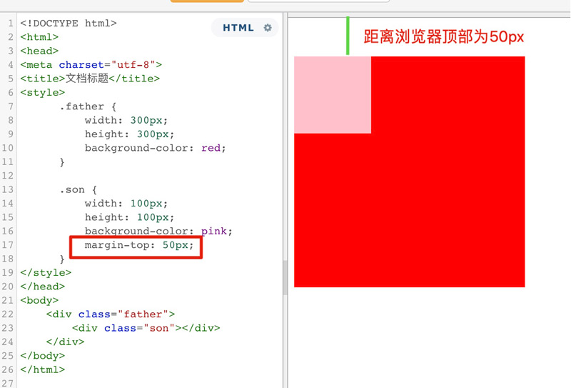

   原本正确的显示方式，应该是粉色盒子与红色盒子的顶部距离为50px， 但是由于margin的塌陷问题，导致盒子内部布局影响到了外部。这个时候，可以通过触发BFC，将父盒子变成一个独立的区域（BFC）,这样在BFC内部的任何操作，都不会影响到外部。

   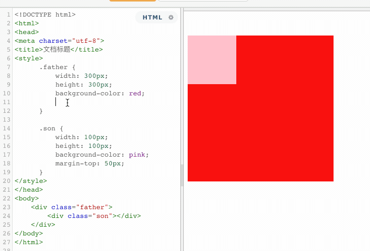

3. 当浮动产生影响的时候，可以利用BFC来清除浮动的影响

   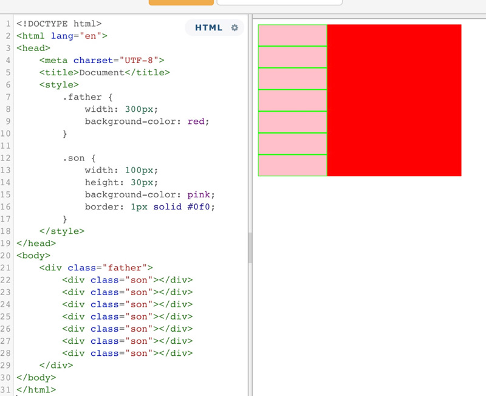

   以上代码表示，一个没有设置高度的父盒子，包含着七个子元素。如果此时，所有的子元素都浮动的话。

   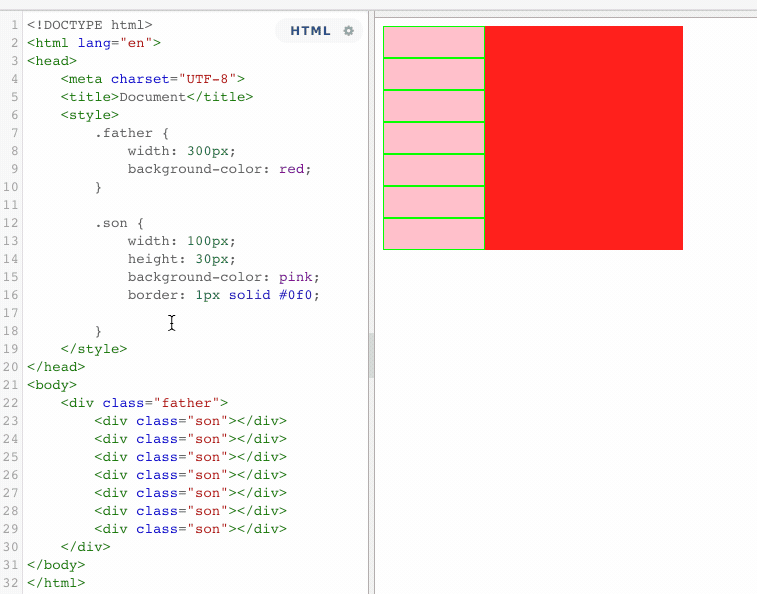

   当所有的子元素都浮动了，这个时候，父盒子失去了原有的高度，这就是浮动的影响。这个时候，同样利用BFC的机制，来清除浮动带来的影响。 

   **解决方法： 在容器（father）中创建BFC**

   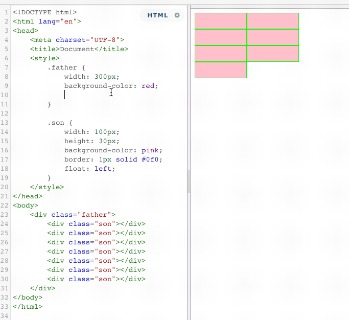

   特别提示：

   * 通过overflow: hidden创建BFC，固然可以解决高度塌陷的问题，但是大范围应用在布局上肯定不是最合适的， 毕竟overflow: hidden； 会造成溢出隐藏的问题，尤其是与JS 的交互效果会有影响。
   * 推荐使用 clearfix 来实现清除浮动。

4. BFC可以组织标准流元素被浮动元素覆盖

   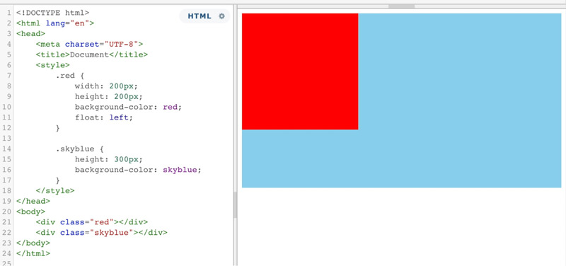

   以上情况，红色盒子浮动，蓝色盒子标准文档流，默认情况下，浮动元素覆盖了标准流元素。但是如果蓝色盒子的BFC触发，那么情况将会有所变化。

   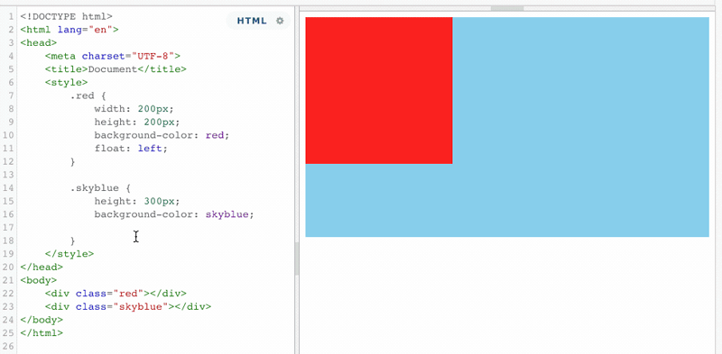

   当蓝色盒子触发了BFC之后，浮动元素再也不能覆盖它了，而且还能利用这个特性，来实现蓝色盒子宽度根据红色盒子的宽度来做自动适应。

5. 总结

   一个BFC区域只包含其子元素，不包括其子元素的子元素。

   并不是所有的元素都能成为一块BFC区域，只有这个元素满足条件的时候才会成为一块BFC区域。不同的BFC区域之间是相互独立的，互相不影响的。利用这个特性我们可以让不同的BFC区域之间的布局不产生影响。


[SegmentDefault ]: https://segmentfault.com/a/1190000013647777	"BFC"
[传智教育]: http://www.itcast.cn/news/20201016/16152387135.shtml	"BFC"


## IFC（内联格式化上下文）

> Inline Formatting Contexts, 形成条件非常简单，需要注意的是当IFC中有块级元素插入式，会产生两个匿名块将父元素分割开来，产生两个IFC

IFC布局规则

* 在一个IFC里，盒子是一个接一个基于baseline水平放置

  ```html
  <div class="container">
      <span>中文</span>
      
      <span>yingwen</span>
    </div>
  ```

  ```css
  .container {
    border: 1px solid #ccc;
  }
  ```

  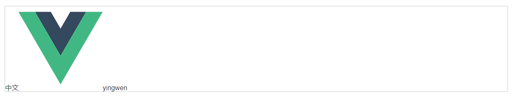

* 子元素只会计算横向样式空间，【padding, border, margin】；垂直方向样式空间不会被计算， 【padding, border, margin】。

  ```html
  <div class="container">
      <span class="chinese">中文</span>
      <span class="english">yingwen</span>
    </div>
  ```

  ```css
  .chinese {
    border: 1px solid #ccc;
    font-size: 16px;
  }
  .english {
    margin: 10px;
    font-size: 30px;
  }
  ```

  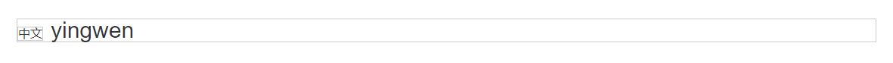

* 在垂直方向上，子元素会以不同形式来对齐（vertical-align）

  ```html
  <div class="container">
      <span class="align-chinese">中文</span>
      <span class="align-english">yingwen</span>
    </div>
  ```

  ```css
  .align-chinese {
    vertical-align: middle;
    font-size: 16px;
  }
  .align-english {
    font-size: 30px;
    vertical-align: middle;
  }
  ```

  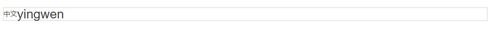

* 能把在一行上的框都完全包含进去的一个矩形区域，被称为该行的行框（line box）。`行框的宽度是由包含块(containing box)和与其中的浮动元素来决定。`当内部的容器盒子太多了一个line box装不下，他们这行之后会变成两个或者多个line box， line box 垂直方向无间隔的堆叠，但不会重叠。

  ```html
  <div class="container inline-block">
      <span class="align-chinese">中文</span>
      
      <span class="align-english">yingwen</span>
    </div>
  ```

  ```css
  .inline-block {
    display: inline-block;
  }
  .fl {
    float: left;
  }
  .align-chinese {
    vertical-align: middle;
    font-size: 16px;
  }
  .align-english {
    font-size: 30px;
    vertical-align: middle;
  }
  ```

  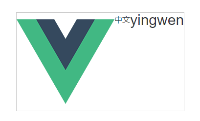

* IFC中的“line box” 一般左右边贴近其包含块，但float元素会优先排列

  demo 如上图所示

* 浮动后IFC内部的浮动元素宽高参与IFC的line-box宽高计算并且换行后的行开始排列。

  demo 如上图所示
  
* line box之间不会存在空隙，也不会发生重叠；


## CSS 属性选择器

### 简单语法介绍

* \[attr\]: 该选择器选择包含attr属性的所有元素，不论attr的值为何。
* \[attr=val]: 该选择器仅选择attr属性被赋值为val的所有元素
* \[attr~=val]: 该选择器仅选择具有attr属性的元素，而且要求val值是attr值包含的被空格分隔的取值列表里中的一个。

### 子串(Substring value) 属性选择器

下面几个属于CSS3新增语法，也被称为“伪正则选择器”，因为它们提供类似regular expression的灵活匹配方式。

* \[attr|=val]: 选择attr属性的值是val或值以val- 开头的元素（注意，这里的“-”不是一个错误，这是用来处理语言编码的）。
* \[attr^=val]: 选择attr属性的值以val开头(包括val)的元素。
* \[attr$=val]: 选择attr属性的值以val结尾（包括val）的元素。
* \[attr*=val]: 选择attr属性的值中包含子字符串val的元素（一个子字符串就是一个字符串的一部分而已，例如，“cat”是caterpillar的子字符串）

### 用例：

#### 层叠选择

```css
div[href] {
    ....
}
```

#### 多条件复合选择 

选择一个img标签，它含有title属性，并且包含雷鸣为logo的元素。

```css
img[title][class~=logo] {
    ....
}
```

#### 伪正则写法

*  i 参数

  忽略类名的大小写限制，选择包含class类名包含子字符串为text，Text，TeXt 。。。等情况的p元素。这里的i的含义就是正则表达式参数i的含义， ignore， 忽略大小写的意思

```css
p[class*='text' i] {
   ......
}

/* 所以上面的选择器可以选中类似这样的目标元素：*/
<p class='text'></p>
<p class='nameText'></p>
<p class='desc textarea'></p>

```

* g 参数

  与正则表达式不一样， 参数g在这里表示大小写敏感。然而， 这个属性当前仍未纳入标准，支持的浏览器不多

#### 配合:not() 伪类

还有一种比较常用的场景就是搭配:not()伪类，完成一些判断检测行的功能。譬如下面这个选择器，就可以选取所有没有[href]属性的a标签，添加一个红色边框。

```css
a:not([href]) {
    border: 1px solid red;
}
```

复杂一点，我们可以搭配不仅仅一个:not()伪类，像是这样， 可以同时多个配合使用，选择一个href，target，rel属性都没有的a标签

```css
a:not([href]):not([target]):not([rel]) {
    border: 1px solid blue;
}
```

#### 重写行内样式？

如果有这种场景，我们甚至可以覆盖掉行内样式，像这样：

```html
<p style="height: 24px; color: red;"></p>
```

我们可以使用属性选择器强制覆盖掉上述样式：

```css
[style*="color: red"] {
    color: blue !important;
}
```

#### 组合拳，搭配伪元素提升用户体验

#### 角标功能

这里有个小知识点，伪元素的content属性，通过`attr(xxx)`,可以读取到对应DOM元素标签名为xxx的属性的值。

```html
<div count="5">
    Message
</div>

<style>
    div {
        position: relative;
        width； 200px;
        height: 64px;
    }
    div:: before {
        content: attr(count);
        ....
    }
</style>
```


## 手写Reduce

```js
Array.prototype.myReduce = function(func, init) {
    
    const arr = this;
    const len = arr.length;
    const tempArr = arr.slice(0).unshift(init);
    let  i  = init ===0 ||  !!init ? 0 : 1;
    let prev = init ===0 ||  !!init ? init : arr[0];
    
    if(typeof func !== "function"){
        throw "参数必须为函数"
    }
    
    if(Array.isArry(arr)) {
       throw "只能对数组使用reduce方法"
    }
    
    if(tempArr.length === 1) {
        
        return tempArr[0];
        
    } else if(tempArr.length === 0){
        
        return throw Error('Reduce of empty array with no initial value')
        
    } else {
        
        const fn = func;
        
        for(; i < len; i++) {
            prev = fn(prev, arr[i], i, arr);
        }    
        
    }
    return prev;
}
```


## 数组去重


## js 中的falsy值

```js
1. false
2. ""
3. null
4. undefined
5. NaN
6. document.all
7. 0
document.all 在过去被用于浏览器检测， 是HTML规范在此定义了故意与ECMAScript标准相违背的，以保持与历史代码的兼容性。
document.all 可以判断浏览器是否是IE 11 之前的版本 

```


## JS - 继承

1. 原型链继承

   ```js
   function Parent() {
       this.name = '小李';
       this.hobbies = ['唱','跳']
   }
   
   Parent.prototype.getHobbies= function() {
       return this.hobbies;
   }
   
   Parent.prototype.addHobbies = function(hobby) {
       this.hobbies.push(hobby)
   }
   
   function Child() {
       this.age = 18;
   }
   
   Child.prototype = new Parent();
   
   var child1 = new Child();
   var child2 = new Child();
   
   child1.addHobies("篮球")
   
   // 引用属性被所有子类实例共享
   console.log(child1.getHobbies()); // '唱','跳', '篮球'
   console.log(child2.getHobbies()); // '唱','跳', '篮球'
   
   ```

   优点：子类实例可继承父类构造函数中的属性，以及父类原型的属性

   缺点：

   1. 创建子类实例时无法向父类构造函数传参
   2. 继承单一
   3. **引用属性**被所有子类实例共享, 一个实例修改了**引用属性**，其他实例也跟着修改

   

2. 构造函数继承

   ```js
   function Parent(name) {
       this.name=name
   }
   
   Parent.prototype.getName = function() {
       console.log(this.name)
   }
   
   function Child(name,age) {
       this.age = age;
       Parent.call(this, name);
   }
   
   var child1 = new Child('小红', 18);
   var child2 = new Child('小白', 20);
   ```

   优点：

   1. 创建子类实例时可以想父类构造函数传参
   2. 父类构造函数的引用属性不再被共享

   缺点：

   1. 无法继承父类原型属性
   2. 每个新实例都有父类构造函数的副本，臃肿

   

3. **组合式继承**

   ```js
   function Parent(name) {
       this.name=name
   }
   
   Parent.prototype.getName = function() {
       console.log(this.name)
   }
   
   function Child(name,age) {
       this.age = age;
       Parent.call(this, name);
   }
   
   Child.prototype = new Parent();
   ```

   优点：

   1. 可以继承父类构造函数的属性和父类原型属性，可以传参和复用
   2. 引用父类构造函数的属性是私有的

   缺点：

   1. 父类原型上的**引用属性**被所有子类实例共享, 一个实例修改了**引用属性**，其他实例也跟着修改
   2. 每个新实例都有父类构造函数的副本，臃肿

4. 原型式继承

   ```js
   function createObject(o) {
       var F = function() {};
       F.prototype = o;
       return new F();
   }
   
   var person = {
       name:'xiaoli',
       hobbies:['唱','跳']
   }
   
   var person1 = createObject(person);
   var person2 = createObject(person);
   ```

   优点：

   缺点：

   1. 所有实例都会继承原型上的属性。
   2. 无法实现复用。（新实例属性都是后面添加的）

5. 寄生式继承

   ```js
   var ob = {
       name: 'xiaopao',
       friends: ['lulu','huahua']
   }
   
   function CreateObj(o){
       function F(){};  // 创建一个构造函数F
       F.prototype = o;
       return new F();
   }
   
   // 上面CreateObj函数 在ECMAScript5 有了一新的规范写法，Object.create(ob) 效果是一样的 , 看下面代码
   var ob1 = CreateObj(ob);
   var ob2 = Object.create(ob);
   console.log(ob1.name); // xiaopao
   console.log(ob2.name); // xiaopao
   
   function CreateChild(o){
       var newob = CreateObj(o); // 创建对象 或者用 var newob = Object.create(ob)
       newob.sayName = function(){ // 增强对象
           console.log(this.name);
       }
       return newob; // 指定对象
   }
   
   var p1 = CreateChild(ob);
   p1.sayName(); // xiaopao 
   ```

6. 寄生组合式继承

   ```js
   function Parent(name){
       this.name = name;
       this.colors = ['red', 'blue', 'green'];
   }
   
   Parent.prototype.sayName = function(){
       console.log(this.name);
   }
   
   function Child(name,age){
       Parent.call(this,name); 
       this.age = age;
   }
   
   function CreateObj(o){
       function F(){};
       F.prototype = o;
       return new F();
   }
   
   // Child.prototype = new Parent(); // 这里换成下面
   function prototype(child,parent){
       var prototype = CreateObj(parent.prototype);
       prototype.constructor = child;
       child.prototype = prototype;
   }
   prototype(Child,Parent);
   
   var child1 = new Child('xiaopao', 18);
   console.log(child1); 
   ```

   


## 箭头函数与普通函数的区别

1. 写法不同

2. this的指向不同,箭头函数没有this，它会从自己的作用域链的上一层继承this（因此无法使用apply/call/bind进行绑定this值）

3. 箭头函数没有arguments对象。可用rest代替。

4. 变量提升

   由于js的内存机制，普通数声明的时候存在变量提升

   ```js
   foo()  // foo
   function foo(){
     console.log('foo') 
   }
   
   fn() //Uncaught TypeError: fn is not a function
   let fn = () => {
     console.log('fn');
   }
   ```

5. 不可以使用yield命令，因此箭头函数不能用作Generator函数。

6. 不可使用new命令实例化对象，因为没有this

7. 没有prototype

   new 的本质是生成一个新对象， 将对象的_proto_指向函数的prototype，再执行call方法， 最后将新对象赋给定义对象，而箭头函数既没有this ， 也没prototype。

   ```js
   // new 的大致过程
   function newFunc(father, ...rest) {
       var result = {};
       result.__proto__ = father.prototype;
       var result2 = father.apply(result, rest);
       if ( (typeof result2 === 'object' || typeof result2 === 'function') &&  result2 !== null ) {
           return result2;
       }
       return result;
   }
   ```

   

## flat

```js
function flatten(arr, depth) {
	return depth > 0
		? arr.reduce((prev, next) => {
				return prev.concat(Array.isArray(next) ? flatten(next, depth - 1) : next);
		  }, [])
		: arr;
}
```


## cors注意事项


## 吸顶效果

```css
// css 吸顶
.sticky-bar {
    position: sticky;
    top: 0;
}
```

```js
// js 方式吸顶
element.getBoundingClientRect().top // 获取元素相对视窗的距离
element.offsetTop // 获取元素相对父级position != static 元素的距离
```


## 原型链

1. 构造函数

   每个构造函数都有个原型对象，原型对象都包含一个指向构造函数的指针

2. 实例

   每个实例都包含一个指向原型对象的内部指针。

```假如我们让原型对象等于另一个类型的实例， 此时原型对象将包含一个指向另一个原型的指针，相应的，另一个原型中也包含着一个指向另一个构造函数的指针。如此层层递进，就构成了实例与原型的链条。这就是所谓的原型链。```


## Event Loop

1. js解析方法时，将同步任务排队到执行栈中，异步任务排队到事件队列中。
2. 事件队列分为:

- 宏任务：setTimeout，setInterval，setImmediate，I/O，UI交互事件
- 微任务：process.nextTick，Promise.then

3. 浏览器环境中执行方法时，先将执行栈中的任务清空，再将微任务推到执行栈中并清空，之后检查是否存在宏任务，若存在则取出一个宏任务，执行完成检查是否有微任务，以此循环…

4. Event Loop在浏览器与node环境中的区别：（**目前版本没有差别了**）

- 浏览器环境每次执行一个宏任务，再去检查微任务
- node会清空当前所处阶段的队列，即执行所有task，再去检查微任务

## 盒子模型

> 每一个可见的HTML元素都是一个盒子，一个盒子由外到内可以分成四个部分：margin（外边距）、border（边框）、padding（内边距）以及content（内容）。我们可以发现margin、padding和border都是CSS属性，它们三是用来控制盒子的边距边框，而content就是描述HTML元素的内容。

盒子的大小指的是盒子的宽度和高度，在这里我们需要注意的是它的宽度和高度不是我们所理解的width和height属性，而是（默认情况下）：

```text
盒子宽度计算公式：内容宽度(width) + 左填充(padding-left) + 右填充(padding-right) + 左边框(border-left) + 右边框(border-right) + 左边距(margin-left) + 右边距(margin-right)

盒子高度计算公式：内容高度(height) + 上填充(padding-top) + 下填充(padding-bottom) + 上边框(border-top) + 下边框(border-bottom) + 上边距(margin-top) + 下边距(margin-bottom)
```


盒模型分为 **标准 w3c 盒子模型**、**IE 盒子模型**

* 标准 w3c 盒子模型

  <b>在标准盒模型中，width 和 height 指的是内容区域的宽度和高度。</b>增加内边距、边框和外边距不会影响内容区域的尺寸，但是会增加元素框的总尺寸。

* IE盒子模型

  <b>IE 盒子模型的 content 部分包含了 border 和 padding 这两个属性。</b>

## 深度克隆

```js
/**
 * 完全版 深度克隆 这里包含了对 Date Regexp 以及循环引用的问题 的判断
 * @param {*} obj
 */
const isObject = (obj) => {
	return (typeof obj === "object" || typeof obj === "function") && obj !== null;
};

const deepClone = (target, map = new WeekMap()) => {
	if (map.get(target)) {
		return target;
	}
	const constructor = target.constructor;
	if (/^(Regexp|Date)$/i.test(constructor.name)) {
		return new constructor(target);
	}
	if (isObject(target)) {
		map.set(target, true);
		const newTarget = Array.isArray(target) ? [] : {};
		for (let key in target) {
			if (Object.prototype.hasOwnProperty.call(target, key)) {
				newTarget[key] = deepClone(target[key], map);
			}
		}
		return newTarget;
	} else {
		return target;
	}
};
```


## HTTP

### 缓存策略

> 浏览器缓存主要分为强缓存（本地缓存） 和 协商缓存（弱缓存）

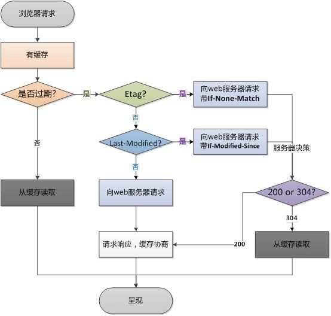

如上图，在浏览器第一次发送请求后，需要再次发送请求时，浏览器会首先获取该资源缓存的header信息，然后根据Cache-Control和expires来判断是否过期。若没有过期则直接从缓存中获取资源信息，包括缓存的header的信息，所以此次请求不会与服务器进行通信。如果缓存过期，浏览器会向服务器发送请求，本次请求会带着第一次请求返回的有关缓存的header字段信息，比如以下两种情况：

1. Etag

   客户端会通过`If-None-Match`头将先前服务端返回的Etag发送给服务器，服务器会对比这个客户端发过来的Etag是否与服务器的相同，若相同，就将`If-None-Match`的值设置为false，返回状态304，客户端继续使用本地缓存，不解析服务端发回来的数据。若不相同就将`If-None-Match`的值设置为true，返回状态为200，客户端重新接收服务器端返回的数据。

2. If-Modified-Since

   客户端还会通过`If-Modified-Since`头将先前服务器端发过来的最后修改时间戳发送给服务器，服务器端通过这个时间戳判断客户端的页面是否是最新的，如果不是最新的，则返回最新的内容，如果是最新的，则返回304，客户端继续使用本地缓存

### 强缓存

> 强缓存是利用http头中的`Expires`和`Cache-Control`两个字段来控制的，用来表示自愿的缓存时间

1. Expires： 是http1.0的规范，它的值是一个绝对时间的GMT格式的时间字符串。比如网页的`Expires`值是：

   ```js
   expires:Mar, 06 Apr 2020 10:47:02 GMT
   ```

   这个时间代表这个资源的失效时间，只要发送请求时间是在`Expires`之前，那么本地缓存始终有效，则在缓存中读取数据。所以这种方式有一个明显的缺点，由于失效的时间是一个绝对时间，**所以当服务器与客户端时间偏差较大时，就会导致缓存混乱。**

2. Cache-Control: 是http1.1中出现的，一般利用该字段的max-age来判断，这个值是一个相对时间。例如：

   ```js
   Cache-Control: max-age=3600 // 代表资源的有效期是3600秒
   ```

   除了该字段还有其他几个常用的值。

   * no-cache： 不使用本地缓存。需要使用协商缓存，先与服务器确认返回的响应是否被更改，如果之前的响应中存在Etag，那么请求的时候会与服务端验证，如果资源未被更改，则可以避免重新下载。
   * no-store：直接禁止浏览器缓存数据，每次用户请求该资源，都会向服务器发送一个请求，每次都会下载完整的资源。
   * public： 可以被所有的用户缓存，包括终端用户和CDN等中间代理服务器
   * private：只能被终端用户的浏览器缓存，不允许CDN等中继缓存服务器对其缓存。

#### Cache-Control与Expires的优先级

Cache-Control与Expires可以在服务端配置同时启用，同时启用的时候Cache-Control优先级高。比如：

```js
cache-control: max-age=691200
expires: Fri, 06 Mar 2020 10:47:02 GMT
```

那么表示资源可以被缓存691200秒，会优先考虑`max-age`。


### 协商缓存

协商缓存是由服务器确定缓存资源是否可用。主要涉及两组header字段：

Etag 和 If-None-Match

Last-Modified 和 If-Modified-Since

#### Last-Modified/ If-Modified-Since

浏览器第一次请求一个资源的时候，服务器返回的header中会加上Last-Modified，Last-modified是一个时间标识该资源的最后修改时间，例如Last-Modified:Thu，31 Dec 2037 23:59:59 GMT。

当浏览器再次请求该资源时，request的请求头中会包含If-Modify-Since，该值为缓存之前返回的Last-Modified。服务器收到If-Modified-Since后，根据资源的最后修改时间判断是否命中缓存。如果命中缓存，则返回304，并且不会返回资源内容，并且不会返回Last-Modified。


#### Etag/If-None-Match

从上面看可能会觉得使用Last-Modified 已经足够让浏览器知道本地的缓存副本是否足够新，为什么还需要Etag呢？

首先，Etag/If-None-Match 是“实体标签”（Entity Tag）的缩写，是资源的一个唯一标识，资源变化都会导致Etag变化。服务器根据浏览器上的If-None-Match值来判断是否命中缓存。

因此，Etag的出现主要是为了解决几个Last-Modified比较难解决的问题：

* 一些文件也许会周期性的更改，但是他的内容并不改变（仅仅改变的修改时间），这个时候我们并不希望客户端认为这个文件被修改了，而从心get；
* 某些文件修改非常频繁，比如在秒一下的时间内进行修改，（比方说1s内修改了N次），If-Modified-Since能检查到的粒度是秒级，这种修改无法判断（或者说UNIX记录MTIME只能精确到秒）
* 某些服务器不能精确的得到文件的最后修改时间。

Last-Modified与ETag是可以一起使用的，服务器会优先验证ETag，一致的情况下，才会继续比对Last-Modified，最后才会决定是否返回304.

## WeakMap 、Map 和 WeakSet 、Set

#### WeakMap弱引用的理解

> 弱引用

弱引用是指不能确保其引用的对象不会被垃圾回收器回收的引用（所引用的对象随时可能被垃圾回收器回收）。 一个对象若只  被弱引用所引用，则被认为是不可访问（或弱可访问）的，并因此可能在任何时刻被回收。

- 特性
1.  WeakMap 只接受对象作为键名
```js
const map = new WeakMap();
map.set(1, 2);  // TypeError: Invalid value used as weak map key
map.set(null, 2);   // TypeError: Invalid value used as weak map key
```
2.  WeakMap 的键名所引用的对象是弱引用

    这句话其实让我非常费解，我个人觉得这句话真正想表达的意思应该是：<br/>
    WeakMaps hold "weak" references to key objects,<br/>
    翻译过来应该是 WeakMaps 保持了对键名所引用的对象的弱引用。<br>
    我们先聊聊弱引用：<br>
    在计算机程序设计中，弱引用与强引用相对，是指**不能确保其引用的对象不会被垃圾回收器回收的引用**。 一个对象若只  被弱引用所引用，则被认为是不可访问（或弱可访问）的，并因此可能在任何时刻被回收。

> 强引用

```js
// 在 JavaScript 中，一般我们创建一个对象，都是建立一个强引用：
var obj = new Object();
// 只有当我们手动设置 obj = null 的时候，才有可能回收 obj 所引用的对象。
// 而如果我们能创建一个弱引用的对象：
// 假设可以这样创建一个
var obj = new WeakObject();
// 我们什么都不用做，只用静静的等待垃圾回收机制执行，obj 所引用的对象就会被回收。
```

- 我们再来看看这句：

    WeakMaps 保持了对键名所引用的对象的弱引用

    正常情况下，我们举个例子：
```js
const key = new Array(5 * 1024 * 1024);
const arr = [[key, 1]];
```

使用这种方式，我们其实建立了 arr 对 key 所引用的对象(我们假设这个真正的对象叫 Obj)的强引用。
所以当你设置 key = null 时，只是去掉了 key 对 Obj 的强引用，并没有去除 arr 对 Obj 的强引用，所以 Obj 还是不会被回收掉。

-   Map 类型也是类似：

```js
let map = new Map();
let key = new Array(5 * 1024 * 1024);

// 建立了 map 对 key 所引用对象的强引用
map.set(key, 1);

// key = null 不会导致 key 的原引用对象被回收
key = null;
```

-   我们可以通过 Node 来证明一下这个问题：

```js
// 允许手动执行垃圾回收机制
// 在终端中输入命令: node --expose-gc test.js


// test.js 内容
global.gc();
// 返回 Nodejs 的内存占用情况，单位是 bytes
process.memoryUsage(); // heapUsed: 4640360 ≈ 4.4M

let map = new Map();
let key = new Array(5 * 1024 * 1024);
map.set(key, 1);
global.gc();
process.memoryUsage(); // heapUsed: 46751472 注意这里大约是 44.6M

key = null;
global.gc();
process.memoryUsage(); // heapUsed: 46754648 ≈ 44.6M

// 这句话其实是无用的，因为 key 已经是 null 了
map.delete(key);
global.gc();
process.memoryUsage(); // heapUsed: 46755856 ≈ 44.6M

```
如果你想要让 Obj 被回收掉，你需要先 delete(key) 然后再 key = null:

```js
let map = new Map();

let key = new Array(5 * 1024 * 1024);

map.set(key, 1);

map.delete(key);

key = null;
```


  - 我们依然通过 Node 证明一下：

```js
node --expose-gc

global.gc();
process.memoryUsage(); // heapUsed: 4638376 ≈ 4.4M

let map = new Map();
let key = new Array(5 * 1024 * 1024);
map.set(key, 1);
global.gc();
process.memoryUsage(); // heapUsed: 46727816 ≈ 44.6M

map.delete(key);
global.gc();
process.memoryUsage(); // heapUsed: 46748352 ≈ 44.6M

key = null;
global.gc();
process.memoryUsage(); // heapUsed: 4808064 ≈ 4.6M
```

- 这个时候就要说到 WeakMap 了：

```js
const wm = new WeakMap();
let key = new Array(5 * 1024 * 1024);
wm.set(key, 1);
key = null;
```

当我们设置 wm.set(key, 1) 时，其实建立了 wm 对 key 所引用的对象的弱引用，但因为 let key = new Array(5 * 1024 * 1024) 建立了 key 对所引用对象的强引用，被引用的对象并不会被回收，但是当我们设置 key = null 的时候，就只有 wm 对所引用对象的弱引用，下次垃圾回收机制执行的时候，该引用对象就会被回收掉。

- 我们用 Node 证明一下：
```js
node --expose-gc

global.gc();
process.memoryUsage(); // heapUsed: 4638992 ≈ 4.4M

const wm = new WeakMap();
let key = new Array(5 * 1024 * 1024);
wm.set(key, 1);
global.gc();
process.memoryUsage(); // heapUsed: 46776176 ≈ 44.6M

key = null;
global.gc();
process.memoryUsage(); // heapUsed: 4800792 ≈ 4.6M
```
所以 WeakMap 可以帮你省掉手动删除对象关联数据的步骤，所以当你不能或者不想控制关联数据的生命周期时就可以考虑使用 WeakMap。


**总结:** 这个弱引用的特性，就是 WeakMaps 保持了对键名所引用的对象的弱引用，即垃圾回收机制不将该引用考虑在内。只要所引用的对象的其他引用都被清除，垃圾回收机制就会释放该对象所占用的内存。也就是说，一旦不再需要，WeakMap 里面的键名对象和所对应的键值对会自动消失，不用手动删除引用。<br>也正是因为这样的特性，WeakMap 内部有多少个成员，取决于垃圾回收机制有没有运行，运行前后很可能成员个数是不一样的，而垃圾回收机制何时运行是不可预测的，因此 ES6 规定 WeakMap 不可遍历。<br>所以 WeakMap 不像 Map，一是没有遍历操作（即没有keys()、values()和entries()方法），也没有 size 属性，也不支持 clear 方法，所以 WeakMap只有四个方法可用：get()、set()、has()、delete()。

> 应用

1. 在 DOM 对象上保存相关数据
传统使用 jQuery 的时候，我们会通过 \$.data() 方法在 DOM 对象上储存相关信息(就比如在删除按钮元素上储存帖子的 ID 信息)，jQuery 内部会使用一个对象管理 DOM 和对应的数据，当你将 DOM 元素删除，DOM 对象置为空的时候，相关联的数据并不会被删除，你必须手动执行 $.removeData() 方法才能删除掉相关联的数据，WeakMap 就可以简化这一操作：
```js
let wm = new WeakMap(), element = document.querySelector(".element");

wm.set(element, "data");

let value = wm.get(elemet);

console.log(value); // data

element.parentNode.removeChild(element);
element = null;
```
2. 数据缓存
从上一个例子，我们也可以看出，当我们需要关联对象和数据，比如在不修改原有对象的情况下储存某些属性或者根据对象储存一些计算的值等，而又不想管理这些数据的死活时非常适合考虑使用 WeakMap。数据缓存就是一个非常好的例子：
```js
const cache = new WeakMap();
function countOwnKeys(obj) {
    if (cache.has(obj)) {
        console.log('Cached');
        return cache.get(obj);
    } else {
        console.log('Computed');
        const count = Object.keys(obj).length;
        cache.set(obj, count);
        return count;
    }
}
```
3. 私有属性
WeakMap 也可以被用于实现私有变量，不过在 ES6 中实现私有变量的方式有很多种，这只是其中一种：
```js
const privateData = new WeakMap();

class Person {
    constructor(name, age) {
        privateData.set(this, { name: name, age: age });
    }

    getName() {
        return privateData.get(this).name;
    }

    getAge() {
        return privateData.get(this).age;
    }
}

export default Person;
```


## HMR原理


## 防抖 节流

```js
// 防抖
const throttle = function (fn, delay, options) {
	let timer;
	let prev;
	let context;
	let args;
	let option;
	if (!options) {
		option = options;
	}
	const later = function () {
		fn.apply(context, args);
	};

	const throttled = function () {
		context = this;
		args = Array.prototype.slice.call(arguments);
		const now = +new Date();
		if (!prev && !option.leading) prev = now;
		let remaining = delay + prev - now;
		if (remaining < 0 || remaining > delay) {
			if (timer) {
				clearTimeout(timer);
				timer = null;
			}
			prev = now;
			fn.apply(context, args);
		} else {
			timer = setTimeout(later, remaining);
		}
	};
	return throttled;
};


// 节流
const debounce = (fn, delay, immediate) => {
    let timer;
    return function () {
        const context = this;
        const args = Array.prototype.slice.call(arguments);
        let result;
        if (timer) clearTimeout(timer);
        if (immediate) {
            let callnow = !timer;
            timer = setTimeout(() => {
                timer = null;
            }, delay);
            if (callnow) {
                result = fn.apply(context, args);
            }
        } else {
            timer = setTimeout(() => {
                fn.apply(context, args);
                timer = null;
            }, delay);
        }
        return result;
    };
};
```


## 可控组件与不可控组件

#### 可控组件

> 在 HTML 中，表单元素（如`<input>`、 `<textarea>` 和 `<select>`）通常自己维护 state，并根据用户输入进行更新。而在 React 中，可变状态（mutable state）通常保存在组件的 state 属性中，并且只能通过使用[`setState()`](https://zh-hans.reactjs.org/docs/react-component.html#setstate)来更新
>
> 我们可以把两者结合起来，使 React 的 state 成为“唯一数据源”。渲染表单的 React 组件还控制着用户输入过程中表单发生的操作。被 React 以这种方式控制取值的表单输入元素就叫做“受控组件”。

```jsx
<input type='text' value={this.state.value} onChange={this.handleChange} />
// 由于在表单匀速上设置了value属性，因此显示的值始终为this.state.value，这使得React的state成为唯一的数据源

<textarea value={this.state.value} onChange={this.handleChange} />
```


#### 不可控组件

非受控组件，表单数据将交由 DOM 节点来处理

```html
<input type="file" /> <!-- 在react中始终是一个非受控组件，因为他的值只能由用户设置，而不能通过代码控制-->
```


## valueof 和 toString的区别

valueOf和toString是Object.prototype的方法。一般很少直接调用，但是在使用对象参与运算的时候就会调用这两个方法了。在使用的时候有以下疑问：

* valueOf和toString哪个优先级高？
* 是不是所有场景都会调用valueOf和toString

### 概念解释

* valueOf：返回对象的原始值表示
* toString：返回对象的字符串表示

在介绍下面的内容之前先了解以下转换规则，下面的内容解释都是基于这个规则表来的：

#### valueOf转换规则

valueOf是Object.prototype的方法，由Object来的对象都会有该方法，但是很多内置对象会重写这个方法，以适合实际需要。

说道原始值就必须说到原始类型， JS规范中 **原始类型** 如下：

* Boolean
* Null
* Undefined
* Number
* String
* Symbol

非原始值（也就是对象）重写规则如下：

| 对象     | valueOf返回值        |
| -------- | -------------------- |
| Array    | 数组本身             |
| Boolean  | 布尔值               |
| Date     | 返回毫秒形式的时间戳 |
| Function | 函数本身             |
| Number   | 数字值               |
| Object   | 对象本身             |
| String   | 字符串值             |

#### 对象转换为布尔值

1. 直接转换为true（包装类型也一样），不调用valueOf和toString

```js
// 保存原始的valueOf
var valueOf = Object.prototype.valueOf;
var toString = Object.prototype.toString;

// 添加valueOf日志
Object.prototype.valueOf = function () {
    console.log('valueOf');
    return valueOf.call(this);
};
// 添加toString日志
Object.prototype.toString = function () {
    console.log('toString');
    return toString.call(this);
};
var a = {};
var b = new Boolean(false);

if (a) {
    console.log(1);
}
if(b) {
    console.log(2);
}
```


#### 对象转换为数字

在预期会将对象用作数字使用时，比如参与算数运算等操作，对象转换为数字会依次调用valueOf和toString方法，具体规则如下：

1. 如果对象具有`valueOf`方法且返回原始值（string、number、boolean、undefined、null），则将该原始值转换为数字（转换失败会返回NaN），并返回这个数字
2. 如果对象具有`toString`方法且返回原始值（string、number、Boolean、undefined、null），则将该原始值转换为数字（转换失败会返回NaN），并返回这个数字
3. 转换失败，抛出TypeError

```js
// 保存原始的valueOf
var valueOf = Object.prototype.valueOf;
var toString = Object.prototype.toString;

// 添加valueOf日志
Object.prototype.valueOf = function() {
    console.log('valueOf');
    return valueOf.call(this);
};
// 添加toString日志
Object.prototype.toString = function() {
    console.log('toString');
    return toString.call(this);
};
var a = {};
console.log(++a);
// output
/*
 * valueOf
 * toString
 * NaN
 */
```

#### 分析

1. valueOf方法返回的是对象本身，不是原始值，继续执行
2. toString方法返回的是“[object Object]”,是原始值（字符串），将字符串转换为数字NaN

```js
// 保存原始的valueOf
var valueOf = Object.prototype.valueOf;
var toString = Object.prototype.toString;

// 添加valueOf日志
Object.prototype.valueOf = function () {
    console.log('valueOf');
    return "1"; // 强制返回原始值
};
// 添加toString日志
Object.prototype.toString = function () {
    console.log('toString');
    return toString.call(this);
};
var a = {};
console.log(++a);
// output
/*
 * valueOf
 * 2
 */
```

#### 分析

1. valueOf返回原始值（字符串），直接将该字符串转换为数字，得到1

#### 对象转换为字符串

1. 如果对象具有`toString`方法且返回原始值（string、number、boolean、undefined、null），则将该原始值转换为字符串，并返回该字符串
2. 如果对象具有`valueOf`方法且返回原始值（string、number、boolean、undefined、null），则将该原始值转换为字符串，并返回该字符串
3. 转换失败，抛出TypeError

```js
// 保存原始的valueOf
var valueOf = Object.prototype.valueOf;
var toString = Object.prototype.toString;

// 添加valueOf日志
Object.prototype.valueOf = function () {
    console.log('valueOf');
    return valueOf.call(this);
};
// 添加toString日志
Object.prototype.toString = function () {
    console.log('toString');
    return toString.call(this);
};
var a = {};
aler(a);
// output
/*
 * toString
 * 弹出[object Object]
 */
```

#### 分析

1. 调用toString方法，返回了字符串“[object Object]”，对象最终转换为该字符串

```js
// 保存原始的valueOf
var valueOf = Object.prototype.valueOf;
var toString = Object.prototype.toString;

// 添加valueOf日志
Object.prototype.valueOf = function () {
    console.log('valueOf');
    return valueOf.call(this);
};
// 添加toString日志
Object.prototype.toString = function () {
    console.log('toString');
    return this;
};
var a = {};
alert(a);
// output
/*
 * toString
 * valueOf
 * TypeError: xxx
 */
```

#### 分析

1. 调用toString方法，返回的不是原始值，继续执行
2. 调用valueOf方法，返回的不是原始值，继续执行
3. 抛出TypeError

#### **【番外】**使用加号运算符连接字符串和对象时的处理

在测试对象到字符串转换时，发现如下代码的表现和预期并不一致：

```js
// 保存原始的valueOf
var valueOf = Object.prototype.valueOf;
var toString = Object.prototype.toString;

// 添加valueOf日志
Object.prototype.valueOf = function () {
    console.log('valueOf');
    return valueOf.call(this);
};
// 添加toString日志
Object.prototype.toString = function () {
    console.log('toString');
    return toString.call(this);
};

console.log("a" + {});
// 输出如下
/*
 * valueOf
 * toString
 * a[object Object]
 */
```

#### 疑问

`"a"+ {}` 应该是预期把`{}`当做字符串使用，应该先调用toString方法的，实际情况却不是这样。

#### 结论

1. 如果有一个是对象，则遵循对象对原始值的转换过程（Date对象直接调用toString完成转换，其他对象通过valueOf转化，如果转换不成功则调用toString）
2. 如果两个都是对象，两个对象都遵循步骤1转换到字符串
3. 两个数字，进行算数运算
4. 两个字符串直接拼接
5. 一个字符串一个数字，直接拼接为字符串


### toString转换规则

| 对象     | toString返回值                                               |
| -------- | ------------------------------------------------------------ |
| Array    | 以逗号分割的字符串，如[1,2]的toString返回值为“1,2”           |
| Boolean  | “True”                                                       |
| Date     | 刻度的时间字符串，如“Tue Oct 15 2019 12:20:56 GMT +0800（中国标准时间）” |
| Function | 声明函数的JS源代码字符串                                     |
| Number   | “数字值”                                                     |
| Object   | “[object Object]”                                            |
| String   | "字符串"                                                     |


## 浅拷贝

```js
const shallowClone = (obj) => {
    if (typeof obj !== "object") {
        return;
    }
    const newObj = obj instanceof Array ? [] : {};
    for (let key in obj) {
        newObj[key] = obj[key];
    }
    return newObj;
};

```

## 深拷贝

```js
/**
 * 完全版 深度克隆 这里包含了对 Date Regexp 以及循环引用的问题 的判断
 * @param {*} obj
 */
const isObject = (obj) => {
	return (typeof obj === "object" || typeof obj === "function") && obj !== null;
};

const deepClone = (target, map = new WeekMap()) => {
	if (map.get(target)) {
		return target;
	}
	const constructor = target.constructor;
	if (/^(Regexp|Date)$/i.test(constructor.name)) {
		return new constructor(target);
	}
	if (isObject(target)) {
		map.set(target, true);
		const newTarget = Array.isArray(target) ? [] : {};
		for (let key in target) {
			if (Object.prototype.hasOwnProperty.call(target, key)) {
				newTarget[key] = deepClone(target[key], map);
			}
		}
		return newTarget;
	} else {
		return target;
	}
};
```


## compositionStart 和 compositionEnd解决的什么问题

> **compositionstart：**compositionstart事件触发于一段文字的输入之前（类似于 keydown 事件，但是该事件仅在若干可见字符的输入之前，而这些可见字符的输入可能需要一连串的键盘操作、语音识别或者点击输入法的备选词）。
> **compositionend：**当文本段落的组成完成或取消时, compositionend 事件将被触发 。

`compositionstart` 事件在用户开始进行非直接输入的时候触发，而在非直接输入结束，也即用户点选候选词或者点击「选定」按钮之后，会触发 `compositionend` 事件。

#### 非直接输入

在 iOS 中，input 事件会**截断非直接输入**，什么是非直接输入呢，在我们输入汉字的时候，比如说「喜茶」，中间过程中会输入拼音，每次输入一个字母都会触发 input `onChnage 事件`，然而在没有点选候选字或者点击「选定」按钮前，都**属于非直接输入。**

eg:

```js
var inputLock = false;
function do(inputElement) {
    var regex = /[^1-9a-zA-Z]/g;
    inputElement.value = inputElement.value.replace(regex, '');
}

inputElement.addEventListener('compositionstart', function() {
  inputLock = true;
});


inputElement.addEventListener('compositionend', function(event) {
  inputLock = false;
  do(event.target);
})


inputElement.addEventListener('input', function(event) {
  if (!inputLock) {
    do(event.target);
    event.returnValue = false;
  }
});
```


## defer / async , prefetch / preload 区别

* prefetch 和 preload

  prefetch和preload 是现代浏览器对 <link>标签新增的rel值， 用来加快页面资源的加载速度，改善用户体验

  1. prefetch 和preload 不影响window.onload事件（window.onload事件不会管prefetch和preload资源是否已经下载完毕）
  2. prefetch用于加载 未来需要的资源， 而且只有5分钟的生命期， 也就是说，浏览器会低优先级下载该资源，拿到资源之后会存入disk cache，未来真的需要它的时候吗会从disk cache中读取， 以加快页面资源加载速度。

* defer 和 async 都是<script>标签上的属性

  |                  | 无属性           | defer                                                  | async                              |
  | ---------------- | ---------------- | ------------------------------------------------------ | ---------------------------------- |
  | 是否阻塞HTML解析 | 下载和执行都阻塞 | 都不阻塞                                               | 下载不阻塞，仅在执行时阻塞         |
  | 按书写顺序下载   | 是               | 否，跟之后的js并行下载                                 | 否，跟之后的js并行下载             |
  | 下载后立即执行   | 是               | 否，在HTML全部解析后，DOMContentLoaded执行前的节点执行 | 是                                 |
  | 按书写顺序执行   | 是               | 如果后续js没有“无属性”和“async”，则是，否则不是        | 先下载完成的先执行，所以一定是乱序 |
  | 按下载顺序执行   | 是               | 如果后续js没有“无属性”和“async”，则是，否则不是        | 是，但是下载是乱序的，所以总体乱序 |


## setTimeout 和 dom 原生事件同步

问题与下面意思相同

## React 合成事件和原生事件的区别， 原生事件怎么设计

* 在组件生命周期或React合成事件 中， setState是异步的；（异步操作， 但特定情况下会执行一次， 性能被优化）
* 在 setTimeout 或者 原生dom 事件中， setState是同步；（完全是同步函数）

## setState 为什么异步执行

* setState 设计为异步，可以显著提升性能；

  如果每次调用setState都进行一次更新，意味着render函数会被频繁的调用，即重新渲染，这样效率很低。

* 最好的办法是获取到多个更新， 之后进行批量更新；（这里有前端框架最初的设计时的思想，为了提高性能，减少操作dom次数，通过算法计算少次多量地进行操作dom）


## Hooks 解决的问题 ， 使用上的限制

**优点：**

1. 更容易代码复用
2. 代码量更少，清爽的代码风格

**缺点：**

1. 响应式的useEffect
2. hooks不擅长异步的代码（旧引用问题，状态不同步）
3. custom hooks有时严重依赖参数的不可变性

**避坑：**

1. 不要在useEffect里面写太多的依赖项，划分这些依赖项成多个单一功能的useEffect。

2. 如果碰到状态不同步的问题， 可以考虑手动传递参数到函数

   ```js
   // showCount 的count 来自父级作用域
   const [count, setCount] = useState(xxx);
   function showCount() { console.log(count) }
   
   // showCount  的count来自参数
   const [count, setCount] = useState(xxx);
   function showCount(c) { console.log(c) }
   
   ```

3. 拆分组件，细粒化组件的粒度。复杂业务场景中使用hooks，应尽可能的细分组件，是的组件的功能尽可能单一，这样的hooks组件更好维护。

**总结：**

`hooks`很好用很强大，但它不擅长**异步**。但在有太多**异步逻辑**的代码时，class比它更适合、更稳、更好维护。

## React-router 原理


## useEffect 和useLayoutEffect

- `useEffect` 是异步执行的，而`useLayoutEffect`是同步执行的。
- `useEffect` 的执行时机是浏览器完成渲染之后，而 `useLayoutEffect` 的执行时机是浏览器把内容真正渲染到界面之前，和 `componentDidMount` 等价。

举个栗子：

```js
import React, { useEffect, useLayoutEffect, useState } from 'react';
import logo from './logo.svg';
import './App.css';

function App() {
  const [state, setState] = useState("hello world")

  useEffect(() => {
    let i = 0;
    while(i <= 1000000000) {
      i++;
    };
    setState("world hello");
  }, []);

  // useLayoutEffect(() => {
  //   let i = 0;
  //   while(i <= 1000000000) {
  //     i++;
  //   };
  //   setState("world hello");
  // }, []);

  return (
    <>
      <div>{state}</div>
    </>
  );
}

export default App;
```

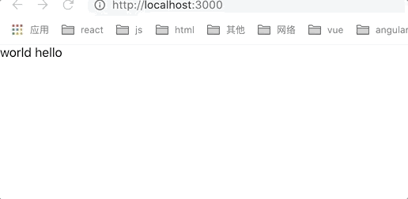


换成 useLayoutEffect之后

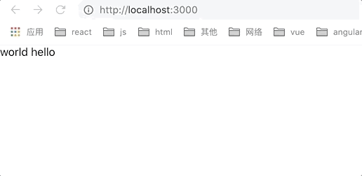


**原因**： 

1. 因为 `useEffect` 是渲染完之后异步执行的，所以会导致 hello world 先被渲染到了屏幕上，再变成 world hello，就会出现闪烁现象。
2.  `useLayoutEffect` 是渲染之前同步执行的，所以会等它执行完再渲染上去，就避免了闪烁现象。也就是说我们最好把操作 dom 的相关操作放到 `useLayouteEffect` 中去，避免导致闪烁。

**结论**：

1. 优先使用 `useEffect`，因为它是异步执行的，不会阻塞渲染
2. 会影响到渲染的操作尽量放到 `useLayoutEffect`中去，避免出现闪烁问题
3. `useLayoutEffect`和`componentDidMount`是等价的，会同步调用，阻塞渲染
4. `useLayoutEffect` 是不会在服务端执行的，在服务端渲染的时候使用会有一个 warning，因为它可能导致首屏实际内容和服务端渲染出来的内容不一致。

**问题**：由于`useLayoutEffect` 是不会在服务端执行的，所以就有可能导致 ssr 渲染出来的内容和实际的首屏内容并不一致。而解决这个问题也很简单：

1. 放弃使用 `useLayoutEffect`，使用 `useEffect` 代替

2. 如果你明确知道 `useLayouteffect` 对于首屏渲染并没有影响，但是后续会需要，你可以这样写

   ```js
   import { useEffect, useLayoutEffect } from 'react';
   export const useCustomLayoutEffect = typeof window !== 'undefined' ? useLayoutEffect : useEffect;
   ```

   当你使用 `useLayoutEffect` 的时候就用 `useCustomLayoutEffect` 代替。这样在服务端就会用 `useEffect` ，这样就不会报 warning 了。

## 关于 React Hooks

1. 为什么只能在函数最外层调用 Hook，不要在循环、条件判断或者子函数中调用？
2. 为什么 useEffect 第二个参数是空数组，就相当于 ComponentDidMount ，只会执行一次？
3. 自定义的 Hook 是如何影响使用它的函数组件的？
4. Capture Value 特性是如何产生的？


## React Scheduler

### 知识前置

1. window.performance.now

   浏览器内置的时钟， **从页面加载开始计时，返回到当前的总时间**，单位为`ms`。意味着你在打开页面第十分钟在控制台调用这个方法，返回的数字大概是600000（可能存在误差）。

2. window.requestAnimationFrame

   * 它让我们可以在下一帧开始时调用指定的函数。它的执行时跟随系统的刷新频率的。`requestAnimationFrame`方法接收一个参数，即要执行的回调函数。这个回调函数会默认的传入一个参数，**即从打开页面到回调函数呗触发时的时间长度，单位为毫秒**。

   * 可以理解为系统在调用回调前立马执行了一下`performance.now()`传给了回调当参数。这样我们就可以在执行回调的时候知道当前的执行时间了。

     ```js
     requestAnimationFrame(function F(t) {
         console.log(t, '======'); // 会不断打印执行回调的时间，如果刷新率为60Hz，则相邻的t时间间隔为16.67ms；
         requestAnimationFrame(F);
     })
     ```

   * `requestAnimationFrame`有个特点，就是当页面处理未激活的状态下`requestAnimationFrame`会停止执行；当页面后面再转为激活时，`requestAnimationFrame`又会接着上次的地方继续执行。

3. window.MessageChannel

   这个接口允许我们创建一个新的消息通道，并通过它的两个`MessagePort(port1,port2)`属性发送数据。

   eg:

   ```js
   var channel = new MessageChannel();
   var port1 = channel.port1;
   var port2 = channel.port2;
   port1.onmessage = function (event) {
       console.log(event.data) // someData
   }
   port2.postMessage('someData');
   
   ```

   这里有一点要注意， `onmessage`的回调函数的调用时机是在一阵的paint完成之后。根据观察vue的`nextTick`也是用`MessageChannel`来做`fallback`的（优先用`setImmediate`）。

   `react scheduler`内部正事利用了这一点来在一帧染结束后的剩余时间来执行任务的。

4. 链表

### 任务优先级

```js
   var ImmediatePriority = 1;  //最高优先级
   var UserBlockingPriority = 2; //用户阻塞型优先级
   var NormalPriority = 3; //普通优先级
   var LowPriority = 4; // 低优先级
   var IdlePriority = 5; // 空闲优先级
```

上述五种优先级对应5种过期时间

```js
  // Max 31 bit integer. The max integer size in V8 for 32-bit systems.
   // Math.pow(2, 30) - 1
   var maxSigned31BitInt = 1073741823;

   // 立马过期 ==> ImmediatePriority
   var IMMEDIATE_PRIORITY_TIMEOUT = -1;
   // 250ms以后过期
   var USER_BLOCKING_PRIORITY = 250;
   //
   var NORMAL_PRIORITY_TIMEOUT = 5000;
   //
   var LOW_PRIORITY_TIMEOUT = 10000;
   // 永不过期
   var IDLE_PRIORITY = maxSigned31BitInt;
```


### unstable_scheduleCallback

* 目前尚不稳定，下面用`scheduleCallback`代替
* 这个方法的作用就是把任务以过期时间作为优先级进行排序，过程类似双向链表操作。

```js
  function scheduleCallback(callback, options? : {timeout:number} ) {
       //to be coutinued
   }
```

这个方法有两个入参，第一个是要执行的`callback`，暂时可以理解为一个任务。第二个参数是可选的，可以传入一个超市时间来标识这个任务多久超时。**如果不传的话就会根据上述的任务优先级确定过期时间。**

```js
  //这是一个全局变量，代表当前任务的优先级,默认为普通
  var currentPriorityLevel = NormalPriority
  
  function scheduleCallback(callback, options? : {timeout:number} ) {
      var startTime = getCurrentTime()
      if (
          typeof options === 'object' &&
          options !== null &&
          typeof options.timeout === 'number'
        ){
          //如果传了options, 就用入参的过期时间
          expirationTime = startTime + options.timeout;
        } else {
          //判断当前的优先级
          switch (currentPriorityLevel) {
            case ImmediatePriority:
              expirationTime = startTime + IMMEDIATE_PRIORITY_TIMEOUT;
              break;
            case UserBlockingPriority:
              expirationTime = startTime + USER_BLOCKING_PRIORITY;
              break;
            case IdlePriority:
              expirationTime = startTime + IDLE_PRIORITY;
              break;
            case LowPriority:
              expirationTime = startTime + LOW_PRIORITY_TIMEOUT;
              break;
            case NormalPriority:
            default:
              expirationTime = startTime + NORMAL_PRIORITY_TIMEOUT;
          }
        }
        
        //上面确定了当前任务的截止时间，下面创建一个任务节点，
        var newNode = {
          callback, //任务的具体内容
          priorityLevel: currentPriorityLevel, //任务优先级
          expirationTime, //任务的过期时间
          next: null, //下一个节点
          previous: null, //上一个节点
        };
      //to be coutinued
  }
```


## 浏览器的默认缓存时间是多久？

**(访问时间 - 最后修改时间） ÷ 10**

```text
假设index.html最后修改时间为5:00
访问index.html的时间为7:00
（7 - 5）* 60 * 60 / 10 = 720(s)
```

